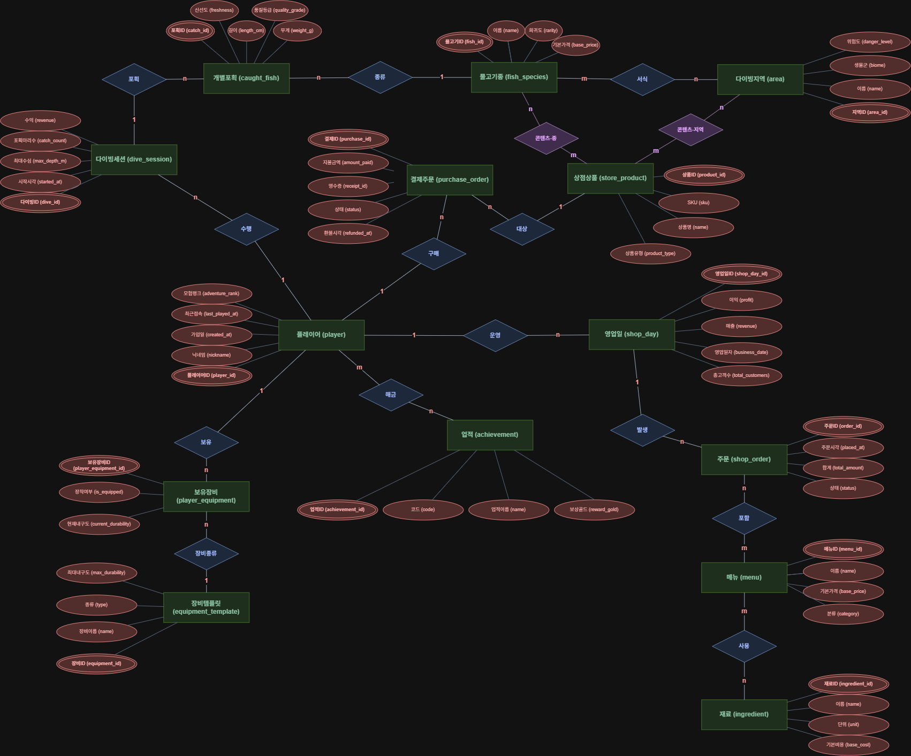
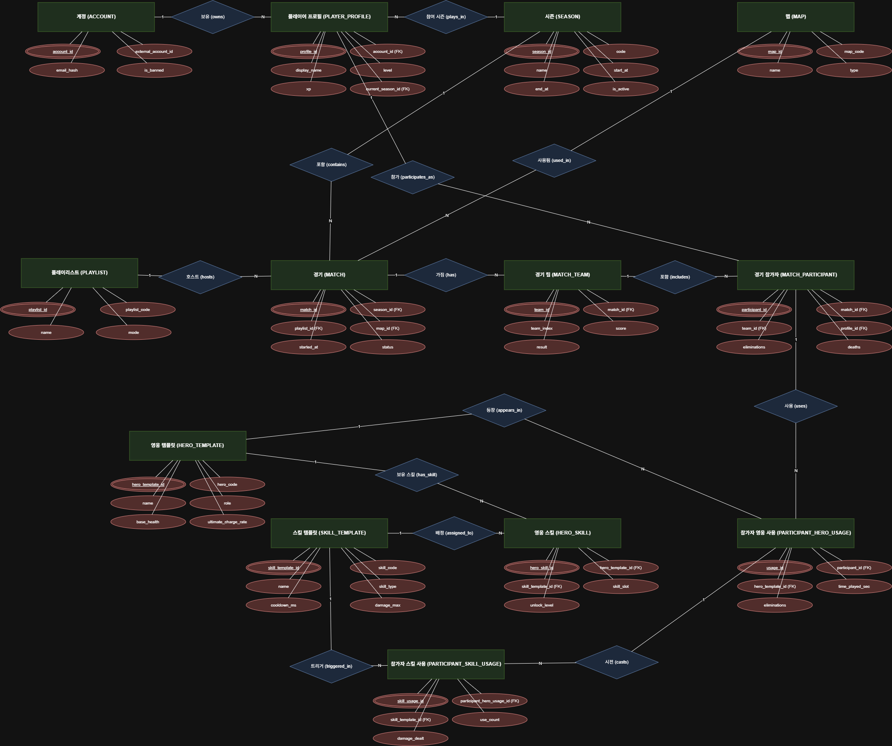
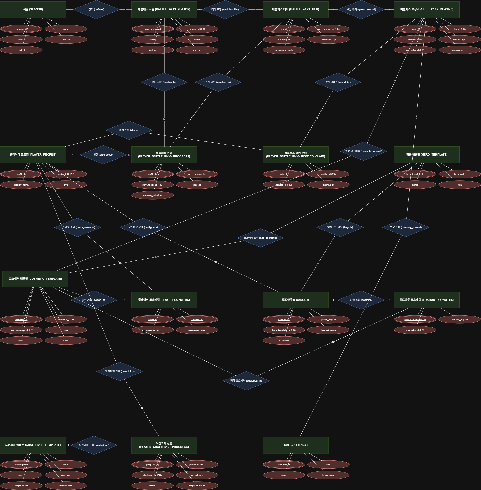
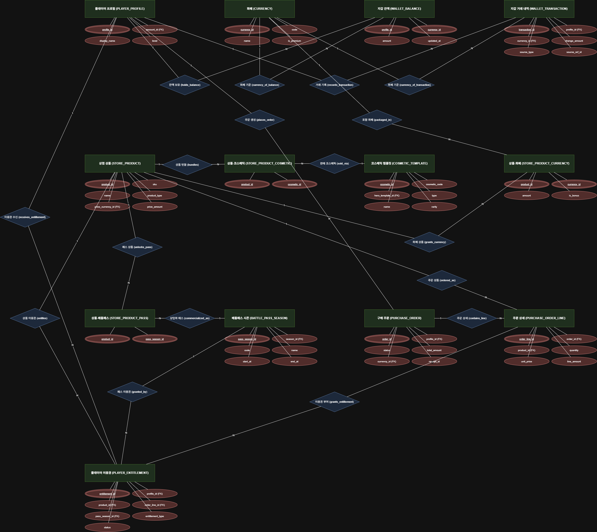
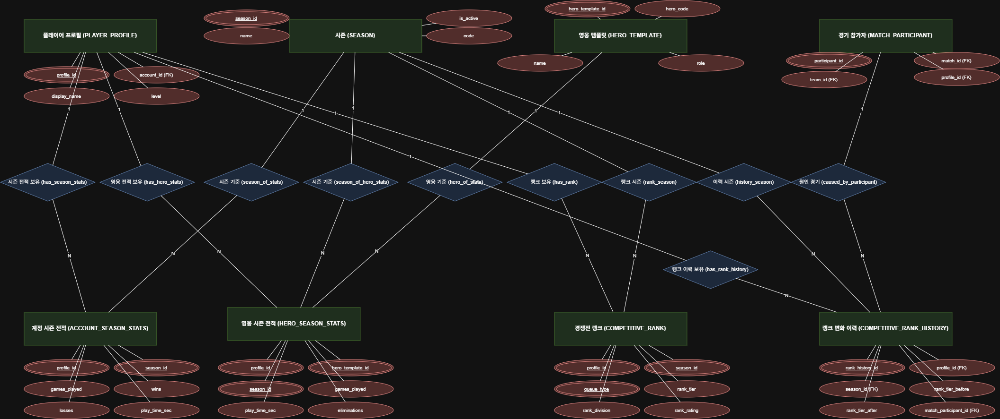
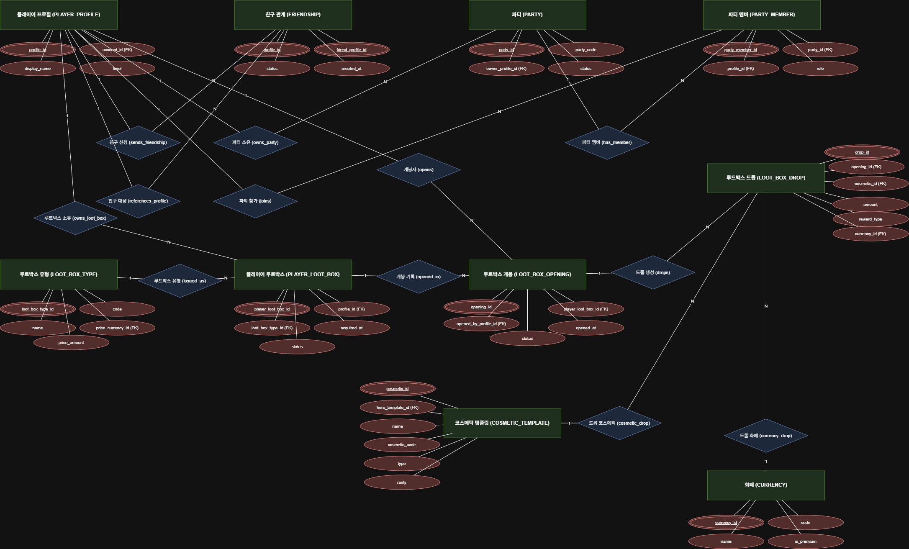

# 김승준_인터넷프로그래밍과제

# 게임 데이터베이스 분석 포트폴리오

## NEXON : Dave the Diver와 Overwatch 2

---

## 제출 정보

| 항목 | 내용 |
| --- | --- |
| 과목 | 인터넷프로그래밍 |
| 과제명 | 게임 데이터베이스 분석 포트폴리오 |
| 학번 | 25311003 |
| 이름 | 김승준 |
| 제출일 | 2026.10.05 |
| 분석 대상 게임 | Dave the Diver, Overwatch 2 |
| ERD 표기법 | Crow’s Foot |
| ERD 도구 | draw.io, MySQL Workbench |
| 첨부 파일 | 보고서, ERD PNG 파일, .mwb 모델 파일 |

---

## 개요

본 보고서는 기존 게임에서 관찰 가능한 기능과 데이터를 바탕으로, 해당 게임들이 관계형 데이터베이스 관점에서 어떤 구조를 가질 수 있는지 분석한 보고서이다. 분석 대상은 **Dave the Diver**와 **Overwatch 2** 두 종이며, 각 게임의 주요 시스템을 도메인 단위로 분리하고, 필요한 개체(Entity), 속성(Attribute), 키(Key), 관계(Relationship), 카디널리티(Cardinality)를 도출하였다.

Dave the Diver는 단일 플레이어 저장 데이터 기반으로, 인벤토리, 장비, 물고기 수집, 다이빙 구역, 식당 경영, 퀘스트, 업적, 수집 로그 등의 데이터가 한 명의 플레이어 저장 슬롯을 중심으로 연결되는 구조를 가진다. 반면 Overwatch 2는 온라인 서비스형 게임으로, 계정, 프로필, 히어로, 코스메틱, 상점, 화폐, 배틀패스, 시즌, 매치, 랭크, 소셜, 제재, 결제 및 권한 부여 구조가 서버 중심으로 관리되는 복잡한 관계형 데이터 모델이 필요하다.

또한 두 게임 모두 과금 또는 구매 관련 데이터를 포함하므로, 결제 트랜잭션과 콘텐츠 접근 권한을 분리하는 **Transaction-Entitlement 구조**를 설계에 반영하였다. Dave the Diver는 본편 및 DLC/추가 콘텐츠 구매를 가정하였고, Overwatch 2는 상점 상품, 코스메틱 번들, 배틀패스, 화폐 충전 등의 과금 구조를 분석하였다.

본 보고서의 ERD는 Crow’s Foot 표기법을 사용하며, 가독성을 위해 draw.io에서 PNG 이미지로 추출하여 본문에 삽입하였다. 동시에 MySQL Workbench 모델 파일 `.mwb`를 첨부하여, 보고서의 논리적 설계와 실제 데이터베이스 모델링 파일이 연계되도록 하였다.

---

# 1. 서론

## 1.1 분석 대상 선정 이유

### 1.1.1 Dave the Diver

Dave the Diver는 싱글 플레이어 기반 게임이지만, 단순한 액션 게임이 아니라 다음과 같은 다양한 시스템을 포함하고 있다.

- 다이빙 및 물고기 포획
- 인벤토리 및 아이템 관리
- 장비 획득 및 업그레이드
- 식당 경영 및 요리 주문
- NPC 퀘스트 및 이야기 진행
- 수집 도감 및 업적
- 지역별 다이빙 구역 및 출현 물고기
- 저장 슬롯 기반 게임 진행

이러한 시스템은 관계형 데이터베이스에서 개체 간 관계, M:N 관계 분해, 트랜잭션성 데이터와 마스터 데이터 분리 등을 학습하기에 적합하다.

### 1.1.2 Overwatch 2

Overwatch 2는 온라인 멀티플레이어 서비스형 게임으로, 다음 요소가 포함된다.

- 계정 및 프로필 관리
- 영웅 및 영웅 진척도
- 코스메틱 소유 및 장착
- 상점, 화폐, 번들, 배틀패스
- 시즌제 운영
- 매치 결과 및 플레이어 통계
- 랭크 전적
- 친구, 신고, 제재 시스템
- 결제 및 콘텐츠 권한 부여

따라서 Dave the Diver가 “로컬 저장 기반의 관계형 모델”이라면, Overwatch 2는 “서버 기반 온라인 서비스 데이터 모델”에 해당한다. 두 게임을 비교 분석하면 게임 장르와 서비스 모델에 따라 데이터베이스 구조가 어떻게 달라지는지 명확히 파악할 수 있다.

## 1.3 분석 범위 및 가정

본 보고서의 분석 범위는 다음과 같다.

| 구분 | 내용 |
| --- | --- |
| 분석 게임 | Dave the Diver, Overwatch 2 |
| Dave the Diver 과금 | 본편 구매 및 DLC/추가 콘텐츠 |
| Overwatch 2 과금 | 상점 상품, 코스메틱, 배틀패스, 화폐 충전 등 인게임 구매 기준 |
| ERD 표기법 | Crow’s Foot |
| ERD 도구 | draw.io PNG, MySQL Workbench .mwb |

---

# 2. 분석 방법론

## 2.1 게임 기능 관찰 → 데이터 도출

각 게임에서 사용자가 볼 수 있는 화면과 시스템을 먼저 분류하였다. 예를 들어 Dave the Diver에서는 인벤토리, 물고기 도감, 식당 메뉴, 퀘스트 로그, 장비 업그레이드 화면 등을 관찰 대상으로 삼았다. Overwatch 2에서는 프로필, 히어로 갤러리, 코스메틱, 상점, 배틀패스, 매치 하이라이트, 랭크 전적, 친구 목록, 보고 기능 등을 관찰 대상으로 삼았다.

관찰된 기능은 다음과 같은 데이터로 변환하였다.

| 게임 기능 | 데이터 관점 |
| --- | --- |
| 아이템 보유 | ITEM, INVENTORY_SLOT |
| 물고기 도감 | FISH_SPECIES, CAUGHT_FISH, COLLECTION_LOG |
| 식당 주문 | RESTAURANT_ORDER, ORDER_LINE |
| 퀘스트 진행 | QUEST, PLAYER_QUEST, QUEST_OBJECTIVE |
| 히어로 사용 통계 | HERO, PLAYER_HERO_MASTERY, MATCH_PLAYER |
| 코스메틱 소유 | COSMETIC, PLAYER_COSMETIC |
| 상점 구매 | SHOP_PRODUCT, PAYMENT_TRANSACTION, ENTITLEMENT |
| 배틀패스 보상 | SEASON, BATTLE_PASS_TIER, PLAYER_BP_CLAIM |
| 매치 결과 | MATCH, MATCH_TEAM, MATCH_PLAYER |
| 친구/신고 | FRIENDSHIP, REPORT, SANCTION |

## 2.2 개체, 속성, 키 도출 기준

### 개체(Entity)

개체는 게임에서 독립적으로 관리되어야 하는 데이터 단위이다. 예를 들어 아이템, 물고기 종류, 퀘스트, 히어로, 코스메틱, 매치, 결제 거래 등은 모두 개체가 된다.

### 속성(Attribute)

속성은 개체를 설명하는 데이터이다. 예를 들어 ITEM의 `item_name`, `rarity`, `stack_limit` 등이 속성이 된다.

### 키(Key)

- **기본키(PK)**: 개체 내에서 고유하게 식별되는 값
- **외래키(FK)**: 다른 개체를 참조하는 값
- **후보키(UK)**: 고유성을 가지지만 기본키로 선택되지 않은 속성
- **복합키**: 여러 속성이 결합되어 고유성을 갖는 경우

예를 들어 Dave the Diver의 인벤토리 슬롯은 `save_id`와 `slot_index` 조합으로 고유하게 식별할 수 있다. Overwatch 2의 플레이어 코스메틱 소유 기록은 `profile_id`와 `cosmetic_id` 조합으로 고유성을 보장할 수 있다.

## 2.3 관계 및 카디널리티 분석

관계는 다음 세 유형으로 분석하였다.

| 관계 유형 | 의미 | 예시 |
| --- | --- | --- |
| 1:1 | 한 개체가 다른 개체 하나와만 연결 | ACCOUNT와 PLAYER_PROFILE |
| 1:N | 한 개체가 여러 개체와 연결 | PLAYER_SAVE와 CAUGHT_FISH |
| M:N | 양쪽 개체가 서로 여러 개체와 연결 | RECIPE와 ITEM, PROFILE와 COSMETIC |

M:N 관계는 관계형 데이터베이스에서 그대로 표현할 수 없으므로, 중간 연관 엔티티를 만들어 1:N 관계 두 개로 분해하였다.

예시:

- Dave the Diver`RECIPE M:N ITEM` → `RECIPE_INGREDIENT`로 분해
- Overwatch 2`PLAYER_PROFILE M:N COSMETIC` → `PLAYER_COSMETIC`로 분해

## 2.4 Crow’s Foot ERD 작성 원칙

본 보고서의 ERD는 Crow’s Foot 표기법을 사용하였다.

| 표기 | 의미 |
| --- | --- |
| 직선 | 관계 존재 |
| 세 갈래 발 | Many, 여러 개 |
| 막대 | One, 하나 |
| 원 | Optional, 0 가능 |
| PK | Primary Key |
| FK | Foreign Key |
| UK | Unique Key |

draw.io에서는 가독성을 위해 엔티티 안에 주요 속성만 표시하고, 전체 속성 목록은 본문의 데이터 딕셔너리에서 상세히 기술하였다.

---

# 3. Dave the Diver 데이터베이스 구조 분석

## 3.1 게임 개요

Dave the Diver는 바다에서 물고기를 잡고, 낮에는 다이빙 액션을 즐기며, 밤에는 스시 식당을 경영하는 게임이다. 플레이어는 다양한 장비를 획득하고 업그레이드하며, 지역별 다이빙 구역에서 서로 다른 물고기를 포획한다. 또한 NPC와의 대화를 통해 퀘스트를 수행하고, 수집 도감과 업적을 통해 진행 상황을 기록한다.

데이터베이스 관점에서 Dave the Diver는 다음과 같은 특징을 가진다.

- 단일 플레이어 저장 데이터 중심
- 로컬 저장 슬롯을 기준으로 모든 진행 상황 연결
- 마스터 데이터와 플레이어 인스턴스 데이터 분리
- 아이템, 레시피, 재료 간의 M:N 관계 존재
- 주문, 포획, 퀘스트 진행 등 트랜잭션성 데이터 존재
- 본편 및 DLC/추가 콘텐츠 구매 가정 시 결제 및 권한 부여 테이블 필요

## 3.2 주요 시스템 도메인

Dave the Diver의 데이터베이스를 설계하기 위해 게임을 다음 도메인으로 분리하였다.

| 도메인 | 포함 시스템 |
| --- | --- |
| 저장/계정 도메인 | 저장 슬롯, 플레이어 이름, 플레이 시간, 플랫폼 계정, DLC 구매 |
| 아이템/인벤토리 도메인 | 아이템, 인벤토리 슬롯, 수량, 장비, 장비 업그레이드 |
| 낚시/다이빙 도메인 | 물고기 종류, 포획 기록, 다이빙 구역, 출현 확률, 도감 |
| 식당/요리 도메인 | 레시피, 재료, 메뉴, 고객, 주문, 주문 상세 |
| 퀘스트/진행 도메인 | 퀘스트, 목표, 플레이어 퀘스트 상태, 진행도 |
| 업적/수집 도메인 | 업적, 달성 기록, 물고기 수집 로그 |
| 과금/구매 도메인 | 상품, 구매 거래, 권한 부여, DLC 설치 상태 |

---

## 3.3 Dave the Diver 개체 및 속성 설계

아래 표는 Dave the Diver에서 도출한 주요 개체와 속성, 키 구조이다.

### 3.3.1 저장 및 계정 도메인

| 개체 | 설명 | 주요 속성 | 키 |
| --- | --- | --- | --- |
| PLATFORM_ACCOUNT | 플랫폼 계정, 구매 권한 관리용 | account_id, platform_code, external_account_id, created_at | PK: account_id |
| PLAYER_SAVE | 플레이어 저장 슬롯 | save_id, account_id, slot_number, save_name, created_at, last_played_at, play_seconds | PK: save_id, FK: account_id |
| PRODUCT | 본편, DLC, 추가 콘텐츠 상품 | product_id, product_name, product_type, price, currency_code, platform_code, release_date | PK: product_id |
| PURCHASE_TRANSACTION | 구매 거래 기록 | transaction_id, account_id, product_id, status, amount, currency_code, purchased_at, platform_receipt_id | PK: transaction_id, FK: account_id, product_id |
| ENTITLEMENT | 콘텐츠 이용 권한 | entitlement_id, account_id, product_id, source_transaction_id, granted_at, expires_at, revocation_reason | PK: entitlement_id, FK: account_id, product_id, source_transaction_id |
| SAVE_CONTENT_STATE | 저장 슬롯별 DLC/콘텐츠 설치 상태 | save_content_state_id, save_id, product_id, installed_flag, unlocked_at | PK: save_content_state_id, FK: save_id, product_id |

### 3.3.2 아이템 및 인벤토리 도메인

| 개체 | 설명 | 주요 속성 | 키 |
| --- | --- | --- | --- |
| ITEM | 아이템 마스터 | item_id, item_name, category, rarity, stack_limit, description | PK: item_id |
| INVENTORY_SLOT | 저장 슬롯별 아이템 보유 현황 | inventory_slot_id, save_id, item_id, slot_index, quantity, acquired_at | PK: inventory_slot_id, FK: save_id, item_id |
| EQUIPMENT_TEMPLATE | 장비 종류 마스터 | equipment_id, equipment_name, equipment_type, base_attack, base_defense, max_upgrade_level | PK: equipment_id |
| PLAYER_EQUIPMENT | 플레이어가 보유한 장비 인스턴스 | player_equipment_id, save_id, equipment_id, upgrade_level, durability, equipped_flag, slot_type | PK: player_equipment_id, FK: save_id, equipment_id |

### 3.3.3 낚시 및 다이빙 도메인

| 개체 | 설명 | 주요 속성 | 키 |
| --- | --- | --- | --- |
| FISH_SPECIES | 물고기 종류 마스터 | fish_id, fish_name, family, rarity, base_price, min_size_cm, max_size_cm | PK: fish_id |
| DIVE_ZONE | 다이빙 구역 | zone_id, zone_name, min_depth, max_depth, danger_level, unlock_condition | PK: zone_id |
| ZONE_FISH_SPAWN | 구역별 물고기 출현 정보 | zone_fish_spawn_id, zone_id, fish_id, spawn_weight, depth_min, depth_max | PK: zone_fish_spawn_id, FK: zone_id, fish_id |
| CAUGHT_FISH | 실제 포획 기록 | caught_fish_id, save_id, fish_id, zone_id, size_cm, weight_g, caught_at | PK: caught_fish_id, FK: save_id, fish_id, zone_id |
| COLLECTION_LOG | 물고기 도감 진행 기록 | collection_log_id, save_id, fish_id, first_caught_at, max_size_cm, catch_count | PK: collection_log_id, FK: save_id, fish_id |

### 3.3.4 식당 및 요리 도메인

| 개체 | 설명 | 주요 속성 | 키 |
| --- | --- | --- | --- |
| RECIPE | 레시피 마스터 | recipe_id, recipe_name, category, base_price, unlock_level, description | PK: recipe_id |
| RECIPE_INGREDIENT | 레시피별 재료 | recipe_ingredient_id, recipe_id, item_id, quantity | PK: recipe_ingredient_id, FK: recipe_id, item_id |
| MENU_ITEM | 식당 메뉴 항목 | menu_item_id, recipe_id, current_price, available_flag, popularity_modifier | PK: menu_item_id, FK: recipe_id |
| CUSTOMER | 고객 유형 | customer_id, customer_name, customer_type, preferred_taste, visit_count | PK: customer_id |
| RESTAURANT_ORDER | 주문 기록 | order_id, save_id, customer_id, order_time, table_number, status, total_amount | PK: order_id, FK: save_id, customer_id |
| ORDER_LINE | 주문 상세 | order_line_id, order_id, menu_item_id, quantity, unit_price, discount_amount | PK: order_line_id, FK: order_id, menu_item_id |

### 3.3.5 퀘스트 및 진행 도메인

| 개체 | 설명 | 주요 속성 | 키 |
| --- | --- | --- | --- |
| QUEST | 퀘스트 마스터 | quest_id, quest_title, quest_type, prerequisite_quest_id, reward_money, reward_exp | PK: quest_id, FK: prerequisite_quest_id |
| QUEST_OBJECTIVE | 퀘스트 목표 | objective_id, quest_id, objective_type, target_type, target_id, required_count | PK: objective_id, FK: quest_id |
| PLAYER_QUEST | 플레이어 퀘스트 상태 | player_quest_id, save_id, quest_id, status, started_at, completed_at | PK: player_quest_id, FK: save_id, quest_id |
| PLAYER_QUEST_PROGRESS | 퀘스트 목표 진행도 | progress_id, player_quest_id, objective_id, current_count, completed_at | PK: progress_id, FK: player_quest_id, objective_id |

### 3.3.6 업적 및 수집 도메인

| 개체 | 설명 | 주요 속성 | 키 |
| --- | --- | --- | --- |
| ACHIEVEMENT | 업적 마스터 | achievement_id, achievement_name, condition_type, reward_description | PK: achievement_id |
| PLAYER_ACHIEVEMENT | 플레이어 업적 달성 기록 | player_achievement_id, save_id, achievement_id, unlocked_at | PK: player_achievement_id, FK: save_id, achievement_id |

---

## 3.4 Dave the Diver 관계 및 카디널리티 분석

| 관계 | 카디널리티 | 설명 | 구현 방식 |
| --- | --- | --- | --- |
| PLATFORM_ACCOUNT 1 : N PLAYER_SAVE | 1:N | 한 플랫폼 계정이 여러 저장 슬롯을 가질 수 있음 | PLAYER_SAVE.account_id FK |
| PLAYER_SAVE 1 : N INVENTORY_SLOT | 1:N | 한 저장 슬롯이 여러 인벤토리 슬롯을 가짐 | INVENTORY_SLOT.save_id FK |
| ITEM 1 : N INVENTORY_SLOT | 1:N | 한 아이템이 여러 슬롯에 나눠 저장될 수 있음 | INVENTORY_SLOT.item_id FK |
| PLAYER_SAVE 1 : N PLAYER_EQUIPMENT | 1:N | 한 저장 슬롯이 여러 장비를 보유 | PLAYER_EQUIPMENT.save_id FK |
| EQUIPMENT_TEMPLATE 1 : N PLAYER_EQUIPMENT | 1:N | 한 장비 종류를 여러 인스턴스로 보유 가능 | PLAYER_EQUIPMENT.equipment_id FK |
| PLAYER_SAVE 1 : N CAUGHT_FISH | 1:N | 한 저장 슬롯이 여러 물고기를 포획 | CAUGHT_FISH.save_id FK |
| FISH_SPECIES 1 : N CAUGHT_FISH | 1:N | 한 물고기 종류가 여러 번 포획됨 | CAUGHT_FISH.fish_id FK |
| DIVE_ZONE 1 : N CAUGHT_FISH | 1:N | 한 구역에서 여러 물고기가 포획됨 | CAUGHT_FISH.zone_id FK |
| DIVE_ZONE M : N FISH_SPECIES | M:N | 한 구역에 여러 물고기, 한 물고기가 여러 구역에 출현 | ZONE_FISH_SPAWN으로 분해 |
| RECIPE M : N ITEM | M:N | 한 레시피에 여러 재료, 한 재료가 여러 레시피에 사용 | RECIPE_INGREDIENT으로 분해 |
| RESTAURANT_ORDER 1 : N ORDER_LINE | 1:N | 한 주문에 여러 메뉴 항목 | ORDER_LINE.order_id FK |
| MENU_ITEM 1 : N ORDER_LINE | 1:N | 한 메뉴가 여러 주문에 포함 | ORDER_LINE.menu_item_id FK |
| CUSTOMER 1 : N RESTAURANT_ORDER | 1:N | 한 고객이 여러 주문을 생성 | RESTAURANT_ORDER.customer_id FK |
| QUEST 1 : N QUEST_OBJECTIVE | 1:N | 한 퀘스트에 여러 목표 | QUEST_OBJECTIVE.quest_id FK |
| PLAYER_SAVE 1 : N PLAYER_QUEST | 1:N | 한 저장 슬롯이 여러 퀘스트 수행 | PLAYER_QUEST.save_id FK |
| QUEST 1 : N PLAYER_QUEST | 1:N | 한 퀘스트가 여러 저장 슬롯에서 수행될 수 있음 | PLAYER_QUEST.quest_id FK |
| PLAYER_QUEST 1 : N PLAYER_QUEST_PROGRESS | 1:N | 한 퀘스트 진행에 여러 목표 진행도 | PLAYER_QUEST_PROGRESS.player_quest_id FK |
| QUEST_OBJECTIVE 1 : N PLAYER_QUEST_PROGRESS | 1:N | 한 목표가 여러 플레이어 진행도에 연결 | PLAYER_QUEST_PROGRESS.objective_id FK |
| ACHIEVEMENT M : N PLAYER_SAVE | M:N | 한 저장 슬롯이 여러 업적 달성, 한 업적을 여러 슬롯이 달성 | PLAYER_ACHIEVEMENT으로 분해 |
| PRODUCT 1 : N PURCHASE_TRANSACTION | 1:N | 한 상품을 여러 번 구매 기록 가능 | PURCHASE_TRANSACTION.product_id FK |
| PURCHASE_TRANSACTION 1 : N ENTITLEMENT | 1:N | 한 거래에서 여러 권한 부여 발생 가능 | ENTITLEMENT.source_transaction_id FK |
| PLAYER_SAVE M : N PRODUCT | M:N | 한 저장 슬롯이 여러 DLC 콘텐츠 사용, 한 DLC가 여러 저장 슬롯에 적용 | SAVE_CONTENT_STATE로 분해 |

---

## 3.5 Dave the Diver 과금 데이터 구조 분석

Dave the Diver는 기본적으로 유료 구매 게임이다. 본 보고서에서는 플랫폼에서 본편 구매 외에도 DLC 또는 추가 콘텐츠 구매가 가능하다고 가정하고 과금 데이터를 설계하였다.

### 3.5.1 과금 설계 원칙

단일 플레이어 게임이라도 과금 데이터는 게임 저장 데이터와 완전히 섞지 않는 것이 좋다. 이유는 다음과 같다.

1. 구매 권한은 계정 단위로 관리되어야 함
2. 저장 슬롯은 여러 개일 수 있음
3. DLC 설치 여부와 구매 여부는 다를 수 있음
4. 환불, 이전 구매 복원, 플랫폼별 영수증 검증이 필요함

따라서 다음 구조를 사용하였다.

PLATFORM_ACCOUNT

→ 1:N

PURCHASE_TRANSACTION

→ 1:N

ENTITLEMENT

→

SAVE_CONTENT_STATE

→ N:1

PLAYER_SAVE

### 3.5.2 주요 테이블

| 테이블 | 역할 |
| --- | --- |
| PRODUCT | 본편, DLC, 추가 콘텐츠 상품 정의 |
| PURCHASE_TRANSACTION | 실제 구매 거래 기록 |
| ENTITLEMENT | 계정에게 부여된 콘텐츠 이용 권한 |
| SAVE_CONTENT_STATE | 특정 저장 슬롯에서 해당 콘텐츠가 설치/해금되었는지 기록 |

### 3.5.3 무결성 제약

- `PURCHASE_TRANSACTION.platform_receipt_id`는 유니크 제약으로 중복 구매 기록 방지
- `ENTITLEMENT`은 `account_id`, `product_id`, `source_transaction_id` 조합으로 중복 권한 부여 방지
- `SAVE_CONTENT_STATE`는 `save_id`, `product_id` 조합으로 유니크
- 구매 상태는 `PENDING`, `COMPLETED`, `FAILED`, `REFUNDED` 등으로 관리

---

## 3.6 Dave the Diver 정규화 및 설계 의도

### 3.6.1 1NF

모든 속성은 원자값을 가지도록 설계하였다. 예를 들어 레시피의 재료를 한 컬럼에 문자열로 저장하지 않고, `RECIPE_INGREDIENT` 테이블로 분리하였다.

### 3.6.2 2NF

복합키를 사용하는 테이블에서 부분 함수 종속을 제거하였다. 예를 들어 `ZONE_FISH_SPAWN`은 `zone_id`와 `fish_id`가 결합되어 고유성을 가지며, 출현 확률과 수심 조건은 이 관계 자체의 속성으로 저장된다.

### 3.6.3 3NF

트랜지티브한 종속을 제거하기 위해 마스터 데이터와 인스턴스 데이터를 분리하였다. 예를 들어 물고기 종류 정보는 `FISH_SPECIES`에 저장하고, 실제 포획 기록은 `CAUGHT_FISH`에 저장한다.

### 3.6.4 트랜잭션 데이터와 마스터 데이터 분리

다음과 같이 구분하였다.

| 구분 | 예시 |
| --- | --- |
| 마스터 데이터 | ITEM, FISH_SPECIES, RECIPE, QUEST, ACHIEVEMENT |
| 트랜잭션 데이터 | CAUGHT_FISH, RESTAURANT_ORDER, ORDER_LINE, PLAYER_QUEST_PROGRESS |
| 상태 데이터 | PLAYER_SAVE, INVENTORY_SLOT, COLLECTION_LOG, SAVE_CONTENT_STATE |

이 분리는 게임 밸런스 수정, 도감 초기화, 주문 이력 분석, DLC 권한 관리 등에서 확장성을 제공한다.

---

## 3.7 Dave the Diver ERD

그림 1. Dave the Diver ERD

---

# 4. Overwatch 2 데이터베이스 구조 분석

## 4.1 게임 개요

Overwatch 2는 블리자드가 서비스하는 온라인 멀티플레이어 팀 기반 FPS 게임이다. 플레이어는 계정과 프로필을 기반으로 게임에 접속하며, 히어로를 선택해 매치를 진행한다. 매치 결과, 킬, 어시스트, 피해량, 치유량, 목표 기여도 등의 통계가 기록된다. 또한 시즌제 배틀패스, 상점, 코스메틱, 화폐, 랭크 전적, 친구, 신고, 제재 등의 온라인 서비스 요소가 존재한다.

데이터베이스 관점에서 Overwatch 2는 다음과 같은 특징을 가진다.

- 서버 중심의 계정/프로필 데이터 관리
- 대규모 매치 이력 저장
- 코스메틱 소유 및 장착 상태 관리
- 상점 상품과 콘텐츠 구성의 분리
- 화폐 잔액 변경 이력의 감사성 확보
- 시즌, 배틀패스, 보상 수령 기록 관리
- 결제 거래와 콘텐츠 권한 부여 분리
- 친구, 신고, 제재 등 소셜/운영 데이터 포함

## 4.2 주요 시스템 도메인

| 도메인 | 포함 시스템 |
| --- | --- |
| 계정/프로필 도메인 | 계정, 프로필, 레벨, 경험치, 마지막 접속 |
| 히어로 도메인 | 히어로, 능력, 히어로 마스터리 |
| 코스메틱 도메인 | 스킨, 프라임 스킨, 승리 포즈, 스프레이, 감정 표현, 명함 |
| 상점/화폐 도메인 | 크레딧, 코인, 지갑, 상품, 번들, 상품 구성 |
| 시즌/배틀패스 도메인 | 시즌, 배틀패스 티어, 유저 배틀패스 상태, 보상 수령 |
| 매치 도메인 | 게임 모드, 맵, 매치, 팀, 플레이어, 히어로 사용 기록 |
| 랭크 도메인 | 랭크 티어, 시즌별 랭크 전적 |
| 소셜/운영 도메인 | 친구, 신고, 제재 |
| 과금 도메인 | 결제 거래, 거래 상세, 환불, 권한 부여 |

---

## 4.3 Overwatch 2 개체 및 속성 설계

### 4.3.1 계정 및 프로필 도메인

| 개체 | 설명 | 주요 속성 | 키 |
| --- | --- | --- | --- |
| ACCOUNT | 서비스 계정 | account_id, platform_account_id, email_hash, country_code, created_at, status | PK: account_id |
| PLAYER_PROFILE | 게임 내 프로필 | profile_id, account_id, nickname, tagline, level, experience, last_login_at | PK: profile_id, FK: account_id, UK: account_id |

ACCOUNT와 PLAYER_PROFILE은  1:1 관계로 설계하였다. 

### 4.3.2 히어로 및 마스터리 도메인

| 개체 | 설명 | 주요 속성 | 키 |
| --- | --- | --- | --- |
| HERO | 플레이 가능한 히어로 | hero_id, hero_name, role, base_health, release_season, difficulty | PK: hero_id |
| HERO_ABILITY | 히어로 스킬 | ability_id, hero_id, ability_name, ability_type, cooldown_sec, description | PK: ability_id, FK: hero_id |
| PLAYER_HERO_MASTERY | 프로필별 히어로 마스터리 (진척도) | mastery_id, profile_id, hero_id, mastery_level, mastery_points, games_played, last_played_at | PK: mastery_id, FK: profile_id, hero_id |

### 4.3.3 코스메틱 도메인

| 개체 | 설명 | 주요 속성 | 키 |
| --- | --- | --- | --- |
| COSMETIC | 코스메틱 마스터 | cosmetic_id, cosmetic_name, cosmetic_type, hero_id, rarity, release_season_id, is_active | PK: cosmetic_id, FK: hero_id, release_season_id |
| PLAYER_COSMETIC | 프로필별 코스메틱 소유 기록 | player_cosmetic_id, profile_id, cosmetic_id, acquired_at, acquisition_type | PK: player_cosmetic_id, FK: profile_id, cosmetic_id |
| COSMETIC_EQUIPMENT | 프로필별 코스메틱 장착 상태 | equipment_id, profile_id, cosmetic_id, equip_slot_type, equipped_at | PK: equipment_id, FK: profile_id, cosmetic_id |

`cosmetic_type`은 SKIN, PRIME_SKIN, VICTORY_EMOTE, SPRAY, EMOTE, VOICE_LINE, NAME_CARD 등으로 구분할 수 있다.

### 4.3.4 화폐 및 지갑 도메인

| 개체 | 설명 | 주요 속성 | 키 |
| --- | --- | --- | --- |
| CURRENCY_TYPE | 화폐 종류 | currency_id, currency_code, currency_name, is_purchasable, exchange_policy | PK: currency_id |
| WALLET | 프로필별 화폐 잔액 | wallet_id, profile_id, currency_id, balance | PK: wallet_id, FK: profile_id, currency_id |
| CURRENCY_LEDGER | 화폐 변동 이력 | ledger_id, profile_id, currency_id, change_amount, balance_after, reason_type, reference_id, created_at | PK: ledger_id, FK: profile_id, currency_id |

Overwatch 2와 같은 온라인 게임에서는 잔액만 저장하는 것보다 변동 이력을 함께 저장하는 것이 안전하다. 따라서 `WALLET`은 현재 잔액을, `CURRENCY_LEDGER`는 모든 증가/감소 내역을 기록한다.

### 4.3.5 상점 및 상품 도메인

| 개체 | 설명 | 주요 속성 | 키 |
| --- | --- | --- | --- |
| SHOP_PRODUCT | 상점 상품 | product_id, product_name, product_type, price, currency_id, discount_percent, start_at, end_at, season_id | PK: product_id, FK: currency_id, season_id |
| PRODUCT_COSMETIC | 상품에 포함된 코스메틱 | product_cosmetic_id, product_id, cosmetic_id, quantity | PK: product_cosmetic_id, FK: product_id, cosmetic_id |
| PRODUCT_CURRENCY_GRANT | 상품 구매 시 부여되는 화폐 | product_currency_grant_id, product_id, currency_id, amount | PK: product_currency_grant_id, FK: product_id, currency_id |

`SHOP_PRODUCT.product_type`은 BUNDLE, COSMETIC_PACK, BATTLE_PASS, CURRENCY_PACK 등으로 구분할 수 있다.

### 4.3.6 시즌 및 배틀패스 도메인

| 개체 | 설명 | 주요 속성 | 키 |
| --- | --- | --- | --- |
| SEASON | 시즌 정보 | season_id, season_name, start_at, end_at, theme | PK: season_id |
| BATTLE_PASS_TIER | 배틀패스 티어 보상 정의 | tier_id, season_id, tier_number, reward_type, reward_ref_id, premium_required | PK: tier_id, FK: season_id |
| PLAYER_BATTLE_PASS | 프로필별 배틀패스 상태 | player_bp_id, profile_id, season_id, current_tier, total_xp, premium_pass_flag, purchased_at | PK: player_bp_id, FK: profile_id, season_id |
| PLAYER_BP_CLAIM | 배틀패스 보상 수령 기록 | claim_id, player_bp_id, tier_id, claimed_at, reward_snapshot | PK: claim_id, FK: player_bp_id, tier_id |

### 4.3.7 매치 도메인

| 개체 | 설명 | 주요 속성 | 키 |
| --- | --- | --- | --- |
| GAME_MODE | 게임 모드 | mode_id, mode_name, team_size, rule_set | PK: mode_id |
| MAP | 맵 정보 | map_id, map_name, environment_type, objective_type | PK: map_id |
| MATCH | 매치 기록 | match_id, mode_id, map_id, season_id, started_at, ended_at, duration_sec, winner_team_id, match_type | PK: match_id, FK: mode_id, map_id, season_id |
| MATCH_TEAM | 매치 내 팀 결과 | match_team_id, match_id, team_side, score, result | PK: match_team_id, FK: match_id |
| MATCH_PLAYER | 매치 내 플레이어 참가 기록 | match_player_id, match_id, match_team_id, profile_id, kills, deaths, assists, damage_dealt, healing_done, objective_time, play_time_sec | PK: match_player_id, FK: match_id, match_team_id, profile_id |
| MATCH_PLAYER_HERO_USAGE | 플레이어별 히어로 사용 기록 | usage_id, match_player_id, hero_id, start_offset_sec, end_offset_sec, kills, deaths, assists, damage_dealt, healing_done | PK: usage_id, FK: match_player_id, hero_id |

Overwatch 2에서는 한 매치 안에서 히어로를 전환할 수 있으므로, `MATCH_PLAYER`에 히어로를 하나만 저장하는 것보다 `MATCH_PLAYER_HERO_USAGE`를 분리하는 것이 더 정확하다.

### 4.3.8 랭크 도메인

| 개체 | 설명 | 주요 속성 | 키 |
| --- | --- | --- | --- |
| RANK_TIER | 랭크 티어 | rank_id, tier_name, division, rating_min, rating_max | PK: rank_id |
| PLAYER_RANK_HISTORY | 프로필별 시즌 랭크 전적 | rank_history_id, profile_id, season_id, queue_role, rank_id, rr, matches_played, updated_at | PK: rank_history_id, FK: profile_id, season_id, rank_id |

`queue_role`은 TANK, DPS, SUPPORT, OPEN ROLE 등으로 구분할 수 있다.

### 4.3.9 소셜 및 운영 도메인

| 개체 | 설명 | 주요 속성 | 키 |
| --- | --- | --- | --- |
| FRIENDSHIP | 친구 관계 | friendship_id, requester_profile_id, addressee_profile_id, status, created_at | PK: friendship_id, FK: requester_profile_id, addressee_profile_id |
| REPORT | 플레이어 신고 | report_id, reporter_profile_id, reported_profile_id, match_id, reason_code, description, created_at, status | PK: report_id, FK: reporter_profile_id, reported_profile_id, match_id |
| SANCTION | 제재 기록 | sanction_id, profile_id, sanction_type, start_at, end_at, reason, related_report_id | PK: sanction_id, FK: profile_id, related_report_id |

### 4.3.10 과금 도메인

| 개체 | 설명 | 주요 속성 | 키 |
| --- | --- | --- | --- |
| PAYMENT_TRANSACTION | 결제 거래 | transaction_id, account_id, product_id, amount, currency_code, payment_method, status, gateway_reference, created_at | PK: transaction_id, FK: account_id, product_id |
| TRANSACTION_ITEM | 거래 상세 | transaction_item_id, transaction_id, product_id, quantity, unit_price, discount_amount | PK: transaction_item_id, FK: transaction_id, product_id |
| ENTITLEMENT | 콘텐츠 이용 권한 | entitlement_id, account_id, product_id, source_transaction_id, granted_at, expires_at, status | PK: entitlement_id, FK: account_id, product_id, source_transaction_id |
| REFUND | 환불 기록 | refund_id, transaction_id, refund_amount, reason, processed_at | PK: refund_id, FK: transaction_id |

---

## 4.4 Overwatch 2 관계 및 카디널리티 분석

| 관계 | 카디널리티 | 설명 | 구현 방식 |
| --- | --- | --- | --- |
| ACCOUNT 1 : 1 PLAYER_PROFILE | 1:1 | 한 계정은 일반적으로 하나의 프로필을 가짐 | PLAYER_PROFILE.account_id FK + UNIQUE |
| PLAYER_PROFILE 1 : N PLAYER_HERO_MASTERY | 1:N | 한 프로필이 여러 히어로 마스터리를 가짐 | PLAYER_HERO_MASTERY.profile_id FK |
| HERO 1 : N PLAYER_HERO_MASTERY | 1:N | 한 히어로가 여러 프로필에서 마스터리됨 | PLAYER_HERO_MASTERY.hero_id FK |
| HERO 1 : N COSMETIC | 1:N | 한 히어로에 여러 코스메틱이 존재 | COSMETIC.hero_id FK |
| PLAYER_PROFILE M : N COSMETIC | M:N | 한 프로필이 여러 코스메틱 소유, 한 코스메틱을 여러 프로필이 소유 | PLAYER_COSMETIC으로 분해 |
| PLAYER_PROFILE 1 : N COSMETIC_EQUIPMENT | 1:N | 한 프로필이 여러 장착 슬롯에 코스메틱 장착 | COSMETIC_EQUIPMENT.profile_id FK |
| COSMETIC 1 : N COSMETIC_EQUIPMENT | 1:N | 한 코스메틱이 여러 프로필에 장착될 수 있음 | COSMETIC_EQUIPMENT.cosmetic_id FK |
| PLAYER_PROFILE 1 : N WALLET | 1:N | 한 프로필이 여러 화폐 지갑을 가짐 | WALLET.profile_id FK |
| CURRENCY_TYPE 1 : N WALLET | 1:N | 한 화폐 종류가 여러 지갑에 존재 | WALLET.currency_id FK |
| PLAYER_PROFILE 1 : N CURRENCY_LEDGER | 1:N | 한 프로필의 화폐 변동 이력 다수 존재 | CURRENCY_LEDGER.profile_id FK |
| SHOP_PRODUCT 1 : N PRODUCT_COSMETIC | 1:N | 한 상품에 여러 코스메틱 포함 | PRODUCT_COSMETIC.product_id FK |
| COSMETIC 1 : N PRODUCT_COSMETIC | 1:N | 한 코스메틱이 여러 상품에 포함될 수 있음 | PRODUCT_COSMETIC.cosmetic_id FK |
| SEASON 1 : N SHOP_PRODUCT | 1:N | 한 시즌에 여러 상품이 노출될 수 있음 | SHOP_PRODUCT.season_id FK |
| SEASON 1 : N BATTLE_PASS_TIER | 1:N | 한 시즌에 여러 배틀패스 티어 존재 | BATTLE_PASS_TIER.season_id FK |
| PLAYER_PROFILE 1 : N PLAYER_BATTLE_PASS | 1:N | 한 프로필이 여러 시즌의 배틀패스를 가짐 | PLAYER_BATTLE_PASS.profile_id FK |
| SEASON 1 : N PLAYER_BATTLE_PASS | 1:N | 한 시즌에 여러 프로필이 배틀패스를 진행 | PLAYER_BATTLE_PASS.season_id FK |
| PLAYER_BATTLE_PASS 1 : N PLAYER_BP_CLAIM | 1:N | 한 배틀패스에서 여러 보상 수령 | PLAYER_BP_CLAIM.player_bp_id FK |
| BATTLE_PASS_TIER 1 : N PLAYER_BP_CLAIM | 1:N | 한 티어 보상을 여러 사용자가 수령 | PLAYER_BP_CLAIM.tier_id FK |
| GAME_MODE 1 : N MATCH | 1:N | 한 모드에서 여러 매치 발생 | MATCH.mode_id FK |
| MAP 1 : N MATCH | 1:N | 한 맵에서 여러 매치 발생 | MATCH.map_id FK |
| SEASON 1 : N MATCH | 1:N | 한 시즌에 여러 매치 존재 | MATCH.season_id FK |
| MATCH 1 : N MATCH_TEAM | 1:N | 한 매치에 여러 팀 참가 | MATCH_TEAM.match_id FK |
| MATCH_TEAM 1 : N MATCH_PLAYER | 1:N | 한 팀에 여러 플레이어 참가 | MATCH_PLAYER.match_team_id FK |
| PLAYER_PROFILE 1 : N MATCH_PLAYER | 1:N | 한 프로필이 여러 매치에 참가 | MATCH_PLAYER.profile_id FK |
| MATCH_PLAYER 1 : N MATCH_PLAYER_HERO_USAGE | 1:N | 한 플레이어 참가 기록에서 여러 히어로 사용 | MATCH_PLAYER_HERO_USAGE.match_player_id FK |
| HERO 1 : N MATCH_PLAYER_HERO_USAGE | 1:N | 한 히어로가 여러 사용 기록에 등장 | MATCH_PLAYER_HERO_USAGE.hero_id FK |
| PLAYER_PROFILE M : N PLAYER_PROFILE | M:N | 친구 관계는 프로필 간 M:N | FRIENDSHIP으로 분해 |
| PLAYER_PROFILE 1 : N REPORT | 1:N | 한 프로필이 여러 신고를 생성하거나 받을 수 있음 | REPORT.reporter_profile_id, reported_profile_id FK |
| MATCH 1 : N REPORT | 1:N | 한 매치에서 여러 신고 발생 가능 | REPORT.match_id FK |
| PLAYER_PROFILE 1 : N SANCTION | 1:N | 한 프로필이 여러 제재를 받을 수 있음 | SANCTION.profile_id FK |
| ACCOUNT 1 : N PAYMENT_TRANSACTION | 1:N | 한 계정이 여러 결제를 수행 | PAYMENT_TRANSACTION.account_id FK |
| SHOP_PRODUCT 1 : N PAYMENT_TRANSACTION | 1:N | 한 상품이 여러 번 구매됨 | PAYMENT_TRANSACTION.product_id FK |
| PAYMENT_TRANSACTION 1 : N TRANSACTION_ITEM | 1:N | 한 거래에 여러 상품 항목 포함 가능 | TRANSACTION_ITEM.transaction_id FK |
| PAYMENT_TRANSACTION 1 : N ENTITLEMENT | 1:N | 한 거래에서 여러 권한 부여 발생 | ENTITLEMENT.source_transaction_id FK |
| ACCOUNT 1 : N ENTITLEMENT | 1:N | 한 계정이 여러 콘텐츠 권한 보유 | ENTITLEMENT.account_id FK |
| PAYMENT_TRANSACTION 1 : N REFUND | 1:N | 한 거래가 부분/전액 환불될 수 있음 | REFUND.transaction_id FK |

---

## 4.5 Overwatch 2 과금 데이터 구조 분석

Overwatch 2는 무료 플레이 기반이지만, 상점과 시즌제를 통한 인게임 구매가 존재한다. 따라서 과금 데이터는 단순한 “구매 여부”가 아니라 다음 절차를 고려해야 한다.

결제 요청

↓

PAYMENT_TRANSACTION 생성

↓

결제 게이트웨이 승인/실패/환불 처리

↓

TRANSACTION_ITEM 기록

↓

ENTITLEMENT 부여

↓

PLAYER_COSMETIC, WALLET, PLAYER_BATTLE_PASS 등 반영

↓

CURRENCY_LEDGER에 화폐 변동 기록

### 4.5.1 과금 설계 원칙

1. **결제 원장과 권한 부여 분리**
    
    결제가 성공했더라도 실제 콘텐츠 권한 부여는 별도 테이블로 관리해야 환불, 중복 구매 방지, 이벤트 보너스 처리가 용이하다.
    
2. **상품과 상품 구성 분리**
    
    번들 하나에 여러 코스메틱이 포함될 수 있으므로 `SHOP_PRODUCT`와 `PRODUCT_COSMETIC`을 분리한다.
    
3. **화폐 잔액보다 변동 이력 우선**
    
    온라인 게임에서는 해킹, 동시 처리, 환불, 보상 지급 등으로 잔액 오류가 발생할 수 있다. 따라서 `CURRENCY_LEDGER`를 통해 모든 변동을 기록해야 한다.
    
4. **배틀패스는 시즌 보상 정의와 사용자 수령 기록 분리**
    
    `BATTLE_PASS_TIER`는 개발자가 정의한 보상이고, `PLAYER_BP_CLAIM`은 사용자가 실제로 수령한 기록이다.
    
5. **매치 데이터는 변경 금지성 고려**
    
    매치 결과는 서비스 운영상 쉽게 수정되어서는 안 된다. 따라서 `MATCH`, `MATCH_TEAM`, `MATCH_PLAYER`는 이력성 데이터로 설계한다.
    

### 4.5.2 주요 과금 테이블

| 테이블 | 역할 |
| --- | --- |
| SHOP_PRODUCT | 상점에 노출되는 상품 정의 |
| PRODUCT_COSMETIC | 상품에 포함된 코스메틱 구성 |
| PRODUCT_CURRENCY_GRANT | 화폐 충전 상품에서 부여되는 화폐량 |
| PAYMENT_TRANSACTION | 실제 결제 거래 |
| TRANSACTION_ITEM | 거래에 포함된 상품 항목 |
| ENTITLEMENT | 계정에게 부여된 콘텐츠 이용 권한 |
| REFUND | 환불 기록 |
| CURRENCY_LEDGER | 화폐 잔액 변동 이력 |

---

## 4.6 Overwatch 2 정규화 및 설계 의도

### 4.6.1 1NF

반복되는 데이터를 원자화하였다. 예를 들어 한 상품이 여러 코스메틱을 포함하는 경우, 상품 테이블에 코스메틱 ID 목록을 문자열로 저장하지 않고 `PRODUCT_COSMETIC` 테이블로 분리하였다.

### 4.6.2 2NF

연관 엔티티의 속성이 부분적으로만 키에 의존하지 않도록 설계하였다. 예를 들어 `PLAYER_BP_CLAIM`은 `player_bp_id`와 `tier_id` 조합으로 고유해지며, 수령 시각과 보상 스냅샷은 이 관계 자체의 속성이다.

### 4.6.3 3NF

트랜지티브 종속을 제거하기 위해 마스터 데이터와 사용자 상태를 분리하였다. 예를 들어 코스메틱 이름, 종류, 히어로 연결 정보는 `COSMETIC`에 저장하고, 특정 프로필이 언제 어떻게 획득했는지는 `PLAYER_COSMETIC`에 저장한다.

### 4.6.4 감사성 및 운영성 고려

Overwatch 2와 같은 온라인 게임은 단순 CRUD보다 다음이 중요하다.

- 결제 내적 추적
- 화폐 변동 추적
- 매치 결과 보존
- 신고 및 제재 이력
- 보상 수령 중복 방지
- 시즌 종료 후 데이터 아카이빙

따라서 `CURRENCY_LEDGER`, `PAYMENT_TRANSACTION`, `ENTITLEMENT`, `REPORT`, `SANCTION`, `PLAYER_BP_CLAIM` 같은 테이블을 포함하였다.

---

## 4.7 Overwatch 2 ERD

Overwatch 2는 엔티티 수가 많고 도메인이 넓으므로, 보고서 가독성을 위해 ERD를 두 장으로 분할하여 제시한다. 두 그림을 합치면 Overwatch 2 전체 ERD가 된다.

---

### 4.7.1 Overwatch 2 ERD-A: 계정, 히어로, 코스메틱, 상점, 과금

그림 2. Overwatch 2 ERD-A

그림 2-1. Overwatch 2 ERD-계정/히어로

그림 2-2. Overwatch 2 ERD-코스메틱/성장

그림 2-3. Overwatch 2 ERD-과금

---

### 4.7.2 Overwatch 2 ERD-B: 시즌, 랭크, 소셜, 랜덤 박스

그림 3. Overwatch 2 ERD-랭크

그림3-2 Overwatch 2 ERD- 소셜/루트박스

---

# 5. Dave the Diver와 Overwatch 2 데이터베이스 구조 비교 분석

## 5.1 전체 비교 요약

| 비교 항목 | Dave the Diver | Overwatch 2 |
| --- | --- | --- |
| 게임 유형 | 싱글 플레이어 저장 기반 액션/경영 | 온라인 멀티플레이어 서비스형 FPS |
| 데이터 중심축 | PLAYER_SAVE | ACCOUNT / PLAYER_PROFILE |
| 저장 방식 | 로컬 저장 슬롯 중심 | 서버 중심 계정/전적/상점 데이터 |
| 주요 개체 | 아이템, 물고기, 레시피, 주문, 퀘스트 | 히어로, 코스메틱, 매치, 배틀패스, 결제 |
| 과금 구조 | 본편/DLC 구매 가정 | 상점, 화폐, 번들, 배틀패스, 시즌 구매 |
| 관계 복잡도 | 중간 | 높음 |
| 트랜잭션 성격 | 포획, 주문, 퀘스트 진행 | 매치, 결제, 보상 수령, 신고, 제재 |
| 무결성 핵심 | 인벤토리 수량, 도감, 주문 정합성 | 계정-결제-권한-화폐-매치 이력 정합성 |
| 정규화 포인트 | 레시피-재료, 구역-물고기 M:N 분해 | 상품-코스메틱, 프로필-코스메틱, 매치-플레이어 분해 |
| 확장성 포인트 | 신규 DLC, 신규 물고기, 신규 레시피 | 신규 시즌, 신규 히어로, 신규 코스메틱, 신규 모드 |

---

## 5.2 데이터 주체의 차이

Dave the Diver의 가장 중요한 개체는 `PLAYER_SAVE`이다. 게임의 거의 모든 진행 데이터가 저장 슬롯을 기준으로 연결된다.

PLAYER_SAVE

- INVENTORY_SLOT
- PLAYER_EQUIPMENT
- CAUGHT_FISH
- COLLECTION_LOG
- RESTAURANT_ORDER
- PLAYER_QUEST
- PLAYER_ACHIEVEMENT
- SAVE_CONTENT_STATE

반면 Overwatch 2의 중심 개체는 `ACCOUNT`와 `PLAYER_PROFILE`이다. 계정 인증, 프로필, 소유 코스메틱, 매치 참가, 랭크, 배틀패스, 결제 권한이 모두 이 둘을 기준으로 연결된다.

- ACCOUNT
- PLAYER_PROFILE
- PLAYER_HERO_MASTERY
- PLAYER_COSMETIC
- WALLET
- PLAYER_BATTLE_PASS
- MATCH_PLAYER
- PLAYER_RANK_HISTORY
- FRIENDSHIP
- REPORT
- SANCTION

따라서 Dave the Diver는 “한 플레이어의 저장 상태를 정리하는 DB”이고, Overwatch 2는 “다수의 사용자 서비스를 운영하기 위한 DB”라는 차이가 있다.

---

## 5.3 마스터 데이터와 트랜잭션 데이터의 차이

두 게임 모두 마스터 데이터와 트랜잭션 데이터를 분리하지만, 그 성격이 다르다.

### Dave the Diver

| 구분 | 예시 |
| --- | --- |
| 마스터 데이터 | ITEM, FISH_SPECIES, RECIPE, QUEST, ACHIEVEMENT |
| 트랜잭션 데이터 | CAUGHT_FISH, RESTAURANT_ORDER, ORDER_LINE, PLAYER_QUEST_PROGRESS |
| 상태 데이터 | PLAYER_SAVE, INVENTORY_SLOT, COLLECTION_LOG |

Dave the Diver에서는 사용자가 게임 세계를 탐험하고 수집하면서 발생하는 데이터가 중심이다.

### Overwatch 2

| 구분 | 예시 |
| --- | --- |
| 마스터 데이터 | HERO, COSMETIC, MAP, GAME_MODE, SEASON, BATTLE_PASS_TIER |
| 트랜잭션 데이터 | MATCH, MATCH_PLAYER, PAYMENT_TRANSACTION, PLAYER_BP_CLAIM, REPORT |
| 상태 데이터 | PLAYER_PROFILE, WALLET, PLAYER_COSMETIC, PLAYER_BATTLE_PASS, PLAYER_RANK_HISTORY |

Overwatch 2에서는 서비스 운영, 매치 중재, 경제 시스템, 과금, 제재가 중심이다.

---

## 5.4 M:N 관계 처리 방식 비교

### Dave the Diver

대표적인 M:N 관계는 다음과 같다.

- RECIPE와 ITEM
- DIVE_ZONE와 FISH_SPECIES
- PLAYER_SAVE와 ACHIEVEMENT
- PLAYER_SAVE와 PRODUCT

이들은 각각 다음 연관 엔티티로 분해된다.

- RECIPE_INGREDIENT
- ZONE_FISH_SPAWN
- PLAYER_ACHIEVEMENT
- SAVE_CONTENT_STATE

### Overwatch 2

대표적인 M:N 관계는 다음과 같다.

- PLAYER_PROFILE와 COSMETIC
- SHOP_PRODUCT와 COSMETIC
- PLAYER_PROFILE와 SEASON
- PLAYER_BATTLE_PASS와 BATTLE_PASS_TIER
- PLAYER_PROFILE와 PLAYER_PROFILE
- ACCOUNT와 SHOP_PRODUCT

이들은 각각 다음 연관 엔티티로 분해된다.

- PLAYER_COSMETIC
- PRODUCT_COSMETIC
- PLAYER_BATTLE_PASS
- PLAYER_BP_CLAIM
- FRIENDSHIP
- PAYMENT_TRANSACTION / ENTITLEMENT

Overwatch 2가 더 복잡한 이유는 M:N 관계가 단순 콘텐츠 연결을 넘어, 소유, 구매, 수령, 관계, 제재 등 여러 비즈니스 의미를 동시에 갖기 때문이다.

---

## 5.5 과금 구조 비교

| 비교 항목 | Dave the Diver | Overwatch 2 |
| --- | --- | --- |
| 과금 유형 | 본편/DLC 구매 가정 | 인게임 상점, 화폐, 배틀패스, 번들 |
| 구매 주체 | PLATFORM_ACCOUNT | ACCOUNT |
| 상품 정의 | PRODUCT | SHOP_PRODUCT |
| 거래 기록 | PURCHASE_TRANSACTION | PAYMENT_TRANSACTION |
| 권한 부여 | ENTITLEMENT | ENTITLEMENT |
| 콘텐츠 반영 | SAVE_CONTENT_STATE | PLAYER_COSMETIC, WALLET, PLAYER_BATTLE_PASS |
| 환불 처리 | REVOCATION_REASON 또는 별도 환불 테이블 | REFUND 테이블 |
| 화폐 시스템 | 없음 또는 플랫폼 구매 단위 | CURRENCY_TYPE, WALLET, CURRENCY_LEDGER |

Dave the Diver의 과금은 상대적으로 단순하다. 상품을 구매하면 계정 단위로 권한이 생기고, 저장 슬롯에서 해당 콘텐츠가 사용 가능해진다.

반면 Overwatch 2의 과금은 더 복잡하다. 결제 후 바로 코스메틱이 소유되거나, 화폐가 지갑에 충전되고, 배틀패스 권한이 생기며, 이 모든 과정이 로그와 권한 테이블로 추적되어야 한다.

---

## 5.6 관계형 설계 관점에서의 시사점

본 분석을 통해 다음 사항을 확인할 수 있었다.

1. **게임 장르에 따라 DB 중심축이 달라진다.**
    
    싱글 플레이어 게임은 저장 슬롯이 중심이 되고, 온라인 서비스 게임은 계정과 프로필이 중심이 된다.
    
2. **M:N 관계는 반드시 연관 엔티티로 분해해야 한다.**
    
    레시피-재료, 상품-코스메틱, 유저-코스메틱, 유저-유저 친구 관계 등은 모두 중간 테이블이 필요하다.
    
3. **과금 데이터는 결제와 권한을 분리해야 한다.**
    
    구매 성공과 콘텐츠 반영은 다른 문제이며, 환불과 중복 구매 방지를 위해 ENTITLEMENT 구조가 필요하다.
    
4. **온라인 게임은 감사성 데이터가 중요하다.**
    
    화폐 잔액, 매치 결과, 신고, 제재, 보상 수령은 단순 현재 상태뿐 아니라 이력 관리가 필요하다.
    
5. **ERD는 한 장에 모두 담기보다 도메인별로 분할하는 것이 가독성에 유리하다.**
    
    특히 Overwatch 2처럼 엔티티가 많은 게임에서는 계정/상점/과금과 매치/시즌/소셜을 분리하는 것이 효과적이다.
    

---

# 6. 결론

본 보고서에서는 Dave the Diver와 Overwatch 2를 선택하여 게임에서 관찰 가능한 기능을 바탕으로 관계형 데이터베이스 구조를 분석하였다.

Dave the Diver는 저장 슬롯을 중심으로 아이템, 장비, 물고기, 다이빙 구역, 레시피, 주문, 퀘스트, 업적, 수집 기록이 연결되는 구조를 가진다. 또한 DLC/추가 콘텐츠 구매를 가정하여 PLATFORM_ACCOUNT, PRODUCT, PURCHASE_TRANSACTION, ENTITLEMENT, SAVE_CONTENT_STATE 테이블을 설계하였다.

Overwatch 2는 온라인 서비스형 게임으로서 ACCOUNT, PLAYER_PROFILE, HERO, COSMETIC, SHOP_PRODUCT, WALLET, CURRENCY_LEDGER, SEASON, BATTLE_PASS_TIER, MATCH, MATCH_PLAYER, PLAYER_RANK_HISTORY, FRIENDSHIP, REPORT, SANCTION, PAYMENT_TRANSACTION, ENTITLEMENT 등의 개체가 필요하다. 특히 과금 구조에서는 결제 거래, 상품 구성, 권한 부여, 환불, 화폐 변동 이력을 분리하여 설계하였다.

두 게임을 비교하면, Dave the Diver는 “플레이어 진행 상태 보관형 DB”이고, Overwatch 2는 “서비스 운영, 매치 중재, 경제, 과금, 소셜을 포함하는 온라인 서비스 DB”라는 차이가 명확하다. 따라서 같은 게임 데이터라도 게임의 서비스 모델에 따라 관계형 데이터베이스 설계 방향이 크게 달라진다는 것을 확인할 수 있었다.

본 과제를 통해 게임 시스템 분석, 개체/속성/키 도출, 카디널리티 분석, M:N 관계 분해, 과금 데이터 구조 설계, 정규화 고려사항, ERD 시각화 능력을 종합적으로 연습할 수 있었다.

---

# 7. 참고 자료 및 출처

## 7.1 게임 공식 자료

1. Blizzard Entertainment, *Overwatch 2 공식 웹사이트*
    - Overwatch 2의 시즌제, 히어로, 코스메틱, 상점, 배틀패스 등 서비스 구조 확인
    - 게임 플레이
2. MINTROVE / 505 Games, *Dave the Diver 공식 스팀 페이지*
    - Dave the Diver의 게임 설명, 다이빙, 식당 경영, 수집 요소 확인
    - 게임 플레이

## 7.2 게임 정보 및 위키 자료

1. Dave the Diver Wiki / 게임 내 관찰 자료
    - 물고기 종류, 다이빙 구역, 레시피, 장비, 퀘스트, 업적 시스템 확인
2. Overwatch 2 Wiki / 공식 블로그 / 게임 내 관찰 자료
    - 히어로, 코스메틱, 상점 화폐, 배틀패스, 랭크, 매치 통계, 친구 및 신고 시스템 확인

## 7.3 데이터베이스 및 ERD 참고 자료

1. Oracle, *MySQL Workbench Documentation*
    - MySQL Workbench 모델링 및 `.mwb` 파일 활용 참고
2. Wikipedia, *Crow’s foot notation*
    - ERD Crow’s Foot 표기법 참고
3. Wikipedia, *Entity–relationship model*
    - 개체, 속성, 관계, 카디널리티 개념 참고

---