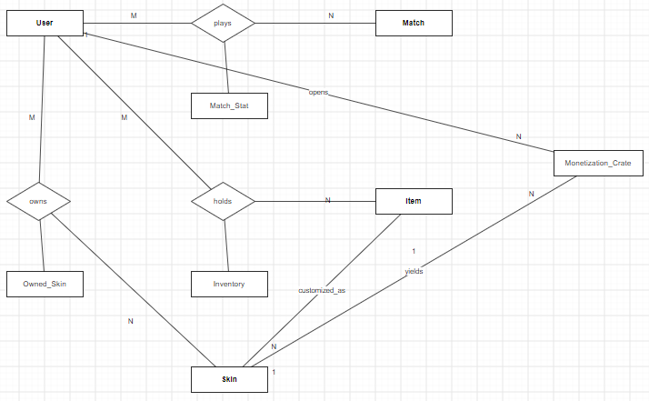
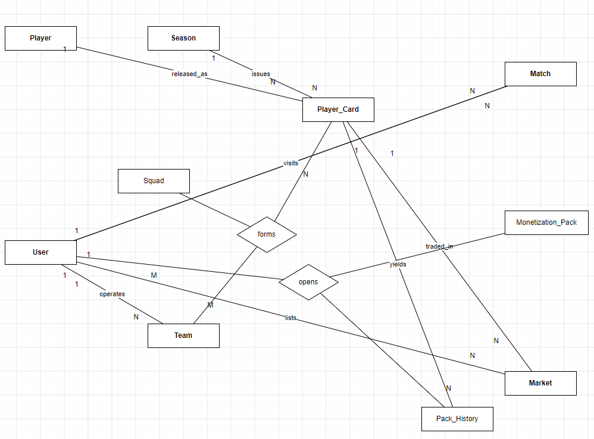
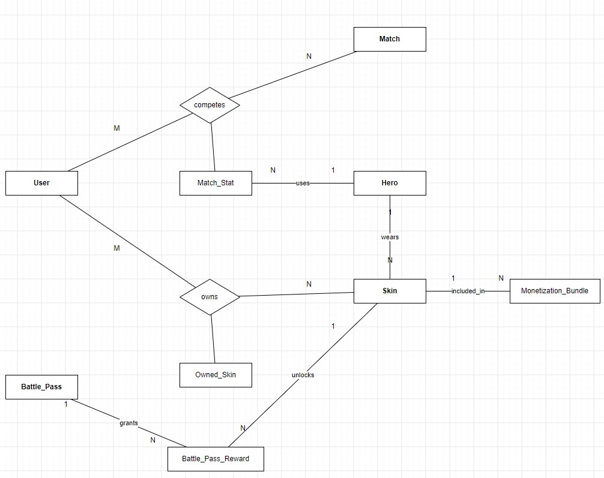

<style>
  /css/
  body 
  {
    background-color: #f8f9fa;
    font-family: 'Malgun Gothic', 'Apple SD Gothic Neo', sans-serif;
    color: #2c3e50;
    line-height: 1.6;
    max-width: 900px;
    margin: 0 auto;
    padding: 40px;
  }

  h1, h2, h3 
  {
    color: #1a252f;
    padding-bottom: 5px;
  }

  table 
  {
    border-collapse: collapse;
    width: 100%;
    background-color: #ffffff;
  }
  th, td 
  {
    border: 1px solid #ddd;
    padding: 8px;
    text-align: left;
  }
  th 
  {
    background-color: #A9A9A9;
  }

  code, pre 
  {
    background-color: #696969;
    color: #f8f8f2;
    font-family: 'Consolas', 'Courier New', monospace;
    border-radius: 5px;
  }
</style>

<h1 align="center">데이터베이스 중간고사 과제 포트폴리오</h1>
<h3 align="center">[게임 관계형 데이터베이스 구조 분석 및 ERD 설계]</h2>

<div align="right">
<b>과제명</b>: 기존 게임의 기능·데이터 분석을 통한 관계형 데이터베이스 구조 설계<br>
<b>이름</b>: 게플2A / 25311012 / 양윤성<br>
<b>작성일</b>: 2026년 9월 29일<br>
</div>


<b>분석 대상 게임</b>:
  1. KRAFTON - PUBG: BATTLEGROUNDS
  2. NEXON - 피파 온라인 4
  3. Blizzard Entertainment - Overwatch

<b>사용 도구</b>: 
- draw.io(Chen 표기법 ERD)
- MySQL Workbench 8.0 CE(EER 모델 - .mwb)
- Notepad++ + MarkdownPanel(보고서)

## 1. 과제 개요 및 분석

### 1.1 과제 목적 및 분석 범위
<span style="font-size: 12px;"> 본 과제는 상용 게임이 실제로 관리하는 데이터를 관계형 데이터베이스 관점에서 역추적하여, 개체(Entity)·속성(Attribute)·키(Key)·관계(Relationship)·카디널리티(Cardinality)를 도출하고
이를 ERD와 관계형 스키마로 표현하는 것을 목적으로 한다. 분석 범위는 각 게임의 핵심 플레이 루프(매치·전적), 자산 관리(인벤토리·스킨·카드), 과금 시스템(재화·확률형 아이템·배틀패스·거래소)의 3개 영역으로 설정하였다. </span>


### 1.2 게임 선정 이유
| 게임 | 장르 | 핵심 과금 모델 | 선정 이유(데이터 관점) |
| :---: | :---: | :---: | :--- |
| 배틀그라운드 | 배틀로얄 FPS | <span style="font-size: 12px;">확률형 크레이트 + 스킨 직접 구매</span> | <span style="font-size: 12px;">매치 단위 일회성 로그가 폭증하는 Write-Heavy 구조 관찰에 적합</span> |
| FIFA 온라인 4 | 스포츠 시뮬레이션 | <span style="font-size: 12px;">확률형 선수 팩 + 유저 간 거래소</span> | <span style="font-size: 12px;">영구 자산(선수 카드)과 유저 주도 경제가 중심인 Read/Transaction-Heavy 구조</span> |
| 오버워치 | 팀 기반 영웅 슈터 | <span style="font-size: 12px;">배틀패스(진행형) + 번들 직접 구매</span> | <span style="font-size: 12px;">시즌제 보상 트랙과 소장품 소유권 관리 구조 관찰에 적합</span> |

<span style="font-size: 12px;"> 세 게임은 모두 "유저, 매치, 전적"이라는 공통 골격을 가지면서도, 장르와 BM에 따라
스키마의 중심축이 어떻게 달라지는지 비교하기에 최적의 조합이라 생각해 선정하게 되었다.</span>

### 1.3 분석 절차
<span style="font-size: 12px;">
1. 게임 플레이 및 UI 관찰 (시스템 목록화) <br>
2. 시스템별 발생 데이터 추출 (개체·속성 후보 도출) <br>
3. 기본키(PK), 외래키(FK), 후보키 결정 <br>
4. 관계 및 카디널리티(1:1, 1:N, M:N) 분석 (M:N은 연관 개체로 분해) <br>
5. 관계형 스키마 표기 및 draw.io Chen 표기법 ERD 작성, MySQL Workbench로 .mwb 모델 검증 <br>
6. 게임별 비교 분석 및 보고서 작성 <br>
</span>

## 2. 게임 1 - 배틀그라운드(PUBG) 데이터베이스 구조 분석

### 2.1 주요 시스템 및 데이터 구조 분석
<span style="font-size: 12px;">배틀그라운드는 최대 100명의 유저가 한 매치에서 생존 경쟁을 하는 배틀로얄 구조로, 
핵심 시스템과 데이터 특성은 다음과 같다.</span>

<b>매치매이킹/매치 시스템</b> 
<br><span style="font-size: 12px;">맵(에란겔, 미라마, 사녹, 론도 등), 모드(Solo/Duo/Squad), 시작·종료 시각이 매치 레코드로 생성된다. 
매치 종료 후 레코드는 통계용으로만 보존되는 준-영구 로그 성격이다.</span><br>

<b>전적/티어 시스템</b>
<br><span style="font-size: 12px;">매치마다 킬, 데스, 어시스트, 가한 피해량, 생존 시간, 순위가 확정되며,
누적 결과로 티어(브론즈~서바이버)가 갱신된다.</span><br>

<b>루팅 및 인벤토리 시스템</b>
<br><span style="font-size: 12px;">매치 내에서 습득한 무기·방어구·부착물·회복 아이템은 매치 한정 인벤토리를 이루며,
매치 종료 시 대부분 소멸한다. 반면 코스튬성 아이템(스킨)은 영구 소장되어 창고 인벤토리로 관리된다.</span><br>

<b>스킨/코스튬 시스템</b>
<br><span style="font-size: 12px;">무기·캐릭터 등 아이템 원본(Item)에 등급별 스킨이 입혀지는 1:N 구조이다.</span><br>

<b>과금 시스템</b>
<br><span style="font-size: 12px;">무과금 재화 BP와 유료 재화 G-Coin의 이중 화폐, 확률형 크레이트, 서바이버 패스 등으로 구성된다.</span><br>

### 2.2 개체 / 속성 / 키 도출
| 개체 | 역할 | 주요 속성 | 키 |
| :--- | :---: | :--- | :--- |
| USER | 계정 | nickname, level, tier, bp_balance, gcoin_balance, created_at | PK: user_id / 후보키: nickname(중복 불가) |
| MATCH | 매치 세션 | map_name, mode, start_time, end_time | PK: match_id |
| MATCH_STAT | 매치별 개인 전적 | kills, deaths, damage_dealt, survival_time, rank | PK: stat_id / FK: match_id, user_id |
| ITEM | 아이템 | item_name, item_type, rarity | PK: item_id |
| INVENTORY | 유저 아이템 | quantity | PK: inventory_id / FK: user_id, item_id |
| SKIN | 코스튬 | skin_name, skin_grade, price_gcoin | PK: skin_id / FK: item_id |
| OWNED_SKIN | 유저 스킨 | acquired_date | PK: owned_id / FK: user_id, skin_id |
| MONETIZATION_CRATE | 인게임 상자 개봉 로그 | crate_type, cost_bp, cost_gcoin, open_time | PK: crate_id / FK: user_id, acquired_skin_id |

### 2.3 개체 간 관계 및 카디널리티 분석
| 관계명 | 참여 개체 | 카디널리티 | 분해 방식 |
| :--- | :--- | :---: | :--- |
| plays | USER - MATCH | M:N | 한 유저는 다수 매치에 참여, 한 매치는 다수 유저가 참여 (연관 개체 MATCH_STAT으로 분해) |
| holds | USER - ITEM | M:N | 한 유저는 다수 아이템 소장, 한 아이템은 다수 유저 소장 (INVENTORY로 분해) |
| owns | USER - SKIN | M:N | 스킨은 중복 소유 및 거래 가능 (OWNED_SKIN으로 분해) |
| customized_as | ITEM - SKIN | 1:N | 하나의 아이템 원본에 여러 등급의 스킨이 존재 |
| opens | USER - MONETIZATION_CRATE | 1:N | 한 유저는 여러 크레이트 개봉 로그를 가짐 |
| yields | SKIN - MONETIZATION_CRATE | 1:N | 하나의 스킨은 여러 개봉 결과 로그에서 등장 가능 |

### 2.4 관계형 데이터베이스 구조(스키마) 표현
```sql
USER (<u>user_id</u>, nickname, level, tier, bp_balance, gcoin_balance, created_at)
```
```sql
MATCH(<u>match_id</u>, map_name, mode, start_time, end_time)
```
```sql
MATCH_STAT(<u>stat_id</u>, match_id, user_id, kills, deaths, damage_dealt, survival_time, rank)
    FK: match_id -> MATCH(match_id) ON DELETE CASCADE
    FK: user_id  -> USER(user_id)   ON DELETE CASCADE
```
```sql
ITEM(<u>item_id</u>, item_name, item_type, rarity)
```
```sql
INVENTORY(<u>inventory_id</u>, user_id, item_id, quantity)
    FK: user_id → USER(user_id), item_id -> ITEM(item_id)
```
```sql
SKIN(<u>skin_id</u>, item_id, skin_name, skin_grade, price_gcoin)
    FK: item_id -> ITEM(item_id)
```
```sql
OWNED_SKIN(<u>owned_id</u>, user_id, skin_id, acquired_date)
    FK: user_id -> USER(user_id), skin_id -> SKIN(skin_id)
```
```sql
MONETIZATION_CRATE(<u>crate_id</u>, user_id, crate_type, cost_bp, cost_gcoin, open_time, acquired_skin_id)
    FK: user_id -> USER(user_id), acquired_skin_id -> SKIN(skin_id) ON DELETE SET NULL
```

### 2.5 과금 시스템 데이터 구조 분석
<b>이중 화폐 구조</b> 
<br><span style="font-size: 12px;">무과금 재화 BP와 유료 재화 G-Coin을 USER 테이블의 별도 잔액 속성으로 분리하여, 결제 기반 재화와 플레이 기반 재화의 회계를 구분한다.</font><br>

<b>확률형 크레이트 로그</b>
<br><span style="font-size: 12px;">MONETIZATION_CRATE는 "어떤 유저가 / 어떤 상자를 / 어느 재화로 / 얼마에 / 언제 열어 / 무엇을 얻었는지"를 하나의 row로 감사(audit) 가능한 구조이다. 
이는 확률형 아이템 확률 공개 제도 대응에 필요한 최소 로그 구조와 일치한다.</font><br>

<b>획득 경로 추적</b>
<br><span style="font-size: 12px;">스킨은 직접 구매·크레이트·이벤트 등 획득 경로가 다양하므로 OWNED_SKIN을 통해 소유 사실만 관리하고, 확률 획득분은 CRATE 로그로 분리하여 두 테이블의 역할을 명확히 한다.</font><br>

### 2.6 ERD

- <span style="font-size: 12px;">마름모 `plays`, `holds`, `owns`는 M:N 관계이며, 각각 `MATCH_STAT` - `INVENTORY` - `OWNED_SKIN` 연관 개체로 구현됨을 다이어그램 상에 함께 표기하였다.</span>
- <span style="font-size: 12px;">동일 구조를 MySQL Workbench에서 Reverse Engineer하여 `양윤성_배틀그라운드.mwb` 모델로 검증하였다.</span>

### 2.7 설계 타당성 및 확장 고려
- <span style="font-size: 12px;">MATCH_STAT은 매치 종료 시점에 대량 INSERT가 발생하므로 (match_id) 기준 파티셔닝, (user_id) 인덱스가 필수적이다.</span>
- <span style="font-size: 12px;">현재 설계에 포함하지 않은 확장 후보로는 스쿼드 파티 매칭(PARTY 개체), 클랜/친구 소셜 개체, 서바이버 패스 보상 트랙이다.</span>

## 3. 게임 2 - 피파 온라인 4 데이터베이스 구조 분석

### 3.1 주요 시스템 및 데이터 구조 분석
<span style="font-size: 12px;">피파 온라인 4는 현실 축구 선수를 카드화하여 수집·조합하고, 유저 간 거래소에서 카드를 매매하는 <b>자산 경제 중심</b> 게임이다.</span>

<b>선수 카드 시스템</b>
<br><span style="font-size: 12px;">현실 선수(Player)는 시즌(Season)별로 별도의 카드(Player_Card)로 발행된다. 즉 "손흥민"이라는 선수 1명에게 20TOTY, 23UCL 등 다수의 시즌 카드가 존재하는 1:N 구조이다. 카드마다 종합 능력치(overall_rating)와 시장 기준 가격이 다르다.</span><br>

<b>팀/스쿼드 시스템</b>
<br><span style="font-size: 12px;">유저는 팀(Team)을 보유하고, 포메이션 포지션별로 카드를 배치(Squad)한다.(팀 -> 카드는 M:N 관계이다)</span><br>

<b>매치 시스템</b>
<br><span style="font-size: 12px;">1:1 대전 결과(스코어)를 저장하며, 한 매치는 정확히 2명의 유저(홈/원정 역할)를 참조한다.</span><br>

<b>거래소(Market) 시스템</b>
<br><span style="font-size: 12px;">유저가 보유 카드를 매물로 등록(가격 - 만료 - 판매 여부)하며, 게임 내 경제의 핵심 테이블이다.</span><br>

<b>과금 시스템</b>
<br><span style="font-size: 12px;">유료 재화로 선수 팩(확률형)을 구매하며, 팩 개봉 결과 카드는 유저 자산 -> 거래소로 순환된다.</span><br>

### 3.2 개체 / 속성 / 키 도출
| 개체 | 역할 | 주요 속성 | 키 |
| :--- | :---: | :--- | :--- |
| USER | 계정 | nickname, level, division, sp_balance(게임 내 포인트), nx_balance(유료 재화) | PK: user_id / 후보키: nickname |
| PLAYER | 현실 선수 | real_name, position, birth_year, nationality | PK: player_id |
| SEASON | 카드 시즌 | season_name, release_year | PK: season_id |
| PLAYER_CARD | 시즌별 카드 | overall_rating, base_price, is_tradeable | PK: card_id / FK: player_id, season_id / 후보키: (player_id, season_id) |
| TEAM | 유저 팀 | team_name, formation | PK: team_id / FK: user_id |
| SQUAD | 팀-카드 배치 | position_in_team | PK: squad_id / FK: team_id, card_id |
| MATCH | 대전 결과 | user1_score, user2_score, match_date | PK: match_id / FK: user1_id, user2_id |
| MARKET | 거래 매물 | price, expiration_date, is_sold | PK: listing_id / FK: card_id, seller_id |
| MONETIZATION_PACK | 상품 팩 | pack_name, cost_sp, cost_nx, guaranteed_rating | PK: pack_id |
| PACK_HISTORY | 팩 개봉 로그 | open_time | PK: history_id / FK: user_id, pack_id, acquired_card_id |

### 3.3 개체 간 관계 및 카디널리티 분석
| 관계명 | 참여 개체 | 카디널리티 | 분해 방식 |
| :--- | :--- | :---: | :--- |
| released_as | PLAYER – PLAYER_CARD | 1:N | 선수 1명당 다수의 시즌 카드 |
| issues | SEASON – PLAYER_CARD | 1:N | 한 시즌은 다수의 카드를 발행 |
| operates | USER – TEAM | 1:N | 한 유저는 다수의 팀(스쿼드 preset) 운영 가능 |
| forms | TEAM – PLAYER_CARD | M:N | 한 팀은 다수 카드, 한 카드는(복제 소유 시) 다수 팀에 배치 → SQUAD로 분해 |
| hosts / visits | USER – MATCH | 1:N (2중 역할) | 매치는 홈·원정 2개의 유저 참조를 가지므로 역할 구분 FK 2개로 표현 |
| lists | USER – MARKET | 1:N | 판매자 1명은 다수의 매물 등록 |
| traded_in | PLAYER_CARD – MARKET | 1:N | 한 카드 종목은 다수의 매물 row로 유통 |
| opens | USER – MONETIZATION_PACK | M:N | 유저–팩 다대다 → PACK_HISTORY로 분해 |
| yields | PLAYER_CARD – PACK_HISTORY | 1:N | 개봉 결과로 특정 카드가 로그에 기록 |

### 3.4 관계형 데이터베이스 구조(스키마) 표현
```sql
USER(<u>user_id</u>, nickname, level, division, sp_balance, nx_balance, created_at)
```
```sql
PLAYER(<u>player_id</u>, real_name, position, birth_year, nationality)
```
```sql
SEASON(<u>season_id</u>, season_name, release_year)
```
```sql
PLAYER_CARD(<u>card_id</u>, player_id, season_id, overall_rating, base_price, is_tradeable)
    FK: player_id → PLAYER(player_id), season_id → SEASON(season_id)
```
```sql
TEAM(<u>team_id</u>, user_id, team_name, formation)
    FK: user_id → USER(user_id)
```
```sql
SQUAD(<u>squad_id</u>, team_id, card_id, position_in_team)
    FK: team_id → TEAM(team_id), card_id → PLAYER_CARD(card_id)
```
```sql
MATCH(<u>match_id</u>, user1_id, user2_id, user1_score, user2_score, match_date)
    FK: user1_id → USER(user_id), user2_id → USER(user_id)
```
```sql
MARKET(<u>listing_id</u>, card_id, seller_id, price, expiration_date, is_sold)
    FK: card_id → PLAYER_CARD(card_id), seller_id → USER(user_id)
```
```sql
MONETIZATION_PACK(<u>pack_id</u>, pack_name, cost_sp, cost_nx, guaranteed_rating)
```
```sql
PACK_HISTORY(<u>history_id</u>, user_id, pack_id, acquired_card_id, open_time)
    FK: user_id → USER(user_id), pack_id → MONETIZATION_PACK(pack_id),
        acquired_card_id → PLAYER_CARD(card_id) ON DELETE SET NULL
```

### 3.5 과금 시스템 데이터 구조 분석
<b>확률형 팩 + 보증 옵션</b>
<br><span style="font-size: 12px;">MONETIZATION_PACK의 guaranteed_rating(최소 보증 능력치) 속성은 확률형 상품의 천장/보증 구조를 스키마 수준에서 표현한 것이다.</span><br>

<b>개봉 로그의 자산 순환</b>
<br><span style="font-size: 12px;">PACK_HISTORY에서 획득한 카드는 USER 자산으로 편입되거나 MARKET 매물로 등록된다. 즉 과금 로그 테이블이 자산 테이블과 거래 테이블로 <b>연결되는 순환 구조</b>가 피파온라인 4 스키마의 가장 큰 특징이다.</span><br>

<b>거래소 무결성</b>
<br><span style="font-size: 12px;">MARKET은 is_sold와 expiration_date를 통해 매물 상태 머신(판매중→판매됨/만료)을 표현하며, 판매 확정 시 소유권 이전 트랜잭션이 발생하므로 격리 수준 관리가 중요한 테이블이다.</span><br>

### 3.6 ERD


- <span style="font-size: 12px;">`forms`(TEAM–PLAYER_CARD)과 `opens`(USER–MONETIZATION_PACK) 두 M:N 관계가 마름모로 표현되고, 각각 SQUAD - PACK_HISTORY 연관 개체가 연결된다.</span>
- <span style="font-size: 12px;">동일 구조를 `양윤성_피파온라인4.mwb` 모델로 검증하였다.</span>

### 3.7 설계 타당성 및 확장 고려
- <span style="font-size: 12px;">MARKET은 가격 - 능력치 기준 탐색이 빈번하므로 (card_id, is_sold), (price) 복합 인덱스가 필요하다.
- <span style="font-size: 12px;">확장 후보로는 카드 강화/훈련 개체, 이벤트 재화 개체, 구매 한도(확률형 규제) 로그이다.

## 4. 게임 3 - 오버워치(Overwatch) 데이터베이스 구조 분석

### 4.1 주요 시스템 및 데이터 구조 분석
<span style="font-size: 12px;">오버워치는 고정된 영웅 풀에서 영웅을 선택해 팀 전투를 치르는 영웅 슈터로, 데이터의 중심은 <b>영웅/스킨 소장권과 시즌 배틀패스 보상 트랙</b>이다.</span>

<b>영웅/역할 시스템</b>
<br><span style="font-size: 12px;">탱커·딜러·지원 역할군을 가진 영웅(Hero)은 고정 마스터 데이터이며, 영웅별 스킨(Skin)이 1:N으로 확장된다.</span><br>

<b>매치/전적 시스템</b>
<br><span style="font-size: 12px;">매치 결과(승리 팀)와 함께, 유저가 해당 매치에서 <b>어떤 영웅으로</b>얼마나 기여(킬·데스·피해·힐)했는지가 전적의 핵심이다. 따라서 전적 테이블은 유저와 매치뿐 아니라 영웅까지 참조한다.</span><br>

<b>소장품 시스템</b>
<br><span style="font-size: 12px;">스킨은 상점 직접 구매, 배틀패스 보상, (구작의) 전리품 상자 등 다양한 출처로 획득되며, 출처(source)를 속성으로 보존한다.</span><br>

<b>배틀패스 시스템</b>
<br><span style="font-size: 12px;">시즌별 패스(Battle_Pass)는 티어 트랙을 가지고, 티어×(무료/프리미엄) 매트릭스로 보상(Battle_Pass_Reward)이 정의된다.</span><br>

<b>과금 시스템</b>
<br><span style="font-size: 12px;">유료 재화 오버워치 코인, 무과금 유산 재화 레거시 크레딧, 번들 상품, 프리미엄 배틀패스로 구성된다.</span><br>

### 4.2 개체 / 속성 / 키 도출
| 개체 | 역할 | 주요 속성 | 키 |
| :--- | :--- | :--- | :--- |
| USER | 계정 | battle_tag, level, endorsement_level, overwatch_coins, legacy_credits | PK: user_id / 후보키: battle_tag |
| HERO | 영웅 마스터 | hero_name, role | PK: hero_id |
| SKIN | 코스튬 | skin_name, rarity, price_coins | PK: skin_id / FK: hero_id |
| MATCH | 매치 세션 | game_mode, map_name, winning_team, start_time, end_time | PK: match_id |
| MATCH_STAT | 영웅별 기여 전적 | kills, deaths, damage, healing | PK: stat_id / FK: match_id, user_id, hero_id |
| BATTLE_PASS | 시즌 패스 | season_name, start_date, end_date, total_tiers | PK: pass_id |
| BATTLE_PASS_REWARD | 티어 보상 정의 | tier_level, is_premium, reward_type, reward_item_id | PK: reward_id / FK: pass_id / 후보키: (pass_id, tier_level, is_premium) |
| OWNED_SKIN | 유저–스킨 소유 | acquired_date, source | PK: owned_id / FK: user_id, skin_id |
| MONETIZATION_BUNDLE | 번들 상품 | bundle_name, price_coins | PK: bundle_id / FK: included_skin_id |

### 4.3 개체 간 관계 및 카디널리티 분석
| 관계명 | 참여 개체 | 카디널리티 | 분해 방식 |
| :--- | :--- | :--- | :--- |
| competes | USER – MATCH | M:N | 한 유저는 다수 매치, 한 매치는 10~12명 참여 → MATCH_STAT으로 분해 |
| uses | MATCH_STAT – HERO | N:1 | 각 전적 row는 사용 영웅 1개를 참조 (영웅별 전적 집계 근거) |
| wears | HERO – SKIN | 1:N | 영웅 1명당 다수 스킨 |
| owns | USER – SKIN | M:N | 유저–스킨 다대다 → OWNED_SKIN(출처 속성 포함)으로 분해 |
| grants | BATTLE_PASS – BATTLE_PASS_REWARD | 1:N | 패스 1개는 다수의 티어 보상 정의 |
| unlocks | SKIN – BATTLE_PASS_REWARD | 1:N | 한 스은 여러 시즌 패스의 보상으로 재활용 가능 |
| included_in | SKIN – MONETIZATION_BUNDLE | 1:N | 한 스킨은 여러 번들 구성에 포함 가능 |

### 4.4 관계형 데이터베이스 구조(스키마) 표현
```sql
USER(<u>user_id</u>, battle_tag, level, endorsement_level, overwatch_coins, legacy_credits, created_at)
```
```sql
HERO(<u>hero_id</u>, hero_name, role)
```
```sql
SKIN(<u>skin_id</u>, hero_id, skin_name, rarity, price_coins)
    FK: hero_id → HERO(hero_id)
```
```sql
MATCH(<u>match_id</u>, game_mode, map_name, winning_team, start_time, end_time)
```
```sql
MATCH_STAT(<u>stat_id</u>, match_id, user_id, hero_id, kills, deaths, damage, healing)
    FK: match_id → MATCH(match_id), user_id → USER(user_id), hero_id → HERO(hero_id)
```
```sql
BATTLE_PASS(<u>pass_id</u>, season_name, start_date, end_date, total_tiers)
```
```sql
BATTLE_PASS_REWARD(<u>reward_id</u>, pass_id, tier_level, is_premium, reward_type, reward_item_id)
    FK: pass_id → BATTLE_PASS(pass_id)
```
```sql
OWNED_SKIN(<u>owned_id</u>, user_id, skin_id, acquired_date, source)
    FK: user_id → USER(user_id), skin_id → SKIN(skin_id)
```
```sql
MONETIZATION_BUNDLE(<u>bundle_id</u>, bundle_name, price_coins, included_skin_id)
    FK: included_skin_id → SKIN(skin_id) ON DELETE SET NULL
```

### 4.5 과금 시스템 데이터 구조 분석

<b>진행형 과금(배틀패스)</b>
<br><span style="font-size: 12px;">BATTLE_PASS_REWARD는 (티어, 프리미엄 여부) 조합마다 보상을 정의하는 <b>정의(definition) 테이블</b>이고, 유저별 진척도는 별도 진척 테이블로 확장 가능한 구조이다. 과금이 "보상 트랙 잠금 해제권 판매" 형태로 모델링된다.</span><br>

<b>직접 구매형 과금(번들/상점)</b>
<br><span style="font-size: 12px;">MONETIZATION_BUNDLE은 코인 가격과 구성 스킨을 가지며, 구매 시 OWNED_SKIN(row의 source='Shop')으로 소유권이 이전된다.</span><br>

<b>출처 추적</b>
<br><span style="font-size: 12px;">OWNED_SKIN.source(Shop/BattlePass/Lootbox) 속성은 획득 경로별 회계·고객지원·확률 규제 대응을 위한 최소 비용 설계이다.</span><br>

<b>이중 재화</b>
<br><span style="font-size: 12px;">유료 코인과 무과금 크레딧을 USER 잔액 속성으로 분리하여 PUBG와 동일한 회계 분리 원칙을 적용한다.</span><br>

### 4.6 ERD


- <span style="font-size: 12px;">`competes`(USER–MATCH)와 `owns`(USER–SKIN) 두 M:N 관계가 마름모로, MATCH_STAT·OWNED_SKIN이 연관 개체로 표기된다.</span>
- <span style="font-size: 12px;">동일 구조를 `양윤성_오버워치.mwb` 모델로 검증하였다.</span>

### 4.7 설계 타당성 및 확장 고려
- <span style="font-size: 12px;">MATCH_STAT에 (user_id, hero_id) 복합 인덱스를 두면 "영웅별 승률·평균 기여" 집계가 효율적이다.</span>
- <span style="font-size: 12px;">확장 후보로는 배틀패스 진척(USER_PASS_PROGRESS 개체), 경쟁전 시즌·순위 개체, 업적 개체이다.</span>

## 5. 3종 게임 데이터베이스 구조 비교 및 분석

### 5.1 구조 비교 종합표
| 비교 항목 | 배틀그라운드 | FIFA 온라인 4 | 오버워치 |
| :--- | :--- | :--- | :--- |
| 스키마 중심축 | MATCH / MATCH_STAT (매치 로그) | PLAYER_CARD / MARKET (자산/경제) | HERO·SKIN·BATTLE_PASS (소장/보상 트랙) |
| M:N 관계 수 | 3 (plays, holds, owns) | 2 (forms, opens) | 2 (competes, owns) |
| 연관(분해) 개체 | MATCH_STAT, INVENTORY, OWNED_SKIN | SQUAD, PACK_HISTORY | MATCH_STAT, OWNED_SKIN |
| 유저 간 거래 경제 | 없음 | <b>있음 (MARKET)</b> | 없음 |
| 재화 구조 | BP + G-Coin | 게임 포인트 + 유료 재화 | 코인 + 레거시 크레딧 |
| 과금 유형 | 확률형 크레이트 + 직접 구매 | 확률형 팩(+보증) + 시장 수수료 | 진행형 배틀패스 + 번들 직접 구매 |
| 전적 데이터 입자도 | 매치 × 유저 | 매치 × 유저(스코어 중심) | <b>매치 × 유저 × 영웅</b> |
| DB 부하 특성 | Write-Heavy (매치당 약 100 row 삽입) | Read/Transaction-Heavy (거래소 탐색·소유권 이전) | Mixed (로그 + 소장권 조회) |

### 5.2 핵심 개체 및 관계 토폴로지 비교
- <b>배틀그라운드</b>는 개체 대부분이 MATCH를 향해 수렴하는 <b>허브형 토폴로지</b>로, 매치가 곧 데이터 생성 이벤트이다.
- <b>FIFA 온라인 4</b>는 PLAYER_CARD를 허브로 USER(소유·배치·매도)와 PACK(획득)이 연결되는 <b>자산 순환형 토로지</b>로, 과금 로그 - 자산 - 거래소로 이어지는 사이클이 존재한다.
- <b>오버워치</b>는 HERO–SKIN의 <b>계층형 마스터 데이터</b> 위에 배틀패스라는 <b>시즌 단위 정의 데이터</b>가 얹히는 형태로, 마스터/트랜잭션 분리가 가장 명확하다.

### 5.3 과금 모델에 따른 데이터 구조 차이
<b>확률형 중심(배틀그라운 & 피파온라인 4)</b>
<br><span style="font-size: 12px;">개봉 로그 테이블(CRATE / PACK_HISTORY)이 필수이며, 결과물이 자산 테이블(Skin / Player_Card)로 연결되는 FK를 가진다. FIFA4는 결과 자산이 다시 MARKET으로 유통되는 2차 연결이 추가된다.

<b>진행형 + 직접 구매 중심(Overwatch)</b>
<br><span style="font-size: 12px;">확률 로그 대신 <b>보상 정의 테이블(BATTLE_PASS_REWARD)</b> 과 소유 출처 속성(source)이 그 자리를 대체한다. 즉 "무작위 결과 기록"이 아니라 "티어 도달에 따른 확정 지급 정의"가 스키마의 핵심이 된다.

<b><br>세 게임 모두 유료/무료 재화를 분리 저장하여 회계 무결성을 확보하는 공통 원칙을 확인하였다.</b>

### 5.4 카디널리티·정규화 관점 비교
- 세 게임 모두 USER–MATCH M:N을 전적 연관 개체로 분해하는 동일 패턴을 공유하나, 오버워치만 전적에 HERO FK가 추가되어 <b>3원 관계(유저–매치–영웅)</b>로 확장된다.
- 피파온라인 4의 (player_id, season_id) 후보키, 오버워치의 (pass_id, tier_level, is_premium) 후보키처럼 <b>비즈니스 규칙이 복합 후보키로 표현</b>되는 지점이 게임별 스키마 성격 차이를 가장 잘 보여준다.
- 모든 스키마는 부분 함수적 종속을 제거한 3NF 형태이며, 반복 그룹(스쿼드 슬롯, 티어 보상)을 별도 테이블로 분리하여 삽입 및 갱신 이상을 방지하였다.

## 6. 결론
이번 중간과제에서 게임별 ERD(Chen 표기법)와 MySQL Workbench EER 모델(.mwb)이 상호 일치함을 확인하였으며,
과금 시스템이 스키마에 미치는 영향(확률 로그 vs 보상 정의 vs 시장 순환)을 비교해 보았다.

## 8. 참고 자료 및 출처
1. KRAFTON, 「PUBG: BATTLEGROUNDS」 공식 사이트, https://pubg.kakaogames.com
2. NEXON, 「EA SPORTS FC Online」 공식 사이트, https://fconline.nexon.com
3. Blizzard Entertainment, 「Overwatch」 공식 사이트, https://overwatch.blizzard.com
4. 각 게임 클라이언트 직접 플레이 및 UI 관찰

