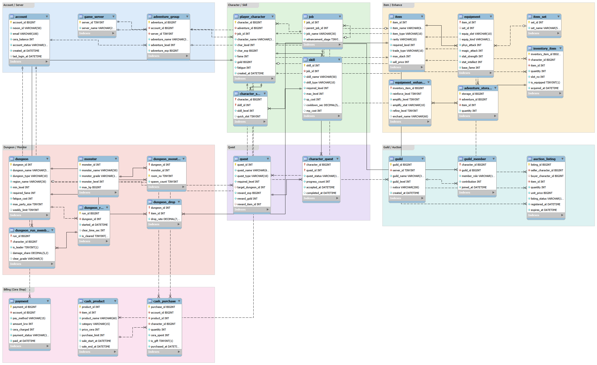
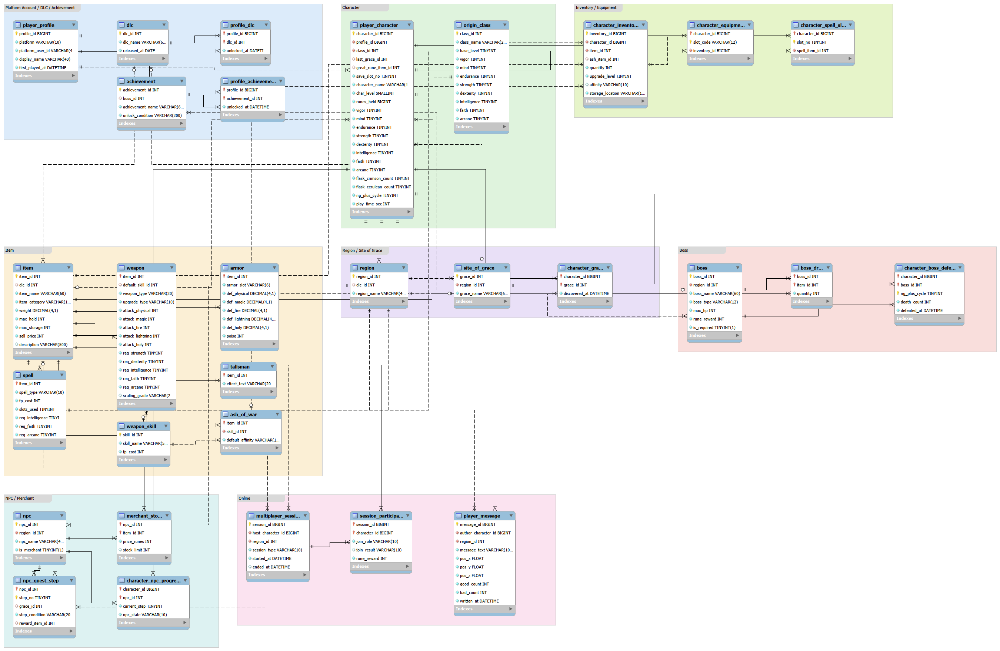
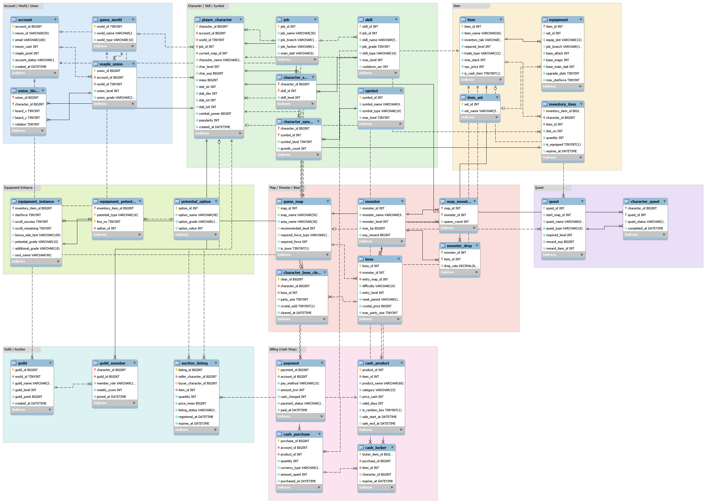
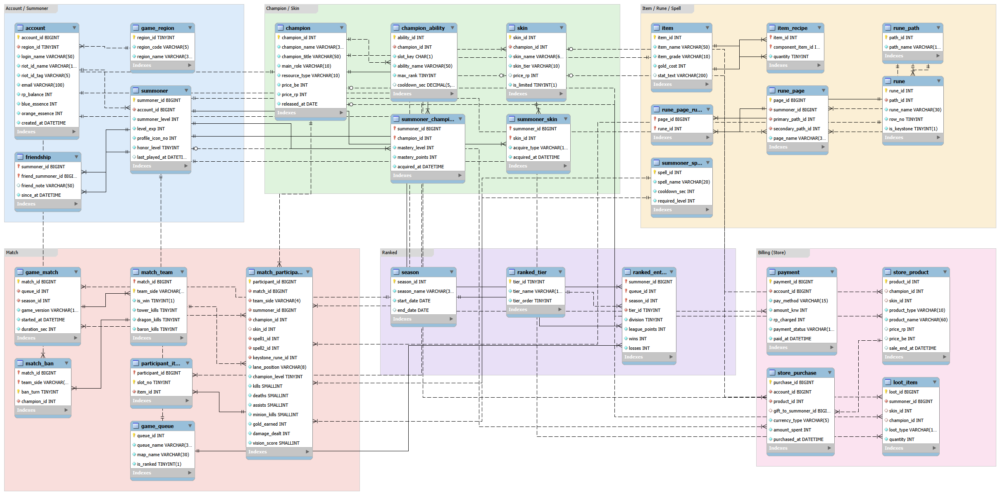

# 게임 데이터베이스 분석 포트폴리오

- 과목: 인터넷프로그래밍
- 학번 / 이름: (작성)
- 분석한 게임: 던전앤파이터, 엘든 링, 메이플스토리, 리그 오브 레전드
- 사용한 프로그램: MySQL Workbench 8.0 CE (Crow's Foot 표기법)

## 0. 들어가며

실제 게임 서버의 데이터베이스는 볼 수 없어서, 게임 화면에 나오는 기능과 숫자를 보고 "이런 테이블이 있겠구나" 하고 생각하면서 만들었습니다.

순서는 이렇게 했습니다.

1. 캐릭터 정보창, 인벤토리, 상점, 경매장 화면에 나오는 데이터를 적었습니다.
2. 따로 존재하는 것은 개체(테이블)로, 화면에 나오는 값은 속성(컬럼)으로 정했습니다.
3. "A 하나가 B를 여러 개 가지는가"를 따져서 관계와 카디널리티를 정했습니다.
4. 다대다 관계는 가운데에 연결 테이블을 하나 더 만들었습니다.
5. MySQL Workbench에서 테이블과 외래 키를 만들고 ERD를 그렸습니다.

게임은 4개를 골랐습니다. 던전앤파이터와 메이플스토리는 캐릭터를 키우는 부분 유료 온라인 게임이고, 엘든 링은 패키지 게임, 리그 오브 레전드는 한 판씩 하는 부분 유료 게임입니다. 서비스 방식과 플레이 방식이 다르면 데이터베이스가 어떻게 달라지는지 비교해 보고 싶었습니다.

속성과 키는 표로 다 적으면 너무 길어져서 ERD에 표시했습니다. ERD에서 노란 열쇠가 기본 키, 빨간 마름모가 외래 키입니다. 보고서에는 개체를 묶음별로 정리하고 중요한 관계만 적었습니다.

제출 파일은 게임별 `.mwb` 파일 4개, ERD 그림(`erd` 폴더), 테이블 생성 SQL(`sql` 폴더)입니다.

---

## 1. 던전앤파이터

### 1.1 주요 시스템

던전앤파이터는 로그인한 다음 서버를 고르고 캐릭터를 선택합니다. 같은 계정, 같은 서버에 있는 캐릭터들은 "모험단"으로 묶여서 모험단 이름과 레벨, 금고를 같이 씁니다. 그래서 계정과 캐릭터 사이에 모험단 테이블을 하나 넣었습니다.

캐릭터마다 레벨, 명성, 골드, 피로도가 따로 있습니다. 직업은 귀검사에서 버서커로 전직하는 것처럼 위아래로 이어져 있어서, 직업 테이블 안에 상위 직업을 가리키는 컬럼을 넣었습니다.

장비는 같은 아이템이라도 사람마다 강화, 증폭, 마법부여가 다릅니다. 그래서 아이템 정보 테이블과 캐릭터가 가진 아이템 테이블을 나누고, 강화 정보는 또 따로 뺐습니다.

던전은 피로도를 쓰고 입장하고, 최대 4명이 파티로 들어갑니다. 한 판이 끝나면 클리어 시간과 등급이 나오기 때문에 던전 플레이 기록 테이블과 참여한 파티원 테이블을 만들었습니다.

그 밖에 퀘스트, 길드, 경매장, 세라샵이 있습니다.

### 1.2 개체 (27개)

- 계정 쪽: account, game_server, adventure_group
- 캐릭터 쪽: player_character, job, skill, character_skill
- 아이템 쪽: item, equipment, item_set, inventory_item, equipment_enhance, adventure_storage
- 던전 쪽: dungeon, monster, dungeon_monster, dungeon_drop, dungeon_run, dungeon_run_member
- 퀘스트: quest, character_quest
- 길드와 거래: guild, guild_member, auction_listing
- 과금: payment, cash_product, cash_purchase

기본 키는 대부분 번호 하나(account_id, character_id 등)로 했습니다. character_skill이나 dungeon_drop 같은 연결 테이블은 외래 키 두 개를 묶어서 기본 키로 썼습니다.

### 1.3 관계와 카디널리티

- account 1 : N adventure_group. 계정 하나가 서버마다 모험단을 하나씩 가집니다.
- adventure_group 1 : N player_character. 모험단 안에 캐릭터가 여러 개 있습니다.
- job 1 : N job. 기본 직업 하나에서 전직 직업이 여러 개 나옵니다.
- player_character M : N skill. 가운데에 character_skill을 두었습니다.
- player_character 1 : N inventory_item. 인벤토리 칸마다 아이템이 하나씩 들어갑니다.
- inventory_item 1 : 0 또는 1 equipment_enhance. 장비일 때만 강화 정보가 있습니다.
- dungeon M : N monster, dungeon M : N item. 각각 dungeon_monster, dungeon_drop으로 연결했습니다.
- dungeon_run M : N player_character. 한 판에 여러 명이 들어가고, 캐릭터는 여러 판을 합니다.
- guild 1 : N guild_member. 캐릭터는 길드에 하나만 가입할 수 있습니다.
- account 1 : N payment, cash_product 1 : N cash_purchase.

### 1.4 과금 구조

던전앤파이터는 돈으로 바로 아이템을 사는 게 아니라 세라를 먼저 충전하고, 그 세라로 세라샵에서 물건을 삽니다. 그래서 충전 내역(payment)과 구매 내역(cash_purchase)을 따로 만들었습니다. 하나로 합치면 "얼마 충전했는지"와 "어디에 썼는지"를 구분하기 어려울 것 같았습니다.

세라는 캐릭터가 아니라 계정에 쌓이기 때문에 잔액은 account 테이블에 넣었습니다. 대신 산 물건은 캐릭터 한 명이 받으니까 구매 내역에는 받는 캐릭터를 적었습니다.

세라샵 상품(cash_product)은 item 테이블을 가리키게 했습니다. 캐시로 산 아바타도 결국 인벤토리에 들어가고 경매장에도 올릴 수 있어서, 아이템을 따로 만들 필요가 없다고 생각했습니다. 기간 한정 상품과 계정당 구매 제한이 있어서 판매 종료일과 구매 제한 컬럼도 넣었습니다.

### 1.5 ERD

---

## 2. 엘든 링

### 2.1 주요 시스템

엘든 링은 게임 계정이 따로 없고 Steam이나 PlayStation 계정으로 실행합니다. 캐릭터는 세이브 슬롯 10칸에 만들 수 있습니다. 그래서 계정 대신 플랫폼 프로필 테이블을 두고, 캐릭터에 슬롯 번호를 넣었습니다.

캐릭터를 만들 때 방랑 기사, 사무라이 같은 소체를 고르는데, 시작 능력치만 다르고 나중에는 자유롭게 키웁니다. 능력치는 생명력, 정신력, 지구력, 근력, 기량, 지력, 신앙, 신비 8개이고 룬을 써서 올립니다. 전직 같은 건 없어서 직업 테이블은 단순합니다.

아이템은 종류마다 가진 정보가 많이 다릅니다. 무기는 공격력과 요구 능력치, 방어구는 컷율과 강인도, 마법은 FP 소모량과 기억 슬롯 수가 있습니다. 한 테이블에 다 넣으면 빈칸이 너무 많아져서 무기, 방어구, 탈리스만, 마법, 전회를 각각 테이블로 나눴습니다.

오픈월드라서 던전 입장 기록 같은 건 없고, 대신 어떤 축복을 찾았는지와 어떤 보스를 잡았는지가 캐릭터마다 저장됩니다. 퀘스트 목록 화면도 없어서 NPC마다 이벤트가 몇 단계까지 진행됐는지를 저장하는 테이블을 만들었습니다.

온라인 요소로는 협력, 침입, 바닥 메시지가 있습니다.

### 2.2 개체 (30개)

- 계정 쪽: player_profile, dlc, profile_dlc, achievement, profile_achievement
- 캐릭터 쪽: player_character, origin_class
- 아이템 쪽: item, weapon, armor, talisman, spell, ash_of_war, weapon_skill
- 캐릭터가 가진 것: character_inventory, character_equipment, character_spell_slot
- 월드: region, site_of_grace, character_grace
- 보스: boss, boss_drop, character_boss_defeat
- NPC: npc, merchant_stock, npc_quest_step, character_npc_progress
- 온라인: multiplayer_session, session_participant, player_message

weapon, armor 같은 종류별 테이블은 item_id를 기본 키이면서 외래 키로 같이 씁니다.

### 2.3 관계와 카디널리티

- player_profile 1 : N player_character. 세이브 슬롯이 10칸이라 최대 10개입니다.
- origin_class 1 : N player_character. 만들 때 소체를 하나 고릅니다.
- item 1 : 0 또는 1 weapon, armor, talisman, spell, ash_of_war. 아이템 종류에 맞는 테이블에만 정보가 있습니다.
- player_character 1 : N character_inventory. 같은 무기라도 강화 수치가 다르면 따로 가지고 있습니다.
- player_character M : N site_of_grace. character_grace로 연결했습니다.
- player_character M : N boss. character_boss_defeat으로 연결했고, 회차도 같이 저장합니다.
- region 1 : N site_of_grace, boss, npc. 지도에서 지역별로 나뉩니다.
- npc M : N item. 상인이 파는 물건 목록(merchant_stock)입니다.
- multiplayer_session M : N player_character. session_participant로 연결했습니다.
- player_profile M : N dlc. profile_dlc로 연결했습니다.

### 2.4 과금 구조

엘든 링은 게임 안에 캐시샵이 없습니다. 게임과 DLC를 Steam 같은 곳에서 한 번 사면 끝입니다. 그래서 결제 테이블이나 구매 내역 테이블은 만들지 않았고, DLC를 가지고 있는지만 저장하는 profile_dlc 테이블 하나만 두었습니다.

게임 안에서 쓰는 돈은 룬인데, 몬스터를 잡아서만 얻을 수 있고 다른 유저와 거래도 안 됩니다. 그래서 따로 테이블을 만들지 않고 캐릭터 테이블에 보유 룬 컬럼만 넣었습니다.

다른 두 게임과 비교하면 결제 관련 데이터가 게임 밖에 있다는 점이 제일 달랐습니다.

### 2.5 ERD

---

## 3. 메이플스토리

### 3.1 주요 시스템

메이플스토리는 월드를 고르고 캐릭터를 만듭니다. 캐릭터 정보창에는 레벨, 메소, STR/DEX/INT/LUK, 전투력, 인기도가 나옵니다.

같은 월드에 있는 캐릭터들은 "유니온"으로 묶입니다. 캐릭터 레벨을 다 더해서 유니온 등급이 정해지고, 전투 지도에 캐릭터를 블록처럼 배치합니다. 던전앤파이터의 모험단과 비슷한 역할이라고 생각해서 계정과 월드마다 유니온을 하나씩 두었습니다.

메이플스토리는 장비 강화 종류가 정말 많습니다. 주문서, 스타포스, 추가 옵션, 잠재능력 3줄, 에디셔널 잠재능력 3줄이 장비 하나에 다 붙습니다. 잠재능력은 줄마다 옵션이 달라서 컬럼으로 넣기 어려웠고, 옵션 목록 테이블과 장비별 잠재능력 테이블을 따로 만들었습니다.

사냥은 던전에 들어가는 게 아니라 맵에서 합니다. 맵마다 나오는 몬스터가 정해져 있고, 아케인포스나 어센틱포스가 필요한 맵도 있습니다. 보스는 난이도마다 입장 레벨과 결정석 가격이 다르고 일주일에 한 번만 잡을 수 있습니다.

그 밖에 심볼, 퀘스트, 길드, 경매장, 캐시샵이 있습니다.

### 3.2 개체 (32개)

- 계정 쪽: account, game_world, maple_union, union_block
- 캐릭터 쪽: player_character, job, skill, character_skill, symbol, character_symbol
- 아이템 쪽: item, equipment, item_set, inventory_item
- 장비 강화: equipment_instance, equipment_potential, potential_option
- 사냥과 보스: game_map, monster, map_monster, monster_drop, boss, character_boss_clear
- 퀘스트: quest, character_quest
- 길드와 거래: guild, guild_member, auction_listing
- 과금: payment, cash_product, cash_purchase, cash_locker

### 3.3 관계와 카디널리티

- account 1 : N player_character, game_world 1 : N player_character.
- account 1 : N maple_union. 유니온은 계정과 월드마다 하나씩입니다.
- maple_union M : N player_character. union_block으로 연결했습니다.
- game_map M : N monster, monster M : N item. 각각 map_monster, monster_drop으로 연결했습니다.
- monster 1 : N boss. 같은 보스가 난이도마다 따로 있습니다.
- inventory_item 1 : 0 또는 1 equipment_instance. 장비일 때만 강화 정보가 있습니다.
- equipment_instance 1 : N equipment_potential. 잠재 3줄, 에디셔널 3줄이라 최대 6개입니다.
- player_character M : N symbol. character_symbol로 연결했습니다.
- player_character M : N boss. 같은 보스를 매주 다시 잡기 때문에 기록마다 번호(clear_id)를 붙였습니다.
- cash_purchase 1 : N cash_locker. 패키지 하나를 사면 아이템이 여러 개 들어옵니다.

### 3.4 과금 구조

메이플스토리는 캐시가 넥슨캐시와 메이플포인트 두 가지입니다. 둘 다 계정에 쌓이기 때문에 account 테이블에 따로따로 넣었고, 구매 내역에는 어느 쪽으로 샀는지 적는 컬럼을 넣었습니다.

던전앤파이터와 다른 점은 캐시 보관함입니다. 캐시샵에서 물건을 사면 바로 캐릭터한테 가지 않고 보관함에 먼저 들어가고, 거기서 원하는 캐릭터로 꺼냅니다. 그래서 cash_locker 테이블을 만들었고, 아직 안 꺼낸 아이템은 캐릭터 칸을 비워 두었습니다.

기간제 아이템이 많아서 상품에는 사용 기간, 받은 아이템에는 만료일을 넣었습니다. 그리고 큐브처럼 잠재능력을 바꾸는 아이템을 캐시로 팔기 때문에, 메이플스토리는 과금이 장비 강화와 바로 이어진다는 것을 알 수 있었습니다. 확률형 아이템인지 구분하는 컬럼도 하나 넣었습니다.

### 3.5 ERD

---

## 4. 리그 오브 레전드

### 4.1 주요 시스템

리그 오브 레전드는 앞의 세 게임과 많이 다릅니다. 캐릭터를 키우는 게임이 아니라, 한 판마다 챔피언을 골라서 5대5로 싸우고 끝나면 처음부터 다시 시작하는 게임입니다. 그래서 캐릭터 테이블이 없고, 대신 한 판의 기록을 저장하는 테이블이 가장 큽니다.

계정은 Riot ID(이름과 태그)로 구분하고, 게임 안에서는 소환사 레벨과 명예 레벨이 있습니다. 결제와 재화는 계정에, 게임 안 정보는 소환사에 넣어서 테이블을 둘로 나눴습니다.

챔피언은 처음부터 다 쓸 수 있는 게 아니라 파랑 정수나 RP로 사야 합니다. 챔피언마다 숙련도 점수도 따로 쌓입니다. 그래서 소환사와 챔피언 사이에 보유 챔피언 테이블을 두고 거기에 숙련도를 넣었습니다. 스킨도 같은 방식입니다.

게임 안에서 사는 아이템은 판이 끝나면 사라집니다. 그래서 인벤토리 테이블이 따로 없고, 전적 화면에 나오는 "마지막에 들고 있던 아이템 6개"만 참가 기록에 붙여서 저장했습니다. 아이템은 하위 아이템을 조합해서 만들기 때문에 조합식 테이블도 만들었습니다.

전적 화면을 보면 한 판에 10명의 챔피언, 킬/데스/어시스트, CS, 골드, 피해량, 룬, 소환사 주문이 다 나옵니다. 팀별로는 승패와 포탑, 드래곤, 바론 처치 수가 나옵니다. 이것을 게임, 팀, 참가자 3단계로 나눠서 저장했습니다.

랭크는 시즌마다 초기화되고 솔로랭크와 자유랭크가 따로 있어서, 소환사, 랭크 종류, 시즌 세 개를 묶어서 기본 키로 썼습니다.

### 4.2 개체 (29개)

- 계정 쪽: account, game_region, summoner, friendship
- 챔피언과 스킨: champion, champion_ability, skin, summoner_champion, summoner_skin
- 아이템, 룬, 주문: item, item_recipe, rune_path, rune, rune_page, rune_page_rune, summoner_spell
- 게임 기록: game_queue, game_match, match_team, match_ban, match_participant, participant_item
- 랭크: season, ranked_tier, ranked_entry
- 과금: payment, store_product, store_purchase, loot_item

match_team은 게임 번호와 팀(BLUE/RED)을 묶어서 기본 키로 썼습니다. match_participant와 match_ban은 이 두 컬럼을 같이 외래 키로 가리킵니다.

### 4.3 관계와 카디널리티

- account 1 : 1 summoner. 계정 하나에 소환사가 하나입니다.
- summoner M : N summoner. 친구 관계라서 friendship으로 연결했습니다.
- summoner M : N champion. summoner_champion으로 연결했고 숙련도를 같이 저장합니다.
- champion 1 : N skin, champion 1 : N champion_ability. 스킬은 챔피언마다 P, Q, W, E, R 5개입니다.
- item M : N item. 조합식이라 item_recipe로 연결했습니다.
- rune_path 1 : N rune, rune_page M : N rune.
- game_match 1 : N match_team. 한 판에 팀이 2개입니다.
- match_team 1 : N match_participant. 한 팀에 5명입니다.
- summoner 1 : N match_participant. 소환사는 여러 판에 참가합니다.
- match_participant 1 : N participant_item. 아이템 칸이 최대 7개입니다.
- summoner 1 : N ranked_entry. 시즌과 랭크 종류마다 하나씩 생깁니다.
- account 1 : N payment, store_product 1 : N store_purchase.

### 4.4 과금 구조

리그 오브 레전드도 RP를 먼저 충전하고 상점에서 쓰는 방식이라 충전 내역(payment)과 구매 내역(store_purchase)을 나눴습니다. 여기까지는 던전앤파이터, 메이플스토리와 같습니다.

다른 점은 파는 물건입니다. 다른 두 게임은 캐시로 강화 재료나 장비에 도움이 되는 아이템도 팔지만, 리그 오브 레전드는 스킨처럼 겉모습만 바꾸는 것을 팝니다. 게임 안 아이템은 골드로만 사고 그 골드는 판마다 0에서 시작합니다. 그래서 과금 테이블이 게임 기록 쪽 테이블과는 거의 이어지지 않고, 챔피언과 스킨 테이블하고만 이어집니다.

챔피언은 RP로도 살 수 있고 게임을 하면 모이는 파랑 정수로도 살 수 있어서, 상품에 가격을 두 가지로 넣고 구매 내역에 어떤 재화로 샀는지 적었습니다.

마법공학 상자를 열면 스킨 파편이 나오고, 파편을 주황 정수로 완성해야 스킨이 됩니다. 바로 스킨이 되는 게 아니라서 전리품 테이블(loot_item)을 따로 만들었습니다.

### 4.5 ERD

---

## 5. 비교 분석

### 5.1 비슷한 점

던전앤파이터, 엘든 링, 메이플스토리는 모두 "캐릭터 - 가지고 있는 아이템 - 아이템 정보" 3단계로 되어 있었습니다. 아이템 정보와 가지고 있는 아이템을 나눠야 같은 아이템이라도 사람마다 강화 상태를 다르게 저장할 수 있기 때문입니다. 리그 오브 레전드는 캐릭터가 없지만 "소환사 - 보유 챔피언 - 챔피언 정보"로 모양은 비슷했습니다.

캐릭터 위에 묶음이 하나씩 있는 것도 같았습니다. 던전앤파이터는 모험단, 메이플스토리는 유니온, 엘든 링은 플랫폼 프로필입니다.

스킬, 드롭 아이템, 보유 챔피언처럼 다대다 관계는 네 게임 모두 가운데에 연결 테이블이 필요했습니다.

부분 유료 게임 3개는 모두 "돈으로 캐시 충전 - 캐시로 상품 구매" 두 단계였고, 충전 내역과 구매 내역 테이블이 따로 있었습니다.

### 5.2 다른 점

과금 테이블 수가 달랐습니다. 던전앤파이터 3개, 메이플스토리 4개, 리그 오브 레전드 4개인데 엘든 링은 하나도 없고 DLC 보유 테이블만 있습니다. 부분 유료 게임은 충전, 상품, 구매 내역을 다 저장해야 하지만 패키지 게임은 결제가 게임 밖에서 끝나기 때문입니다.

과금이 어디와 이어지는지도 달랐습니다. 메이플스토리는 캐시 아이템이 장비 강화와 이어지고, 던전앤파이터는 아이템 테이블과 이어집니다. 리그 오브 레전드는 스킨과 챔피언하고만 이어지고 게임 기록과는 이어지지 않습니다.

저장하는 중심이 달랐습니다. 던전앤파이터, 메이플스토리, 엘든 링은 캐릭터가 중심이고 캐릭터에 레벨, 장비, 퀘스트가 계속 쌓입니다. 리그 오브 레전드는 한 판이 끝나면 레벨과 아이템이 사라지기 때문에 게임 기록(game_match, match_participant)이 중심이고, 계정에는 보유 챔피언과 랭크 점수만 남습니다.

장비 강화 테이블도 달랐습니다. 메이플스토리는 3개, 던전앤파이터는 1개이고 엘든 링은 강화 수치 컬럼만 있습니다. 리그 오브 레전드는 강화가 아예 없습니다.

아이템 종류는 엘든 링이 제일 자세합니다. 무기, 방어구, 탈리스만, 마법, 전회를 다 나눴는데, 다른 게임은 테이블 하나로 충분했습니다.

전투 쪽은 게임 방식대로 나왔습니다. 던전앤파이터는 던전 입장 기록, 메이플스토리는 맵과 몬스터 배치, 엘든 링은 축복과 보스 처치 기록, 리그 오브 레전드는 10명의 전적이 중심입니다.

다른 유저와 이어지는 방식도 달랐습니다. 던전앤파이터와 메이플스토리는 길드와 경매장이 있고, 리그 오브 레전드는 친구와 같은 판에 들어간 기록으로 이어집니다. 엘든 링은 협력이나 침입처럼 잠깐 만나는 기록만 있습니다.

테이블 수는 던전앤파이터 27개, 리그 오브 레전드 29개, 엘든 링 30개, 메이플스토리 32개였습니다.

### 5.3 정리

게임을 어떻게 서비스하고 어떻게 플레이하는지에 따라 데이터베이스 모양이 달라진다는 것을 알았습니다. 계속 운영하는 부분 유료 게임은 계정, 결제, 반복 기록 테이블이 많았고, 패키지 게임은 캐릭터 진행 상황과 월드 정보 테이블이 많았습니다. 같은 부분 유료 게임이어도 캐릭터를 키우는 게임은 캐릭터와 장비 쪽이, 한 판씩 하는 게임은 게임 기록 쪽이 자세하게 나뉘었습니다.

---

## 6. 아쉬운 점

- 실제 서버 구조가 아니라 게임 화면을 보고 생각해서 만든 것입니다.
- 확률이나 데미지 계산처럼 화면에 안 나오는 부분은 자세히 넣지 못했습니다.
- 이벤트, 우편, 채팅은 넣지 않았습니다.

## 7. 참고 자료와 출처

- 던전앤파이터 공식 홈페이지: https://df.nexon.com
- Neople Developers (던전앤파이터 Open API): https://developers.neople.co.kr
- 메이플스토리 공식 홈페이지: https://maplestory.nexon.com
- NEXON Open API (메이플스토리): https://openapi.nexon.com
- ELDEN RING 공식 사이트: https://en.bandainamcoent.eu/elden-ring/elden-ring
- 리그 오브 레전드 공식 홈페이지: https://www.leagueoflegends.com/ko-kr/
- Riot Developer Portal (리그 오브 레전드 API): https://developer.riotgames.com
- MySQL Workbench Manual: https://dev.mysql.com/doc/workbench/en/
- 게임을 직접 실행해서 본 화면 (캐릭터 정보, 인벤토리, 상점, 경매장, 캐시샵, 전적)
