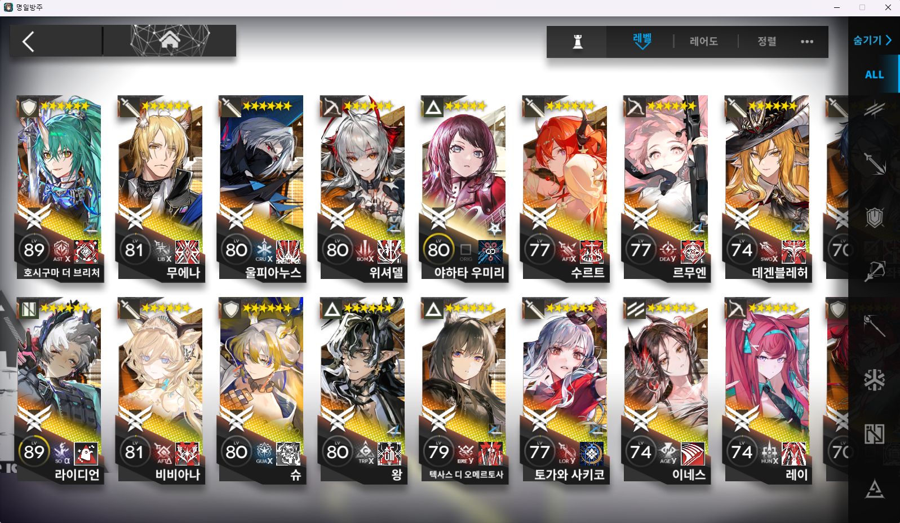
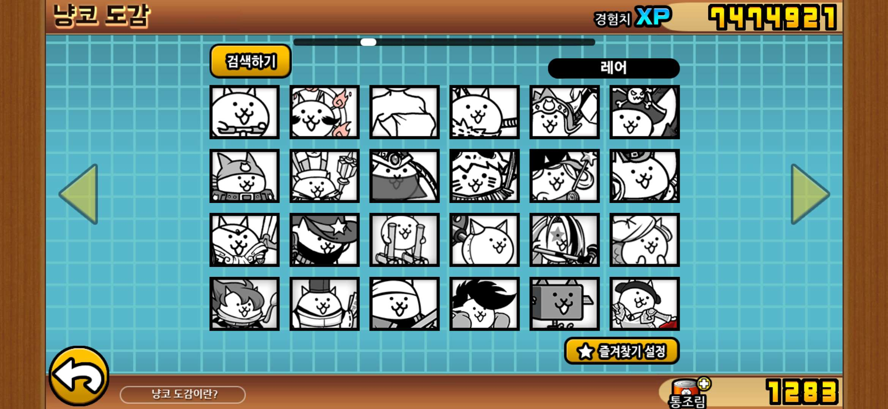
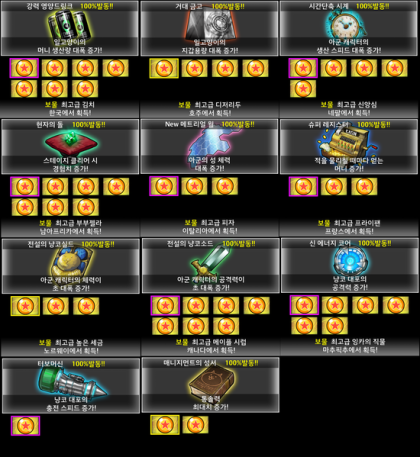
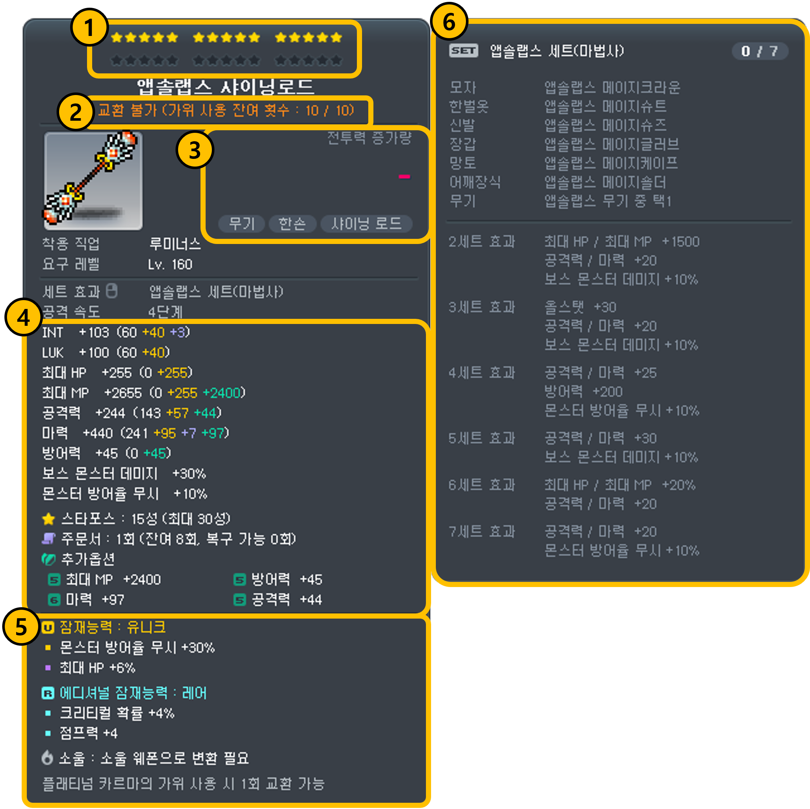

# 게임 데이터베이스 분석 포트폴리오 보고서

## 제1장. 서론

여러 장르의 게임 시스템을 관계형 데이터베이스의 관점에서 분석하였다.

 서로 다른 데이터 구조적 특징을 비교·분석하기 위해, 수집형 전략RPG인 **'명일방주'**, 독특한 계정 버프 시스템을 가진 타워디펜스게임 **'냥코대전쟁'**, 그리고 방대한 대규모 지속성 월드와 복잡한 장비 강화 시스템을 지닌 MMORPG **'메이플스토리'**를 분석 대상으로 선정하였다.
여
---

## 제2장. 게임별 데이터베이스 구조 분석

### 2.1 명일방주 (수집형 전략 RPG)
#### 2.1.1 핵심 시스템 및 데이터 흐름 분석
명일방주는 유저가 스테이지를 소모 이성(스태미나)에 따라 클리어하고, 재화를 모아 가챠를 통해 오퍼레이터를 획득·육성하는 흐름을 가진다. 오퍼레이터 도감과 유저가 실제 보유한 오퍼레이터는 1:N 관계로 맵핑되어 독립적인 육성 상태를 저장한다. 각 스테이지는 다양한 기믹을 제공하여 매 전투마다 색다른 전략을 경험하게 하며, 고난도 이벤트에서 고득점을 위한 동기를 이끌어내기도한다.

#### 2.1.2 개체(Entity), 속성(Attribute), 키(Key) 도출
*   **userTBL (유저):** `userID(PK)`, 닉네임, 레벨, 최대경험치, 현재 경험치, 생성일
*   **operator (오퍼레이터 기본 정보):** `오퍼레이터ID(PK)`, 이름, 성별, 레어도(1~6성), 포지션(ex-가드, 메딕 등)
*   **user_operator (유저 보유 오퍼레이터):** `보유ID(PK)`, `UID(FK)`, `오퍼레이터ID(FK)`, 최대레벨, 현재레벨, 정예화단계(0~2), 잠재력단계(0~6), 스탯
*   **stage (스테이지):** `스테이지ID(PK)`, 스테이지이름,  소모 이성, 등장 적의 수, 처치 적의 수, 최초 클리어 보상
*   **user_stage (스테이지 클리어 기록):** `기록ID(PK)`, `UID(FK)`, `스테이지ID(FK)`, 클리어한 스테이지들ID, 클리어안한 스테이지ID

#### 2.1.3 과금 및 가챠 시스템 데이터 구조
가챠 배너별 독립된 천장 스택을 관리하는 구조이다. 유저의 인벤토리 재화 소모와 함께 가챠 로그가 유기적으로 맵핑된다.
*   **gacha_banner (가챠 배너):** `배너ID(PK)`, 확률업오퍼레이터ID, 시작일시, 종료일시, 배너명, 뽑기시 소모되는 재화
*   **inventory (유저 재화):** `인벤토리ID(PK)`, `userID(FK)`, 용문폐, 합성옥수량, 순오리지늄수량, 스킬개론수량, 작전기록수량, 육성재료수량
*   **gacha_log (가챠 상세 로그):** `로그ID(PK)`, `userID(FK)`, `오퍼레이터ID(FK)`, `배너ID(FK)`, 일시

---

### 2.2 냥코대전쟁 (타워 디펜스)
#### 2.2.1 핵심 시스템 및 데이터 흐름 분석
유저는 세계편, 미래편 등 장(Chapter)별 스테이지를 클리어하여 고유의 보물을 수집할 수 있다. 수집된 보물의 등급 조합에 따라 전체 캐릭터에 적용되는 패시브 버프가 상시 계산되는 데이터 흐름을 지닌다. 수많은 스테이지에서 다양한 전략을 경험하고, 취향의 캐릭터를 뽑아 즐거움을 얻는다. 

#### 2.2.2 개체(Entity), 속성(Attribute), 키(Key) 도출
*   **User (유저):** `userID(PK)`, 유저랭크(캐릭 레벨총합), 통솔력최대치, 현재통솔력, 보유통조림량, 보유XP
*   **catTBL (냥코 캐릭터 도감):** `캐릭터ID(PK)`, 이름, 등급(기본~레전드레어), 최대레벨, 최대진화단계
*   **user_Cat (유저 보유 캐릭터):** `보유ID(PK)`, `유저코드(FK)`, `캐릭터ID(FK)`, 현재레벨, 플러스레벨, 현재진화단계, 스탯
*   **stage (스테이지):** `스테이지ID(PK)`, `장분류ID(FK)`, 스테이지명, 소모통솔력, 최초클리어보상
*   **chapter (장 분류):** `장분류ID(PK)`, 장이름(ex - 세계편, 미래편) 
*   **user_stage (스테이지 클리어 기록):** `기록ID(PK)`, `유저코드(FK)`, `스테이지ID(FK)`, 클리어여부

#### 2.2.3 과금 및 보물 버프 시스템 데이터 구조
보물 도감과 유저의 획득 현황을 1:N으로 연결하여, 특정 장의 보물이 모두 금 등급인지 여부를 판별하는 구조를 가진다.
*   **treasure (보물 도감):** `보물ID(PK)`, `스테이지ID(FK)`, 보물이름, 버프종류(ex - 공격력증가, 캐릭터생산속도증가)
*   **user_treasure (유저 보물 수집 현황):** `수집ID(PK)`, `유저코드(FK)`, `보물ID(FK)`, 보물등급(금, 은, 동)
*   **gacha_log (뽑기/과금 로그):** `로그ID(PK)`, `유저코드(FK)`, `캐릭터ID(FK)`, 소모통조림수, 일시

---

### 2.3 메이플스토리 (MMORPG)
#### 2.3.1 핵심 시스템 및 데이터 흐름 분석 (계정-캐릭터-월드 관계)
하나의 계정이 다수의 월드(서버)를 이용할 수 있고, 월드 내에 종속된 다수의 캐릭터를 다양한 스킬을 활용하여 육성할 수 있다. 재화 및 창고는 월드 단위 혹은 계정 단위(캐시)로 공유되는 계층적 데이터 흐름을 가진다.

#### 2.3.2 개체(Entity), 속성(Attribute), 키(Key) 도출
*   **user (계정):** `계정ID(PK)`, 이메일, 가입일, 넥슨캐시, 메이플포인트, 마일리지
*   **character (캐릭터):** `캐릭터ID(PK)`, `계정ID(FK)`, 월드ID, 이름, 직업, 레벨, 최대경험치, 현재경험치, 메소보유량
*   **Item (아이템 기본 도감):** `아이템ID(PK)`, 이름, 분류(장비, 소비, 기타, 설치, 캐시), 기본스탯(장비 - 기본공격력, 기본방어력, 최대업그레이드횟수 등)
*   **inventory (캐릭터 인벤토리):** `인벤토리ID(PK)`, `캐릭터ID(FK)`, `아이템ID(FK)`, 슬롯타입, 슬롯위치, 보유수량
* **skill (스킬 기본 도감):** `스킬ID(PK)`, 마스터레벨, 스킬이름, 스킬설명

#### 2.3.3 큐브/확률형 과금 및 장비 강화 데이터 구조
동일한 베이스 아이템이라도 스타포스 강화, 잠재능력 등 유저 고유의 강화 인스턴스 값이 무수히 파생되므로 독립된 개별 장비 스탯 테이블과 변경 이력 로그 테이블이 필수적이다.
*   **user_equipment (유저 실제 장비):** `장착ID(PK)`, `캐릭터ID(FK)`, `아이템ID(FK)`, 장착부위, 업그레이드적용횟수, 스타포스수치, 잠재능력옵션(잠재능력, 에디셔널 잠재능력)
*   **cube(큐브 과금/강화 로그):** `로그ID(PK)`, `캐릭터ID(FK)`, `장착ID(FK)`, 변경전잠재옵션, 변경후잠재옵션, 사용메소/캐시, 일시

#### 2.3.4 맵(위치) 시스템 데이터 구조
메이플스토리는 서로 다른 월드('스카니아', '루나' 등)에 각각 독립된 캐릭터를 육성할 수 있다. 월드 간에는 캐릭터, 메소, 인벤토리가 완전히 격리되지만, 계정 내 유니온이나 캐시숍 재화 등은 월드 내(또는 월드 간) 공유되는 복잡한 계층 구조를 지닙니다. 또한 하나의 월드는 실시간 유저 분산을 위해 여러 개의 '채널'을 가진다.
• world (월드): `월드ID(PK)`, 월드이름, 채널 수
• map (맵 기본 도감): `맵ID(PK)`, 맵이름,
• characterLocation (캐릭터 실시간 위치): `위치ID(PK`), `캐릭터ID(FK)`, `현재맵ID(FK)`, 현재채널번호
---

## 제3장. 게임 데이터베이스 구조 비교·분석

### 3.1 장르별 데이터 모델링 차이점
*   **수집형/세션형 (명일방주, 냥코):** 유저와 도감(오퍼레이터, 캐릭터) 간의 다대다(N:M) 관계 해소 및 보유 정보 관리가 핵심이며, 상대적으로 테이블 구조가 정형화되어 있다.
*   **MMORPG (메이플스토리):** 계정-월드-캐릭터의 깊은 계층 구조를 가지며, 필드 드롭 및 거래가 가능한 개별 아이템 인스턴스의 고유 식별 및 상태 추적이 필수적이다.

### 3.2 유저 보유 캐릭터/아이템 강화 방식에 따른 테이블 확장성 비교
*   **캐릭터 강화 (명일방주, 냥코):** 레벨, 돌파 단계 등 고정된 규격의 컬럼 추가로 해결 가능하다.
*   **아이템 강화 (메이플스토리):** 가변적인 잠재능력 옵션, 추가옵션 등 유동적이고 방대한 데이터를 처리해야 하므로 별도의 옵션 맵핑 테이블이나 유연한 구조 설계가 요구된다.

### 3.3 과금 모델(BM) 구조의 복잡도 및 트랜잭션 비교
*   **명일방주/냥코:** 가챠 시점에 재화 차감 및 캐릭터 즉시 획득이라는 비교적 단순한 단발성 트랜잭션 위주이다.
*   **메이플스토리:** 캐시숍 구매뿐만 아니라 유저 간 거래(경매장), 큐브 사용에 따른 실시간 옵션 롤백/적용 등 동시다발적인 대량의 트랜잭션 및 정밀한 이력(Log) 관리가 동반된다.

---

## 제4장. 결론 및 고찰

### 4.1 과제 요약
3종의 게임 분석을 통해 장르별 핵심 재미 요소가 데이터베이스 설계에 반영되는 방식을 확인하였다. 관계형 데이터베이스의 무결성을 유지하면서도 대규모 게임 데이터의 효율적인 조회를 위한 테이블 분리 및 인덱싱 설계의 중요성을 도출하였다.

### 4.2 게임 데이터베이스 설계 시 고려해야 할 시사점
실시간 데이터 변화가 잦은 게임 데이터베이스 특성상 지나친 정규화는 조인(Join) 성능 저하를 야기할 수 있으므로, 로그 테이블의 독립성과 조회용 테이블의 적절한 반정규화 타협점을 찾는 것이 실무 설계의 핵심임을 인지하였다.

---

## 제5장. 참고 자료 및 출처
*   명일방주 인게임 시스템 가이드 및 헤드헌팅 확률 정보 공시
*   냥코대전쟁 위키 데이터베이스 (스테이지 및 보물 수집 효과 부문)
*   메이플스토리 공식 홈페이지 (확률형 아이템 및 장비 강화 가이드라인)
