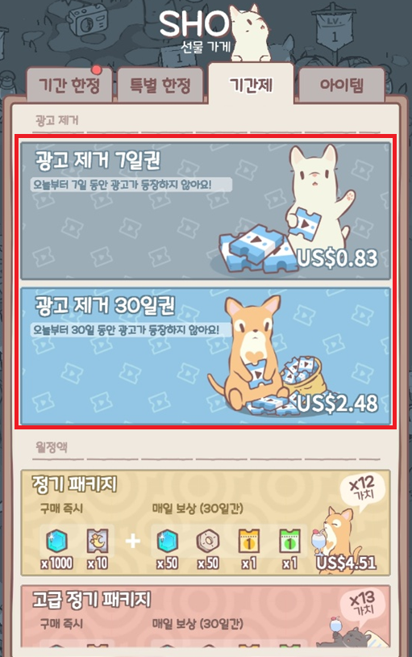
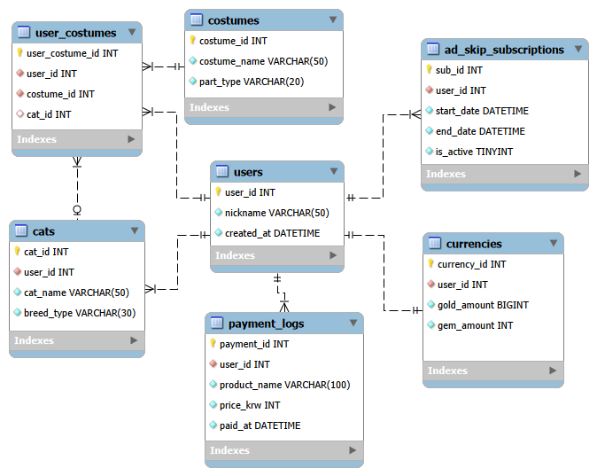
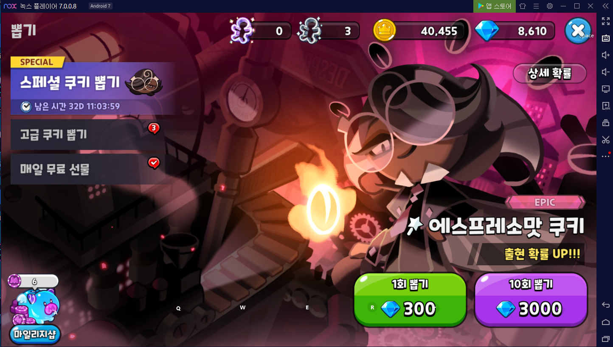
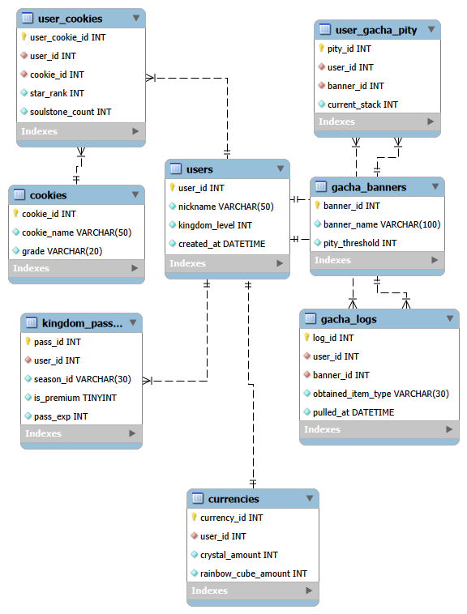
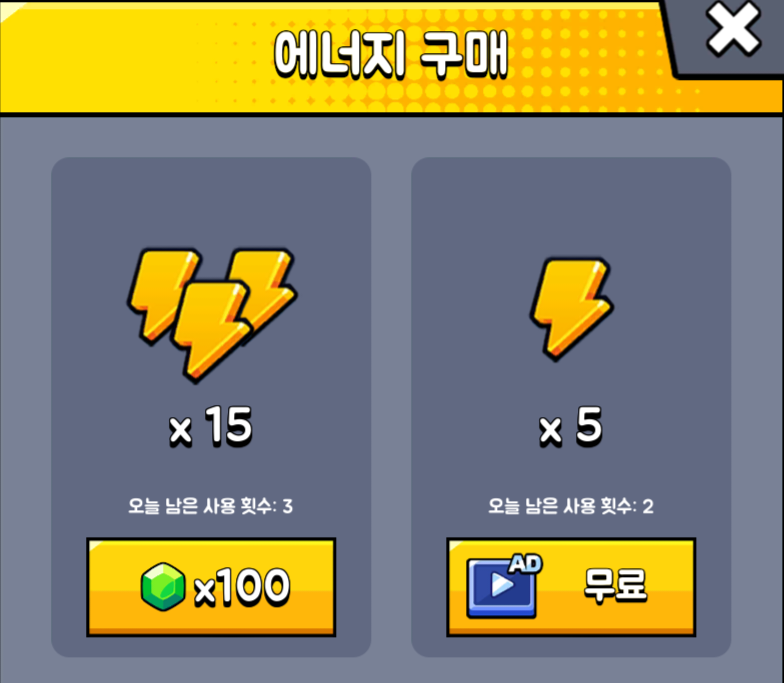
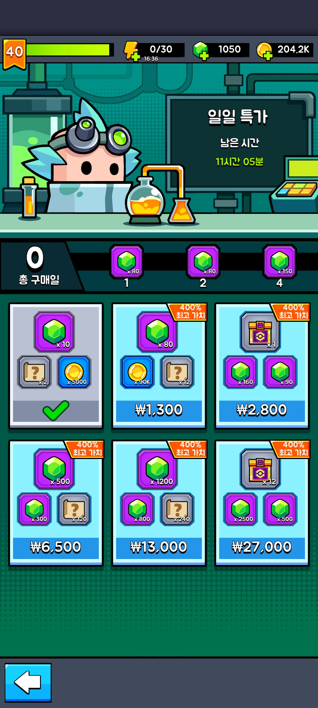
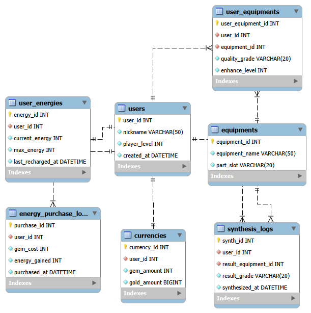

# [보고서] 게임 데이터베이스 분석 포트폴리오

- **제출자:** 게플2A 25311017 이하영

---

## 1. 서론 (Introduction)

### 1.1 분석 목적

본 포트폴리오는 기존 출시된 모바일 게임 3종을 대상으로, 각 게임의 핵심 기능과 시스템이 관계형 데이터베이스(RDBMS) 관점에서 어떻게 구조화되는지 분석하고 추론하여 설계하는 것을 목적으로 한다.

유저의 결제 정보와 게임 재화, 가챠(확률형 뽑기), 구독형 패스, 스테미나 충전 등의 시스템이 데이터베이스 테이블 및 관계(Relationship)로 어떻게 연결되는지 명확히 입증하고자 한다.

### 1.2 분석 대상 게임 선정

서로 다른 장르와 과금 체계를 가진 3종의 게임을 비교 분석 대상으로 선정하였다.

1. **고양이와 스프 (Cats & Soup):** 힐링 방치형 시뮬레이션
    - *주요 과금 BM:* 광고 제거 VIP 패스, 기간제 구독, 확정형 패키지 상품 및 코스튬 수집
2. **쿠키런: 킹덤 (Cookie Run: Kingdom):** 수집형 RPG + 영지 경영
    - *주요 과금 BM:* 확률형 뽑기(가챠), 천장(Pity) 스택 시스템, 영혼석 조각 누적, 킹덤 패스(배틀 패스)
3. **탕탕특공대 (Survivor.io):** 캐주얼 뱀서라이크 / 방치형 RPG
    - *주요 과금 BM:* 행동력(에너지) 소비 및 충전, 부활권, 장비 가챠 및 합성(Merge) 등급 시스템

---

## 2. 게임별 데이터베이스 구조 및 과금(BM) 분석

---

### 2.1 고양이와 스프 (Cats & Soup)

#### (1) 게임 주요 시스템 및 데이터 구조 분석

- **생산 및 배치 시스템:** 유저가 얻은 고양이를 특정 요리 시설에 배치하여 골드를 자동 생산함.
- **코스튬 및 수집 시스템:** 고양이에게 옷, 모자, 액세서리를 착용시켜 능력치를 향상시킴.
- **과금(BM) 시스템:**
    - **광고 제거 패스:** 매번 광고를 시청해야 얻는 버프/보상을 유료 결제를 통해 즉시 수령하는 기간제 구독 형태.
    - **한정 패키지:** 현금 결제 시 특정 아이템/재화를 즉시 지급.

#### (2) 개체(Entity), 속성(Attribute), 키(Key) 및 제약조건 도출

1. `users` (유저)
    - `user_id` (PK, INT, NN, AI) : 유저 고유 번호
    - `nickname` (VARCHAR(50), NN) : 유저 닉네임
    - `created_at` (DATETIME, NN) : 계정 생성일
2. `currencies` (유저 재화)
    - `currency_id` (PK, INT, NN, AI) : 재화 레코드 ID
    - `user_id` (FK, INT, NN) : 유저 고유 번호 (`users` 참조)
    - `gold_amount` (BIGINT, NN) : 보유 골드 (단위가 크므로 BIGINT)
    - `gem_amount` (INT, NN) : 보유 유료 보석
3. `cats` (고양이)
    - `cat_id` (PK, INT, NN, AI) : 고양이 고유 ID
    - `user_id` (FK, INT, NN) : 소유 유저 ID (`users` 참조)
    - `cat_name` (VARCHAR(50), NN) : 고양이 이름
    - `breed_type` (VARCHAR(30), NN) : 묘종 (예: 렉돌, 페르시안)
4. `costumes` (코스튬 도감)
    - `costume_id` (PK, INT, NN, AI) : 코스튬 ID
    - `costume_name` (VARCHAR(50), NN) : 코스튬 이름
    - `part_type` (VARCHAR(20), NN) : 부위 (모자/옷/액세서리)
5. `user_costumes` (유저 보유 코스튬)
    - `user_costume_id` (PK, INT, NN, AI) : 인벤토리 ID
    - `user_id` (FK, INT, NN) : 유저 ID (`users` 참조)
    - `costume_id` (FK, INT, NN) : 코스튬 ID (`costumes` 참조)
    - `cat_id` (FK, INT, NULLABLE) : 착용 중인 고양이 ID (미착용 시 NULL, `cats` 참조)
6. `ad_skip_subscriptions` (광고스킵 패스 - 과금 DB)
    - `sub_id` (PK, INT, NN, AI) : 구독 ID
    - `user_id` (FK, INT, NN) : 유저 ID (`users` 참조)
    - `start_date` (DATETIME, NN) : 구독 시작일
    - `end_date` (DATETIME, NN) : 구독 만료일
    - `is_active` (TINYINT/BOOLEAN, NN) : 현재 적용 여부
7. `payment_logs` (결제 이력 - 과금 DB)
    - `payment_id` (PK, INT, NN, AI) : 결제 고유 번호
    - `user_id` (FK, INT, NN) : 결제 유저 ID (`users` 참조)
    - `product_name` (VARCHAR(100), NN) : 구매 상품명
    - `price_krw` (INT, NN) : 결제 금액 (한국 원화)
    - `paid_at` (DATETIME, NN) : 결제 일시

#### (3) 개체 간 관계 및 카디널리티 (Crow's Foot)

- `users` : `currencies` = **1 : 1** (유저는 단 하나의 재화 정보 테이블을 가짐)
- `users` : `cats` = **1 : N** (한 유저는 여러 마리의 고양이를 소유할 수 있음)
- `users` : `user_costumes` = **1 : N** (한 유저는 여러 코스튬을 보유할 수 있음)
- `costumes` : `user_costumes` = **1 : N** (한 코스튬 도감 항목은 여러 유저에게 소유될 수 있음)
- `cats` : `user_costumes` = **1 : N (Optional)** (한 고양이는 부위별로 여러 코스튬을 착용할 수 있으며, cat_id를 통해 현재 착용 중인 코스튬을 연결함)
- `users` : `ad_skip_subscriptions` = **1 : N** (시간 경과에 따라 유저는 여러 번 구독 결제를 갱신할 수 있음)
- `users` : `payment_logs` = **1 : N** (유저는 여러 번의 상품 결제 이력을 가짐)

#### (4) 과금(BM) 구조와 DB 설계의 관계

- **재화 인플레이션과 광고 시청:**
  - 후반 콘텐츠로 진입할수록 요구 재화량과 음식 판매 단가 간의 격차가 커지는 방치형 게임 특유의 구조를 가진다.
  - 유저는 재화 부족을 보충하기 위해 광고 시청을 반복적으로 이용할 수 있으며, 이 과정에서 광고 시청에 대한 피로도가 발생할 수 있다고 추론하였다.

- **광고 제거 상품의 기간제 구조와 DB 설계:**
  - 광고 제거 상품이 일회성 구매뿐 아니라 기간제 형태로도 제공되므로, 결제 시점만이 아니라 효과의 시작일과 만료일을 함께 관리할 필요가 있다.
  - 따라서 결제 이력을 저장하는 `payment_logs`와 별도로, 광고 제거 효과의 기간과 적용 상태를 관리하는 `ad_skip_subscriptions` 테이블을 도출하였다.
  - `start_date`, `end_date`를 통해 만료 여부를 판단하고, `is_active`로 현재 적용 상태를 빠르게 조회할 수 있도록 설계하였다. (단, `is_active`는 `end_date`로 계산할 수 있는 파생 속성이므로 조회 성능을 위해 둔 의도적 중복이다.)
  - 한 유저가 구독을 여러 번 갱신할 수 있으므로 `users : ad_skip_subscriptions`를 1:N 관계로 설계하였다.

---

### 2.2 쿠키런: 킹덤 (Cookie Run: Kingdom)

#### (1) 게임 주요 시스템 및 데이터 구조 분석

- **수집 및 승급 시스템:** 가챠를 통해 쿠키를 획득하거나 영혼석(조각)을 모아 완제 쿠키로 교환/승급(성급 올리기)함.
- **과금(BM) 시스템:**
    - **가챠 & 천장 시스템:** 유료 재화(크리스탈/무지개큐브)로 뽑기를 진행하며, 일정 횟수 도달 시 확정 쿠키를 제공하는 천장 스택 데이터 관리.
    - **킹덤 패스:** 시즌 단위로 운영되며 유료 구매 시 전용 건물 및 추가 보상 트랙 활성화.

#### (2) 개체(Entity), 속성(Attribute), 키(Key) 및 제약조건 도출

1. `users` (유저)
    - `user_id` (PK, INT, NN, AI) : 유저 ID
    - `nickname` (VARCHAR(50), NN) : 킹덤명
    - `kingdom_level` (INT, NN) : 왕국 레벨
    - `created_at` (DATETIME, NN) : 계정 생성일
2. `cookies` (쿠키 도감)
    - `cookie_id` (PK, INT, NN, AI) : 쿠키 ID
    - `cookie_name` (VARCHAR(50), NN) : 쿠키 이름
    - `grade` (VARCHAR(20), NN) : 등급 (EPIC, ANCIENT, LEGENDARY 등)
3. `user_cookies` (유저 소유 쿠키/영혼석)
    - `user_cookie_id` (PK, INT, NN, AI) : 유저 쿠키 ID
    - `user_id` (FK, INT, NN) : 유저 ID (`users` 참조)
    - `cookie_id` (FK, INT, NN) : 쿠키 ID (`cookies` 참조)
    - `star_rank` (INT, NN) : 승급 등급 (0~5성)
    - `soulstone_count` (INT, NN) : 보유 중인 영혼석 개수
4. `gacha_banners` (가챠 배너 - 과금 DB)
    - `banner_id` (PK, INT, NN, AI) : 배너 ID
    - `banner_name` (VARCHAR(100), NN) : 픽업 이벤트명
    - `pity_threshold` (INT, NN) : 천장 도달 기준 횟수 (예: 200회)
5. `user_gacha_pity` (유저 천장 스택 - 과금 DB)
    - `pity_id` (PK, INT, NN, AI) : 스택 ID
    - `user_id` (FK, INT, NN) : 유저 ID (`users` 참조)
    - `banner_id` (FK, INT, NN) : 배너 ID (`gacha_banners` 참조)
    - `current_stack` (INT, NN) : 현재 누적 뽑기 횟수
6. `gacha_logs` (가챠 결과 로그 - 과금 DB)
    - `log_id` (PK, INT, NN, AI) : 로그 ID
    - `user_id` (FK, INT, NN) : 유저 ID (`users` 참조)
    - `banner_id` (FK, INT, NN) : 배너 ID (`gacha_banners` 참조)
    - `obtained_item_type` (VARCHAR(30), NN) : 획득 유형 (COOKIE / SOULSTONE)
    - `pulled_at` (DATETIME, NN) : 뽑기 실행 시각
7. `kingdom_passes` (킹덤패스 - 과금 DB)
    - `pass_id` (PK, INT, NN, AI) : 패스 ID
    - `user_id` (FK, INT, NN) : 유저 ID (`users` 참조)
    - `season_id` (VARCHAR(30), NN) : 시즌 코드
    - `is_premium` (TINYINT/BOOLEAN, NN) : 유료 패스 구매 여부
    - `pass_exp` (INT, NN) : 패스 경험치
8. `currencies` (유저 재화)
    - `currency_id` (PK, INT, NN, AI) : 재화 레코드 ID
    - `user_id` (FK, INT, NN) : 유저 ID (`users` 참조)
    - `crystal_amount` (INT, NN) : 보유 크리스탈
    - `rainbow_cube_amount` (INT, NN) : 보유 무지개큐브

#### (3) 개체 간 관계 및 카디널리티 (Crow's Foot)

- `users` : `user_cookies` = **1 : N** (유저는 여러 종류의 쿠키/영혼석을 보유)
- `cookies` : `user_cookies` = **1 : N** (하나의 쿠키 종류는 여러 유저의 인벤토리에 존재)
- `users` : `user_gacha_pity` = **1 : N** (유저는 배너별로 각각의 천장 스택을 가짐)
- `gacha_banners` : `user_gacha_pity` = **1 : N** (배너마다 수많은 유저의 스택이 기록됨)
- `users` : `gacha_logs` = **1 : N** (유저의 뽑기 행위는 무수히 많은 로그를 남김)
- `users` : `kingdom_passes` = **1 : N** (유저는 시즌마다 패스 구매 기록을 남김)
- `users` : `currencies` = **1 : 1** (유저당 하나의 재화 정보 테이블을 가짐)

#### (4) 트랜잭션(Transaction) 및 ACID 무결성 보장 구조

- 유저가 가챠(뽑기)를 진행할 때, 다음과 같은 연관 작업들이 하나의 원자적 트랜잭션(Atomicity Transaction) 단위로 일괄 처리되어야 함:
    1. `currencies` 테이블의 유료 재화(크리스탈 등) 차감 (`UPDATE`)
    2. `user_gacha_pity` 테이블의 `current_stack` 뽑기 횟수만큼 증가 (`UPDATE`)
    3. `gacha_logs` 테이블에 획득한 아이템/쿠키 결과 기록 추가 (`INSERT`)
    4. `user_cookies` 테이블의 완제 쿠키 지급 또는 영혼석 수량 누적 (`INSERT`/`UPDATE`)
- 이 중 단 하나의 쿼리라도 실패하거나 네트워크 장애가 발생할 경우, 전체 과정이 Rollback되어 유저의 재화가 차감된 채 보상이 지급되지 않는 불상사를 완전 방지함.

---

### 2.3 탕탕특공대 (Survivor.io)

#### (1) 게임 주요 시스템 및 데이터 구조 분석

- **전투 및 에너지 시스템:** 스테이지 입장을 위해 '에너지(스테미나)'가 소비되며, 시간 흐름에 따라 자동 회복됨.
- **장비 및 합성 시스템:** 가챠나 드랍으로 얻은 동일 장비를 일정 수량 합성(Merge)하여 등급(일반→고급→희귀→전설)을 올림.
- **과금(BM) 시스템:**
    - **에너지 충전 & 즉시 부활:** 전투 기회 소진 시 보석(유료 재화)을 사용하여 에너지를 즉시 구매하거나 부활권을 결제.
    - **장비 뽑기:** 유료 보석으로 장비 상자를 개봉.

#### (2) 개체(Entity), 속성(Attribute), 키(Key) 및 제약조건 도출

1. `users` (유저)
    - `user_id` (PK, INT, NN, AI) : 유저 ID
    - `nickname` (VARCHAR(50), NN) : 닉네임
    - `player_level` (INT, NN) : 플레이어 레벨
    - `created_at` (DATETIME, NN) : 계정 생성일
2. `user_energies` (에너지 관리 DB)
    - `energy_id` (PK, INT, NN, AI) : 에너지 ID
    - `user_id` (FK, INT, NN) : 유저 ID (`users` 참조)
    - `current_energy` (INT, NN) : 현재 잔여 에너지
    - `max_energy` (INT, NN) : 최대 에너지 한도
    - `last_recharged_at` (DATETIME, NN) : 마지막 자연 회복 계산 시각
3. `equipments` (장비 기본 도감)
    - `equipment_id` (PK, INT, NN, AI) : 장비 기본 ID
    - `equipment_name` (VARCHAR(50), NN) : 장비 이름 (예: 파괴의 힘, 쿠나이)
    - `part_slot` (VARCHAR(20), NN) : 착용 부위 (무기/갑옷/반지 등)
4. `user_equipments` (유저 소유 장비)
    - `user_equipment_id` (PK, INT, NN, AI) : 유저 장비 인스턴스 ID
    - `user_id` (FK, INT, NN) : 유저 ID (`users` 참조)
    - `equipment_id` (FK, INT, NN) : 장비 기본 ID (`equipments` 참조)
    - `quality_grade` (VARCHAR(20), NN) : 등급 (NORMAL, HIGH, RARE, LEGEND)
    - `enhance_level` (INT, NN) : 강화 레벨
5. `synthesis_logs` (장비 합성 이력)
    - `synth_id` (PK, INT, NN, AI) : 합성 로그 ID
    - `user_id` (FK, INT, NN) : 유저 ID (`users` 참조)
    - `result_equipment_id` (FK, INT, NN) : 결과 장비 ID (`equipments` 참조)
    - `result_grade` (VARCHAR(20), NN) : 승급된 등급
    - `synthesized_at` (DATETIME, NN) : 합성 시각
6. `energy_purchase_logs` (에너지 구매 이력 - 과금 DB)
    - `purchase_id` (PK, INT, NN, AI) : 구매 ID
    - `user_id` (FK, INT, NN) : 유저 ID (`users` 참조)
    - `gem_cost` (INT, NN) : 소모된 유료 보석 수
    - `energy_gained` (INT, NN) : 획득한 에너지 수량
    - `purchased_at` (DATETIME, NN) : 구매 일시
7. `currencies` (유저 재화 DB)
    - `currency_id` (PK, INT, NN, AI) : 재화 레코드 ID
    - `user_id` (FK, INT, NN) : 유저 ID (`users` 참조)
    - `gem_amount` (INT, NN) : 보유 유료 보석 수
    - `gold_amount` (BIGINT, NN) : 보유 골드 수

#### (3) 개체 간 관계 및 카디널리티 (Crow's Foot)

- `users` : `user_energies` = **1 : 1** (유저당 1개의 실시간 에너지 상태 데이터를 가짐)
- `users` : `user_equipments` = **1 : N** (유저는 무수히 많은 장비 개체를 소유함)
- `equipments` : `user_equipments` = **1 : N** (장비 도감 항목 하나가 여러 유저의 장비 인스턴스로 생성됨)
- `users` : `synthesis_logs` = **1 : N** (유저가 행한 장비 합성 기록 관리)
- `users` : `energy_purchase_logs` = **1 : N** (유저의 에너지 유료 충전 내역 저장)
- `users` : `currencies` = **1 : 1** (유저당 1개의 실시간 재화 상태 데이터를 가짐)

#### (4) 손실 회피 심리 자극 및 실시간 행동력 처리 계산 방식

- **손실 회피(Loss Aversion) 및 저항감 완화 과금:** 게임 오버 직전의 아쉬움을 자극하여 부활권 및 에너지 즉시 충전을 유도함. 소액 보석 구매 구조를 채택하여 결제 문턱을 최소화함.
- **실시간 계산 처리:** 매초 서버 DB를 업데이트하는 대신, 유저 접속 시 `(현재시간 - last_recharged_at)`을 연산하여 증가할 에너지를 차분 반영하는 효율적 구조 구축.

---

## 3. 게임별 데이터베이스 구조 비교·분석

| 비교 항목 | 고양이와 스프 | 쿠키런: 킹덤 | 탕탕특공대 |
| --- | --- | --- | --- |
| **핵심 장르** | 힐링 방치형 시뮬레이션 | 수집형 RPG + 영지 경영 | 캐주얼 뱀서라이크 / 방치형 |
| **주요 과금(BM) 방식** | 광고 제거 구독 + 확정 패키지 | 확률형 가챠 + 천장 스택 + 시즌패스 | 에너지(행동력) 구매 + 장비 가챠/합성 |
| **주요 DB 테이블** | `ad_skip_subscriptions`, `payment_logs` | `user_gacha_pity`, `gacha_logs`, `kingdom_passes` | `user_energies`, `energy_purchase_logs`, `synthesis_logs` |
| **DB 처리 특징** | 기간제 구독 만료일(`end_date`) 실시간 조회 및 유저 피로도 완화 | 천장 스택 증가 및 가챠 결과 로그 등 **ACID 트랜잭션** 보장 | 실시간 에너지 회복 시간 연산 및 장비 합성/삭제 처리 |

---

## 4. 결론 및 제언

본 포트폴리오 분석을 통해 게임의 장르와 수익 모델(BM)에 따라 데이터베이스 구조가 어떻게 정밀하게 달라지는지 확인할 수 있었다.

1. **고양이와 스프**와 같은 구독형 BM은 광고 제거 효과의 기간을 관리해야 하므로, 구독 시작일과 만료일을 별도로 관리하는 DB 구조가 중요하다.
2. **쿠키런: 킹덤**과 같은 수집형 가챠 BM은 유저가 현금을 지불하고 가챠를 돌렸을 때 재화 차감, 천장 스택 증가, 보상 지급, 로그 생성이 일괄 처리되는 원자성(Atomicity) 기반 **ACID 트랜잭션** 보장이 핵심이다.
3. **탕탕특공대**와 같은 행동력/합성 BM은 시간 기반 회복 계산(`last_recharged_at`)과 장비 등급 상승에 따른 인벤토리 수량 변경 처리에서 데이터 무결성을 유지하는 것이 중요하다.

---

## 5. 참고 자료 및 출처

1. **고양이와 스프 (Cats & Soup)**
   - Google Play(인앱 구매 표기): https://play.google.com/store/apps/details?id=com.hidea.cat
   - 광고 제거 방식 패키지 관련 공지 : https://nwzrise.oqupie.com/portals/1694/customer-news/4434
2. **쿠키런: 킹덤 (Cookie Run: Kingdom)**
   - Google Play(인앱 구매 표기): https://play.google.com/store/apps/details?id=com.devsisters.ck
   - 확률 정보(공식): https://cs-cookierunkingdom.devsisters.com/hc/ko/sections/38117743398681-%ED%99%95%EB%A5%A0-%EC%A0%95%EB%B3%B4
3. **탕탕특공대 (Survivor.io)**
   - Google Play(인앱 구매 표기): https://play.google.com/store/apps/details?id=com.dxx.firenow
   - 과금 구조 관련 기사: https://www.kyungjeilbo.com/view/20220908143808875