# 게임 데이터베이스 설계 및 분석 보고서

> 대상 게임: **아이온2 (AION 2)**, **메이플스토리 (MapleStory)**, **로스트아크 (LOST ARK)**, **던전앤파이터 (Dungeon & Fighter)**, **리니지 클래식 (Lineage Classic)**
> 작성 도구: MySQL Workbench (EER Diagram) · 대상 DBMS: MySQL 8.0 / InnoDB / utf8mb4
> 제출 파일: `aion2.mwb`, `maplestory.mwb`, `lostark.mwb`, `dnf.mwb`, `lineage_classic.mwb`, `game_db_analysis.md`

---

## 1. 개요

다섯 게임은 모두 온라인 RPG로 **계정 → 캐릭터 → 성장(스킬) → 아이템 → 커뮤니티(길드) → 콘텐츠(던전/보스/레이드) → 과금(결제/캐시샵)** 이라는 공통 뼈대를 가지고 있다. 하지만 각 게임이 내세우는 핵심 시스템이 다르기 때문에, 같은 뼈대 위에서도 테이블 구조와 관계가 달라진다.

이 보고서는 각 게임의 핵심 시스템을 분석하고, 그것을 데이터베이스 테이블과 관계(FK)로 어떻게 옮겼는지 설명한다. 실제 회사의 운영 DB를 공개된 것이 아니므로, 게임에서 드러나는 규칙을 바탕으로 **정규화된 학습용 모델**로 재구성하였다.

| 게임 | 스키마 | 테이블 수 | 관계(FK) 수 | 핵심 특징을 담은 테이블 |
|---|---|---|---|---|
| 아이온2 | `aion2` | 30 | 48 | `race`, `daevanion_*`, `legion`, `pvp_kill_log`, `market_listing`, `membership_subscription`, `gacha_pity` |
| 메이플스토리 | `maplestory` | 32 | 47 | `job`(자기참조), `maple_union`, `item_enhancement`, `item_potential`, `starforce_log`, `cube_use_log` |
| 로스트아크 | `lostark` | 37 | 52 | `roster`, `tripod`, `character_skill_tripod`, `engraving`, `raid_gate`, `roster_card`, `crystal_exchange` |
| 던전앤파이터 | `dnf` | 27 | 43 | `adventure`, `awakening`, `reinforce_log`, `auction_listing`, `character_avatar` |
| 리니지 클래식 | `lineage_classic` | 22 | 36 | `polymorph`, `enchant_log`, `clan`, `castle`, `siege_war`, `account_subscription` |

(테이블 수에는 과금 영역 테이블이 포함되어 있다. 아이온2·메이플스토리·로스트아크는 공통 8개 + 게임 특화 2개, 던전앤파이터는 공통 8개 + 1개, 월정액 게임인 리니지 클래식은 이용권 테이블 4개이다. 과금 설계는 [8장](#8-과금bm-영역-설계)에서 설명한다.)

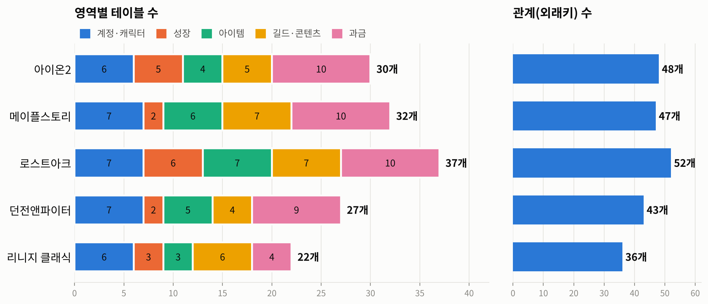

*그림 1. 다섯 게임의 영역별 테이블 수(왼쪽)와 외래키 관계 수(오른쪽)*

### 공통 설계 규칙

- **명명 규칙**: 테이블·컬럼은 영어 `snake_case`, 기본키는 `테이블명_id`. `character`는 MySQL 예약어이므로 캐릭터 테이블은 `game_character`로 이름 지었다.
- **원형(마스터) 데이터와 보유 데이터 분리**: `item`(아이템 원형)과 `character_item`(캐릭터가 실제로 가진 아이템 한 개 한 개)을 분리했다. 같은 아이템이라도 강화 수치·품질이 개체마다 다르기 때문이다. 스킬도 `skill` / `character_skill`로 같은 방식이다.
- **N:M 관계는 연결(교차) 테이블로 해소**: 캐릭터-스킬, 맵-몬스터, 세트-카드, 공격대-캐릭터 등.
- **1:1 확장 테이블**: 자주 바뀌는 능력치는 `character_stat`으로 분리했다(기본키 = FK = `character_id`).
- **FK 삭제 규칙**: 소유 관계(계정 → 캐릭터 → 아이템)는 `ON DELETE CASCADE`, 참조만 하는 기준 정보(서버, 직업 등)는 `RESTRICT`, 사라져도 기록은 남아야 하는 선택적 참조(길드장, 구매자 등)는 `SET NULL`.
- **로그 테이블**: 클리어 기록·강화 기록·PvP 기록은 별도의 `*_log` 테이블에 `BIGINT AUTO_INCREMENT` 키로 쌓는다. 랭킹, 통계, 어뷰징 탐지에 사용된다.
- 모든 컬럼에 한글 코멘트를 달아 Workbench의 테이블 편집기에서 의미를 확인할 수 있다.

### 다이어그램 구성

각 `.mwb` 파일의 EER Diagram은 기능 영역별로 **색이 다른 레이어**로 묶여 있다.

| 레이어 색 | 영역 |
|---|---|
| 파랑 | 계정 / 서버 / 캐릭터 / 직업 |
| 초록 | 성장 (스킬, 데바니온, 트라이포드, 각인) |
| 노랑 | 아이템 / 강화 / 거래 |
| 주황 · 보라 | 길드 / 혈맹 / 던전 / 보스 / 레이드 / 공성전 / PvP |
| 분홍 | 과금 (결제 / 유료 재화 / 캐시샵 / 확률형 아이템 / 이용권) |

---

## 2. 아이온2 (AION 2)

### 2.1 게임 분석

엔씨소프트의 아이온 IP 후속작으로, 원작의 세계관과 핵심 규칙을 이어받은 MMORPG이다.

- **종족 대립 구조**: 천족과 마족 두 종족이 대립한다. 같은 서버 안에서도 종족에 따라 소속과 적대 관계가 갈리며, 레기온(길드)은 같은 종족끼리만 구성된다.
- **8개 직업**: 검성, 수호성, 살성, 궁성, 마도성, 정령성, 치유성, 호법성. 직업마다 역할(탱커, 딜러, 힐러, 서포터)이 다르다.
- **데바니온**: 직업별 성장 보드에서 노드를 하나씩 활성화하며 캐릭터를 강화하는 시스템.
- **비행과 어비스(PvP)**: 날개를 이용한 비행 전투와 종족 간 PvP가 핵심 콘텐츠이고, PvP 성과는 어비스 포인트로 누적된다.
- **거래소와 키나**: 게임 화폐 키나로 플레이어 간에 아이템을 사고판다.

### 2.2 DB 설계 포인트

| 게임 요소 | 테이블 / 설계 |
|---|---|
| 천족·마족 | `race` 기준 테이블. `game_character.race_id`와 `legion.race_id`가 모두 참조하여 "레기온은 한 종족 전용"이라는 규칙을 데이터로 표현 |
| 8개 직업과 역할 | `class.role` ENUM(TANK, MELEE_DPS, RANGED_DPS, HEALER, SUPPORT) |
| 캐릭터명 | 서버 단위로 중복 불가 → `UNIQUE(server_id, name)` |
| 데바니온 | `daevanion_board`(직업별 보드) 1:N `daevanion_node`(노드) N:M `game_character` → 연결 테이블 `character_daevanion` |
| 장비 착용 | `character_equipment`의 기본키를 `(character_id, equip_slot)`으로 잡아 **부위당 하나만 착용**하도록 보장. `inventory_item_id`는 UNIQUE라 한 아이템을 두 부위에 낄 수 없음 |
| 거래소 | `market_listing`이 판매자·구매자로 `game_character`를 **두 번 참조**. 구매자는 판매 전엔 없으므로 NULL 허용 + `SET NULL` |
| PvP | `pvp_kill_log`도 처치자/피처치자로 `game_character`를 두 번 참조 |
| 레기온 | `legion_member`의 기본키가 `character_id`이므로 캐릭터는 한 레기온에만 소속 |

### 2.3 ERD 및 주요 관계

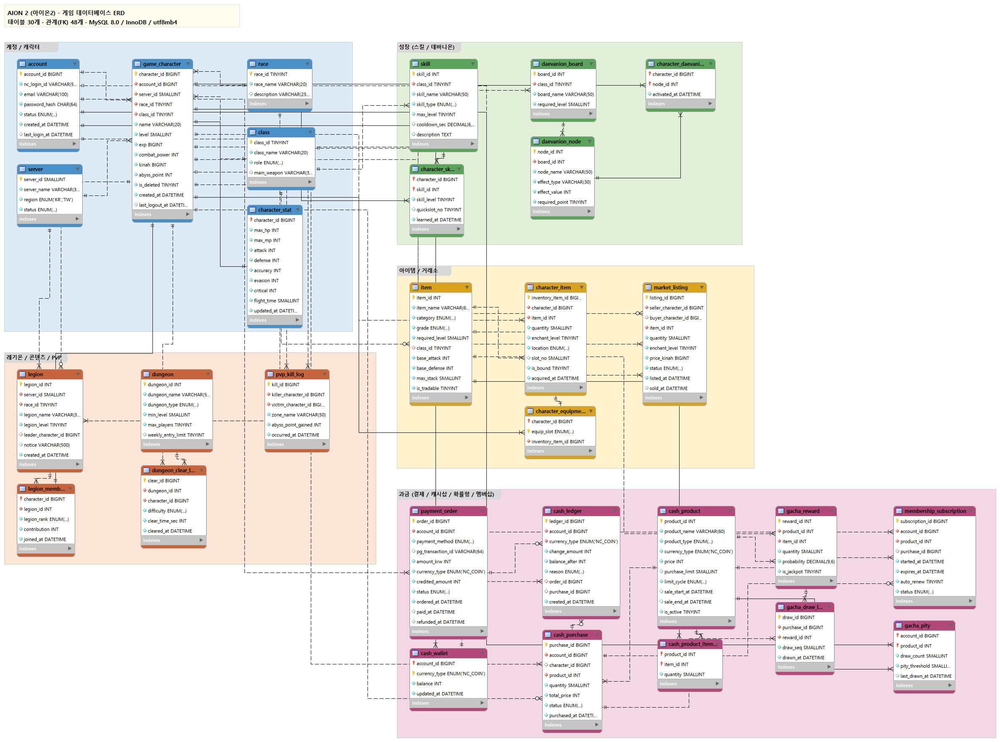

*그림 2. 아이온2 EER 다이어그램 (MySQL Workbench, `aion2.mwb`)*

```
account 1 ─── N game_character N ─── 1 server
                     │  N ─── 1 race,  N ─── 1 class
                     ├─ 1:1  character_stat
                     ├─ N:M  skill            (character_skill)
                     ├─ N:M  daevanion_node   (character_daevanion)
                     ├─ 1:N  character_item ── 1:0..1 character_equipment
                     ├─ 1:N  market_listing (판매자 / 구매자)
                     ├─ 1:1  legion_member N ─── 1 legion
                     └─ 1:N  dungeon_clear_log, pvp_kill_log
```

---

## 3. 메이플스토리 (MapleStory)

### 3.1 게임 분석

넥슨의 2D 횡스크롤 MMORPG로, 오랜 기간 서비스되며 다양한 성장·강화 시스템이 누적된 게임이다.

- **월드와 직업군**: 여러 월드(스카니아, 베라, 루나 등)가 있고, 직업은 모험가·시그너스 기사단·영웅·레지스탕스·노바 등 직업군으로 나뉜다.
- **전직 트리**: 초보자에서 1차 → 2차 → … 로 전직하며 직업이 분화된다(예: 전사 → 파이터 → 크루세이더 → 히어로).
- **메이플 유니온**: 같은 월드의 여러 캐릭터 레벨을 합산하는 계정 단위 성장 시스템.
- **장비 강화**: 스타포스(성공/실패/파괴 확률), 잠재능력과 에디셔널 잠재능력(등급 + 최대 3줄 옵션), 업그레이드 횟수 등이 한 장비에 겹겹이 적용된다.
- **보스 콘텐츠**: 같은 보스라도 이지/노멀/하드/카오스/익스트림 난이도가 있고, 일간·주간·월간으로 입장 횟수가 초기화된다.

### 3.2 DB 설계 포인트

| 게임 요소 | 테이블 / 설계 |
|---|---|
| 전직 트리 | `job.parent_job_id → job.job_id` **자기참조(Self-Referencing) FK**. 재귀 CTE로 "현재 직업의 전직 경로" 조회 가능 |
| 메이플 유니온 | 계정이 아니라 **계정 + 월드** 단위이므로 `maple_union`에 `UNIQUE(account_id, world_id)` |
| 스탯 | `int`는 SQL 타입명과 겹치므로 `int_stat` 처럼 `_stat` 접미사 사용 |
| 장비 강화 상태 | 모든 아이템이 강화되는 건 아니므로 장비에만 필요한 컬럼을 `item_enhancement`(1:1)로 분리 → NULL 컬럼 감소 |
| 잠재능력 | `item_potential`의 기본키 `(inventory_item_id, is_additional, line_no)` → 잠재/에디셔널 각각 최대 3줄. 옵션 문구는 `potential_option`에서 참조 |
| 스타포스 | 결과가 SUCCESS/FAIL/DESTROY인 확률형 강화이므로 모든 시도를 `starforce_log`에 기록 (소모 메소, 전후 단계) |
| 보스 난이도 | 보스명 + 난이도 조합을 한 행으로 → `UNIQUE(boss_name, difficulty)`. 보스는 `monster`를 참조 |
| 맵과 몬스터 | 한 맵에 여러 몬스터, 한 몬스터가 여러 맵 → N:M 연결 테이블 `map_monster_spawn` |

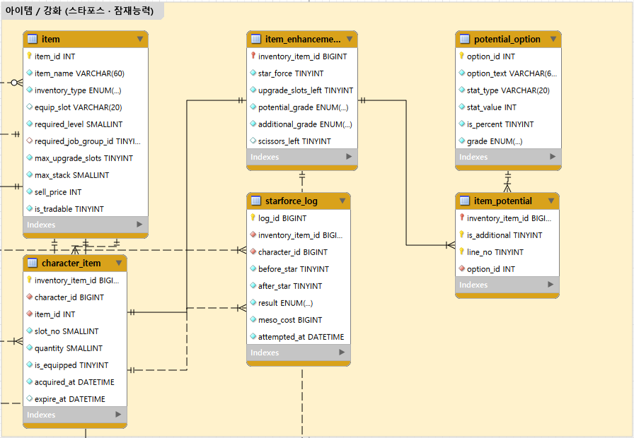

*그림 3. 장비 강화 영역 확대 – 보유 아이템 → 강화 상태(1:1) → 잠재능력 줄(1:N) → 옵션, 큐브 사용 기록*

### 3.3 ERD 및 주요 관계

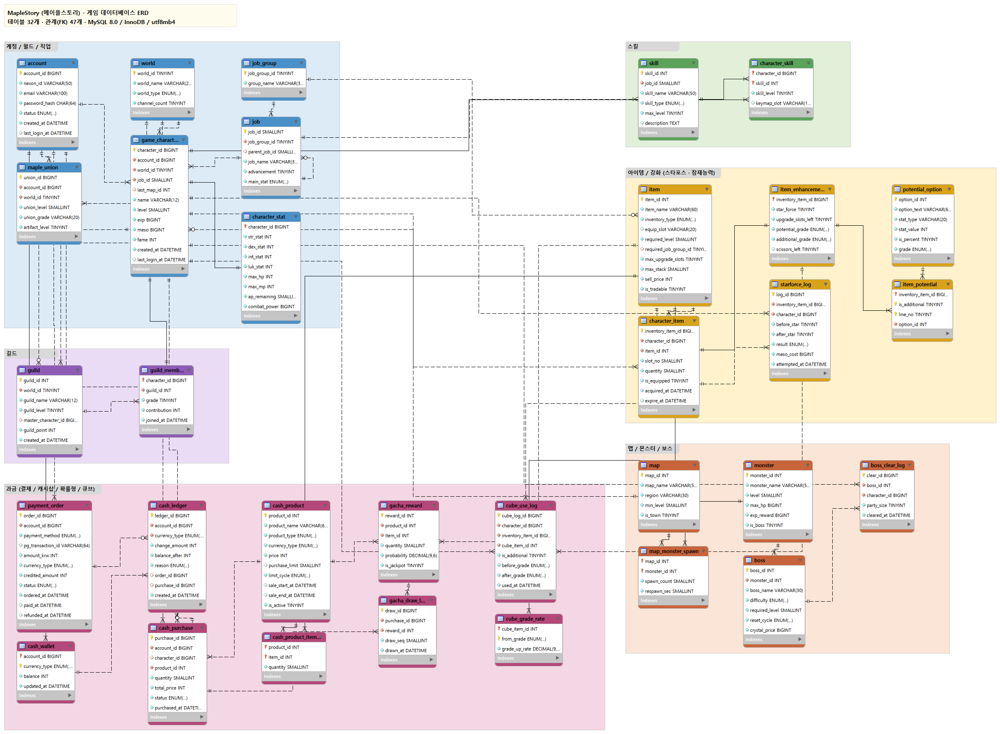

*그림 4. 메이플스토리 EER 다이어그램 (MySQL Workbench, `maplestory.mwb`)*

```
account 1 ─── N game_character N ─── 1 world
   └─ 1:N maple_union (계정+월드)    │ N ─── 1 job ──(self)── job
                                     │            N ─── 1 job_group
                                     ├─ 1:1  character_stat
                                     ├─ N:M  skill (character_skill)
                                     ├─ 1:N  character_item ─ 1:1 item_enhancement ─ 1:N item_potential ─ N:1 potential_option
                                     ├─ 1:N  starforce_log
                                     ├─ 1:1  guild_member N ─── 1 guild
                                     └─ 1:N  boss_clear_log N ─── 1 boss N ─── 1 monster
map N:M monster (map_monster_spawn)
```

---

## 4. 로스트아크 (LOST ARK)

### 4.1 게임 분석

스마일게이트의 쿼터뷰 액션 MMORPG로, 레이드 중심의 엔드 콘텐츠와 세밀한 전투 빌드가 특징이다.

- **원정대**: 같은 서버의 캐릭터들이 원정대로 묶이고, 원정대 레벨과 일부 재화·수집품(골드, 실링, 카드 등)을 공유한다.
- **기본 클래스 → 전직 클래스**: 전사, 마법사, 무도가, 헌터, 암살자, 스페셜리스트 아래에 버서커·바드·소서리스 같은 전직 클래스가 있다.
- **아이템 레벨**: 장비 재련 단계로 결정되는 아이템 레벨이 레이드 입장 조건이 된다. 장비에는 품질(0~100)도 붙는다.
- **전투 빌드**: 스킬마다 트라이포드(단계별 선택지)를 고르고, 각인·보석·카드 세트·전투 특성(치명, 특화, 신속 등)을 조합한다.
- **레이드**: 군단장·어비스·카제로스 레이드 등이 관문 단위로 진행되며, 관문/난이도별로 입장 아이템 레벨과 골드 보상이 다르다.

### 4.2 DB 설계 포인트

| 게임 요소 | 테이블 / 설계 |
|---|---|
| 원정대 | `roster` = 계정 + 서버 (`UNIQUE(account_id, server_id)`). 캐릭터는 서버가 아니라 **원정대**에 소속되고, 골드·실링은 캐릭터가 아닌 `roster`에 저장 |
| 클래스 2단계 | `base_class` 1:N `class` |
| 아이템 레벨 | `game_character.item_level DECIMAL(7,2)` + 인덱스 (레이드 입장 조건 검색용) |
| 재련·품질 | 보유 장비 개체마다 다르므로 `character_item.honing_level`, `quality` |
| 트라이포드 | `tripod`는 `UNIQUE(skill_id, tier, slot_no)`. 캐릭터의 선택은 `character_skill_tripod`에 저장하며 기본키 `(character_id, skill_id, tier)`로 **단계당 하나만 선택**. `(character_id, skill_id)`는 `character_skill`을 참조하는 **복합 외래키** |
| 각인 | `engraving_type`(전투/직업). 직업 각인만 `class_id`를 가짐 (NULL 허용) |
| 보석 | `character_gem`의 기본키 `(character_id, slot_no)`, 적용 스킬을 `skill`에서 참조 |
| 카드 | 카드는 원정대 공유이므로 `roster_card`(원정대-카드 N:M, 각성 단계). 세트 구성은 `card_set_member`(세트-카드 N:M) |
| 레이드 | `raid` 1:N `raid_gate` (`UNIQUE(raid_id, gate_no, difficulty)`). 공격대 `raid_party` N:M 캐릭터(`raid_party_member`, 딜러/서포터) |
| 클리어 기록 | `raid_clear_log`가 관문·캐릭터·공격대를 참조, 획득 골드와 더보기 사용 여부 기록 |

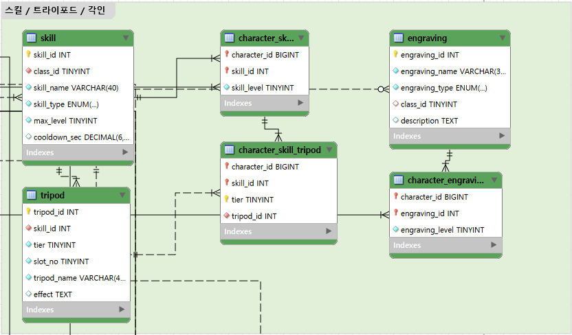

*그림 5. 스킬·트라이포드 영역 확대 – `character_skill_tripod`가 `(character_id, skill_id)` 복합 외래키로 `character_skill`을 참조*

### 4.3 ERD 및 주요 관계

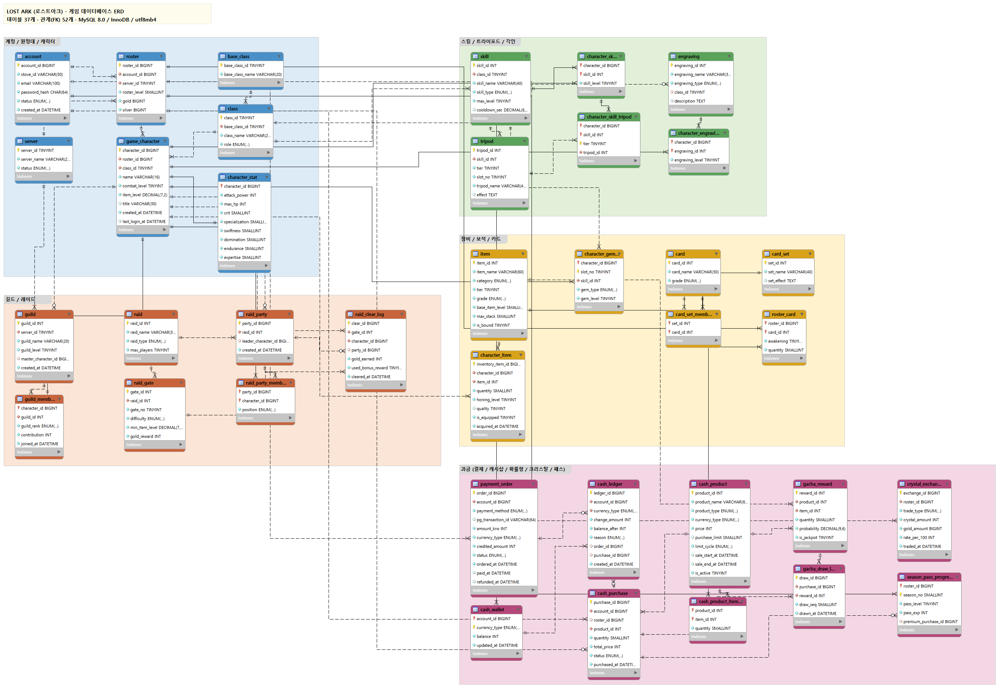

*그림 6. 로스트아크 EER 다이어그램 (MySQL Workbench, `lostark.mwb`)*

```
account 1 ─── N roster N ─── 1 server
                 │ 1:N game_character N ─── 1 class N ─── 1 base_class
                 └ N:M card (roster_card)          │
                                                   ├─ 1:1 character_stat
         skill 1:N tripod                          ├─ N:M skill (character_skill) ─ 1:N character_skill_tripod ─ N:1 tripod
                                                   ├─ N:M engraving (character_engraving)
                                                   ├─ 1:N character_item, character_gem
                                                   ├─ 1:1 guild_member N ─── 1 guild
                                                   └─ N:M raid_party (raid_party_member)
raid 1:N raid_gate 1:N raid_clear_log,  card_set N:M card (card_set_member)
```

---

## 5. 던전앤파이터 (Dungeon & Fighter)

### 5.1 게임 분석

네오플이 개발하고 넥슨이 서비스하는 2D 횡스크롤 액션 RPG이다. 마을에서 파티를 구성해 던전에 들어가는 **던전 중심 구조**가 특징이다.

- **직업 구조**: 귀검사(남/여), 격투가, 거너, 마법사, 프리스트 같은 직업군이 있고, 직업군마다 성별이 정해져 있다. 직업군 안에서 전직(웨펀마스터, 버서커 등)을 고르고, 레벨이 오르면 1차·2차 각성, 진각성으로 이어진다.
- **모험단**: 한 서버에 있는 같은 계정의 캐릭터들이 모험단으로 묶이고, 모험단 이름과 레벨을 가진다.
- **피로도**: 던전에 들어갈 때마다 피로도가 소모되어, 하루에 할 수 있는 사냥량을 제한한다.
- **장비 성장**: 희귀도(레어 → 유니크 → 레전더리 → 에픽 → 태초), 세트 효과, 강화·증폭·재련, 마법부여(카드)가 겹쳐 적용된다. 강화·증폭은 실패하거나 장비가 파괴될 수 있다.
- **경매장**: 골드로 아이템을 사고파는 플레이어 간 시장.
- **아바타**: 캐릭터 외형을 바꾸는 아바타와 엠블렘이 대표적인 유료 상품이다.

### 5.2 DB 설계 포인트

| 게임 요소 | 테이블 / 설계 |
|---|---|
| 모험단 | `adventure` = 계정 + 서버 (`UNIQUE(account_id, server_id)`). 모험단 이름은 서버 안에서 중복 불가 (`UNIQUE(server_id, adventure_name)`) |
| 직업 3단계 | `base_class`(직업군, 성별 고정) 1:N `job`(전직) 1:N `awakening`(각성). `awakening`은 `UNIQUE(job_id, stage)`로 전직마다 단계별 하나 |
| 전직 전 캐릭터 | `game_character.job_id`는 NULL 허용 (전직 전에는 직업군만 있음) |
| 명성 · 피로도 | `fame`(던전 권장 조건, 인덱스), `fatigue`(남은 피로도). `dungeon.fatigue_cost`와 `dungeon_clear_log.fatigue_used`로 소모량 기록 |
| 세트 아이템 | `item_set` 1:N `item` (세트가 없는 아이템은 NULL) |
| 마법부여 | `character_item.enchant_card_id`가 `item`(카드)을 참조 → **같은 테이블(`item`)을 두 컬럼이 참조** |
| 강화·증폭 기록 | `reinforce_log`. 장비가 파괴되면 보유 아이템 행이 지워지므로 `inventory_item_id`는 `SET NULL`, 대신 `item_id`를 따로 저장해 **기록이 사라지지 않게** 했다 |
| 경매장 | `auction_listing`이 판매자/구매자로 `game_character`를 두 번 참조 |
| 아바타 | `character_avatar`의 기본키 `(character_id, avatar_slot)` → 부위당 하나. 엠블렘은 `item` 참조 |

### 5.3 ERD 및 주요 관계

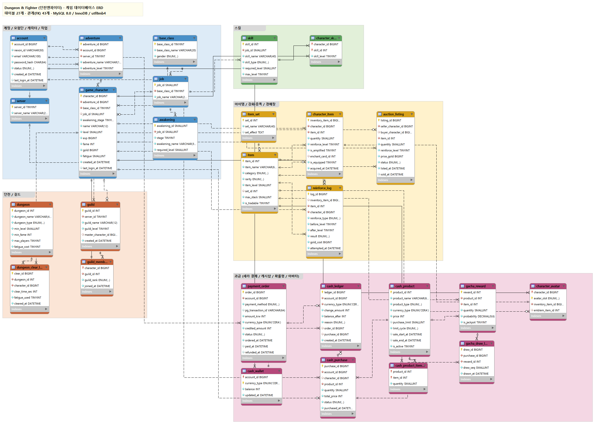

*그림 7. 던전앤파이터 EER 다이어그램 (MySQL Workbench, `dnf.mwb`)*

```
account 1 ─── N adventure N ─── 1 server
                   │ 1:N game_character N ─── 1 base_class 1:N job 1:N awakening
                   │          ├─ N:M skill (character_skill)
                   │          ├─ 1:N character_item ─ 1:N reinforce_log
                   │          ├─ 1:N character_avatar (부위별)
                   │          ├─ 1:N auction_listing (판매자 / 구매자)
                   │          ├─ 1:1 guild_member N ─── 1 guild
                   │          └─ 1:N dungeon_clear_log N ─── 1 dungeon
item_set 1:N item
```

---

## 6. 리니지 클래식 (Lineage Classic)

### 6.1 게임 분석

엔씨소프트가 1998년 서비스를 시작한 「리니지」의 초기(2000년대 초반) 모습을 PC에서 다시 구현한 게임이다. 2026년 2월 한국·대만에 출시되었고, 사전 오픈 이후 **월정액(정액제)** 으로 서비스된다. 클래스는 군주·기사·요정·마법사 4종이다.

- **클래스와 능력치**: STR·DEX·CON·INT·WIS·CHA 여섯 가지 능력치를 사용한다. 군주만 혈맹을 만들 수 있고, 카리스마(CHA)가 중요하다.
- **성향치(라우풀/카오틱)**: 다른 플레이어를 죽이면(PK) 성향치가 떨어져 카오틱이 되고, 사망 시 불이익이 커진다.
- **인챈트**: 강화 주문서로 장비를 강화하며, 안전 수치를 넘기면 장비가 **증발**(소멸)할 수 있다. 아이템에는 축복·저주 상태가 있고, 확인 주문서로 정체를 확인하기 전까지는 미확인 상태이다.
- **변신**: 변신 주문서로 몬스터 모습이 되어 능력이 바뀐다.
- **혈맹과 공성전**: 혈맹이 성을 차지하면 세금을 걷는다. 다른 혈맹이 공성전을 선포해 성을 빼앗을 수 있다.

### 6.2 DB 설계 포인트

| 게임 요소 | 테이블 / 설계 |
|---|---|
| 4개 클래스 | `class.class_code` ENUM(PRINCE, KNIGHT, ELF, WIZARD), `can_found_clan`(군주만 1) |
| 착용 가능 클래스 | 한 아이템을 여러 클래스가 쓸 수 있으므로 `item.usable_classes`를 MySQL **SET 타입**으로 저장 (예: `'KNIGHT,PRINCE'`) |
| 성향치 | `game_character.lawful`은 음수가 가능해야 하므로 **UNSIGNED가 아닌 INT**. AC도 낮을수록 좋고 음수가 되므로 부호 있는 TINYINT |
| 축복 / 저주 / 미확인 | `character_item.bless_status` ENUM, `is_identified`. 저주받은 장비는 인챈트가 음수일 수 있어 `enchant_level`도 부호 있는 타입 |
| 인챈트 증발 | `enchant_log`의 `inventory_item_id`는 `SET NULL`(증발하면 보유 아이템 행이 삭제됨) + `item_id`·`before_level` 보존. `result` = SUCCESS / NO_EFFECT / EVAPORATED |
| 마법 | 클래스별로 배울 수 있는 마법이 다르므로 `class_spell`(클래스-마법 N:M), 캐릭터가 실제로 배운 마법은 `character_spell` |
| 변신 | `game_character.poly_id` → `polymorph` (본모습이면 NULL) |
| 혈맹 · 성 | `clan.prince_character_id`(군주), `castle.owner_clan_id`(소유 혈맹, 없으면 NULL), 세율·성 금고 |
| 공성전 | `siege_war` 1건에 여러 혈맹이 참여 → `siege_participant`(공성전-혈맹 N:M, 수성/공성 구분) |
| PK | `pk_log`가 처치자/피처치자로 캐릭터를 두 번 참조하고, 성향치 변화량을 기록 |

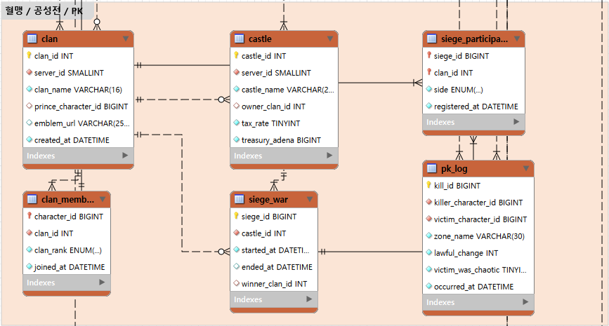

*그림 8. 혈맹·공성전 영역 확대 – 혈맹이 성을 소유하고, 공성전 1건에 여러 혈맹이 수성/공성으로 참여(N:M)*

### 6.3 ERD 및 주요 관계

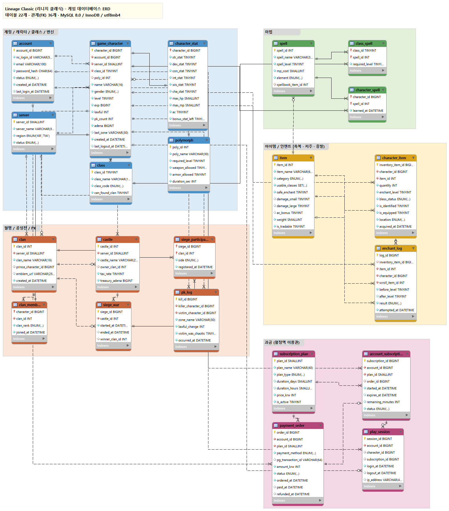

*그림 9. 리니지 클래식 EER 다이어그램 (MySQL Workbench, `lineage_classic.mwb`)*

```
account 1 ─── N game_character N ─── 1 server
                 │  N ─── 1 class ─N:M─ spell (class_spell)
                 │  N ─── 0..1 polymorph
                 ├─ 1:1 character_stat
                 ├─ N:M spell (character_spell)
                 ├─ 1:N character_item ─ 1:N enchant_log
                 ├─ 1:1 clan_member N ─── 1 clan ─ 1:N castle (소유)
                 │                                  └ N:M siege_war (siege_participant)
                 └─ 1:N pk_log (처치자 / 피처치자)
```

---

## 7. 다섯 게임 비교

| 비교 항목 | 아이온2 | 메이플스토리 | 로스트아크 | 던전앤파이터 | 리니지 클래식 |
|---|---|---|---|---|---|
| 캐릭터의 상위 소속 | 계정 + 서버 + **종족** | 계정 + 월드 | 계정 → **원정대** | 계정 → **모험단** | 계정 + 서버 |
| 직업 구조 | 단일 직업 테이블 | **자기참조 전직 트리** | 기본 클래스 → 전직 | 직업군 → 전직 → **각성** | 4개 클래스 |
| 성장 시스템 | 데바니온 보드 | SP 스킬, 하이퍼 | 트라이포드, 각인, 보석, 카드 | SP 스킬, 각성 | 마법서로 마법 습득, 능력치 |
| 장비 강화 | 강화 단계 | 스타포스 + 잠재능력 | 재련 + 품질 | 강화·증폭·재련 + 마법부여 | 인챈트 (**증발**), 축복/저주 |
| 플레이어 경제 | 거래소 (키나) | 메소 | 골드 (원정대 공유) | 경매장 (골드) | 아데나, 성 세금 |
| 길드 | 레기온 (종족 제한) | 길드 | 길드 | 길드 | 혈맹 (군주만 창설) + **공성전** |
| 엔드 콘텐츠 | 던전, 종족 PvP | 난이도별 보스 | 관문형 레이드 | 피로도 기반 던전·레이드 | 공성전, PK |
| 과금 모델 | 부분 유료 + 멤버십 | 부분 유료 | 부분 유료 + 시즌 패스 | 부분 유료 (아바타 중심) | **월정액** |
| 대표 설계 기법 | 동일 테이블 이중 참조 | 자기참조 FK, 1:1 분리 | 복합 외래키, 다단계 N:M | 3단계 계층, 파괴돼도 남는 로그 | SET 타입, 부호 있는 수치, N:M 공성전 |

**정리**

- **아이온2**는 "누구 편인가"(종족)가 데이터 전반을 관통한다. 그래서 `race`가 캐릭터와 레기온 양쪽에서 참조되고, PvP 로그가 중요한 테이블이 된다.
- **메이플스토리**는 하나의 장비에 여러 강화 단계가 겹쳐 쌓이는 구조라, 아이템 쪽 테이블이 가장 깊게 분화된다(보유 아이템 → 강화 상태 → 잠재 옵션 줄).
- **로스트아크**는 원정대라는 "캐릭터 위의 계층"이 있고, 전투 빌드 요소가 많아 테이블 수와 N:M 관계가 가장 많다.
- **던전앤파이터**는 직업이 직업군 → 전직 → 각성의 3단계 계층으로 나뉘고, 강화·증폭으로 장비가 파괴될 수 있어 **원본이 사라져도 남는 기록**을 설계하는 것이 중요하다.
- **리니지 클래식**은 혈맹·성·공성전처럼 **플레이어 집단끼리의 관계**가 핵심이고, 성향치·AC·저주 인챈트처럼 **음수가 의미를 갖는 값**이 많다. 과금은 아이템이 아니라 **접속 권한(이용권)** 에 매겨진다.

---

## 8. 과금(BM) 영역 설계

### 8.1 왜 과금 데이터는 따로 설계하는가

과금 데이터는 실제 돈이 오가는 데이터라서 일반 게임 데이터와 요구 조건이 다르다.

- **정확성과 추적 가능성**: 잔액이 틀리거나 충전 기록이 사라지면 곧바로 금전 분쟁이 된다. 그래서 "현재 잔액"만 저장하지 않고 **모든 증감을 원장(ledger)에 남긴다.**
- **환불·청약철회**: 결제 취소나 환불이 일어나면 결제 건, 구매 건, 재화 차감을 서로 연결해서 되돌릴 수 있어야 한다.
- **확률 정보 공개**: 국내에서는 확률형 아이템의 종류와 획득 확률을 이용자에게 공개하도록 법(게임산업법)으로 의무화되어 있다. 따라서 확률표를 데이터로 관리하고, 실제 뽑기 결과도 기록해 공개 확률과 비교·검증할 수 있게 했다.
- **유료 재화와 게임 재화의 분리**: 현금으로 산 재화(캐시)와 게임 안에서 버는 재화(키나, 메소, 골드)는 성격이 다르다. 캐시는 **계정** 단위, 게임 재화는 **캐릭터/원정대** 단위로 분리해 저장했다.

이를 위해 메이플스토리의 `account.nexon_cash`, `maple_point`와 로스트아크의 `account.royal_crystal` 같은 잔액 컬럼은 계정 테이블에서 빼고 `cash_wallet` 테이블로 옮겼다.

### 8.2 공통 과금 테이블 (부분 유료 게임 4종 공통 8개)

아이온2, 메이플스토리, 로스트아크, 던전앤파이터에 공통으로 들어간다.

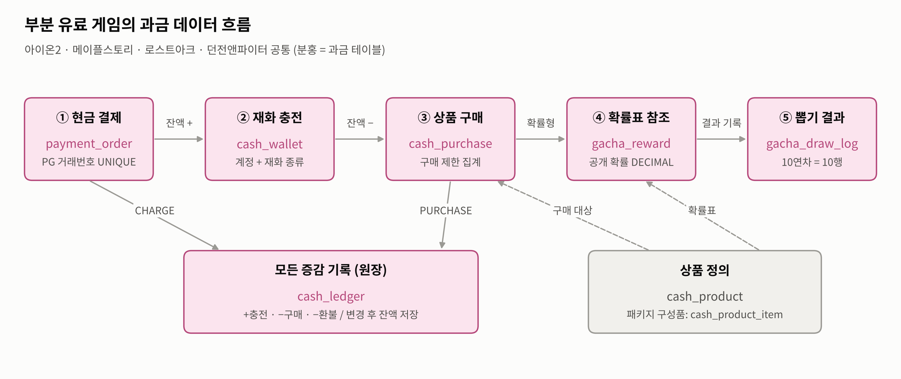

*그림 10. 부분 유료 게임의 과금 데이터 흐름 – 결제·충전·구매는 모두 원장(`cash_ledger`)에 남는다*

| 테이블 | 역할 | 설계 포인트 |
|---|---|---|
| `payment_order` | 현금 결제 주문 (카드, 휴대폰, 앱마켓 등) | `pg_transaction_id` UNIQUE로 **같은 결제가 두 번 충전되는 것을 방지**. 상태는 PENDING → PAID → (CANCELED / REFUNDED) |
| `cash_wallet` | 계정의 유료 재화 잔액 | 기본키 `(account_id, currency_type)` → 한 계정이 여러 종류의 재화(넥슨캐시 + 메이플포인트 등)를 가질 수 있음 |
| `cash_ledger` | 재화 증감 원장 | `change_amount`(+/-)와 `balance_after`를 함께 기록. `(account_id, currency_type)` **복합 FK**로 지갑을 참조하고, 원인이 된 결제(`order_id`) 또는 구매(`purchase_id`)를 연결 |
| `cash_product` | 캐시샵 상품 | 종류(일반/패키지/확률형/멤버십/패스), 가격, 판매 기간, 구매 제한(일·주·월·계정당) |
| `cash_product_item` | 패키지 구성품 | 상품-아이템 N:M. 하나의 패키지에 여러 아이템, 하나의 아이템이 여러 상품에 포함 |
| `cash_purchase` | 캐시샵 구매 내역 | 누가(계정), 어디로(캐릭터 또는 원정대), 무엇을, 얼마에 샀는지. 구매 제한 검사는 이 테이블을 기간별로 집계해서 처리 |
| `gacha_reward` | 확률형 상품의 보상과 **공개 확률** | `probability DECIMAL(9,6)`로 0.000001% 단위까지 표현. `UNIQUE(product_id, item_id)` |
| `gacha_draw_log` | 뽑기 결과 | 구매 1건에 여러 결과(10연차)를 `draw_seq`로 구분. 공개 확률과 실제 결과 비율을 비교하는 감사(audit)에 사용 |

**결제부터 뽑기까지 데이터 흐름 (예시)**

1. 이용자가 10,000원 결제 → `payment_order` 1행 (PAID)
2. 재화 충전 → `cash_wallet.balance` 증가 + `cash_ledger`에 `+` 1행 (reason = CHARGE, order_id 연결)
3. 확률형 상품 10연차 구매 → `cash_purchase` 1행, `cash_ledger`에 `-` 1행 (reason = PURCHASE)
4. 뽑기 결과 → `gacha_draw_log` 10행, 각 행이 `gacha_reward`를 참조
5. 환불 시 → `payment_order.status = REFUNDED`, `cash_ledger`에 `-` 1행 (reason = REFUND)

### 8.3 게임별 과금 특화 테이블

| 게임 | 테이블 | 분석 및 설계 |
|---|---|---|
| 아이온2 | `membership_subscription` | 기간제 이용권·패스형 상품은 "산 순간"이 아니라 **시작~만료 기간**이 중요하다. 시작/만료일시, 자동 갱신, 상태를 별도로 관리 |
| 아이온2 | `gacha_pity` | 일정 횟수를 뽑으면 최고 보상을 보장하는 천장 시스템. 기본키 `(account_id, product_id)`로 **계정·상품별 누적 횟수**를 저장 |
| 메이플스토리 | `cube_use_log` | 큐브는 장비의 잠재능력을 다시 뽑는 확률형 아이템으로, 메이플스토리 과금의 핵심이다. 대상 장비(`item_enhancement`), 사용한 큐브, 사용 전·후 등급을 기록 |
| 메이플스토리 | `cube_grade_rate` | 큐브 종류 × 현재 등급별 **등급 상승 확률 공개표**. 기본키 `(cube_item_id, from_grade)` |
| 로스트아크 | `crystal_exchange` | 크리스탈과 게임 골드를 시세에 따라 교환할 수 있어, 현금 재화와 게임 경제가 이어지는 지점이다. 원정대 골드와 연결하고 체결 시세를 남겨 시세 추이 분석이 가능 |
| 로스트아크 | `season_pass_progress` | 시즌 패스 진행도를 원정대 단위로 저장. 유료 트랙을 샀으면 `premium_purchase_id`가 구매 건을 가리키고, 무료면 NULL |
| 로스트아크 | (공통 테이블 변형) | 캐시 아이템은 원정대 공유이므로 `cash_purchase`의 수령 대상이 캐릭터가 아니라 **`roster_id`**. 상품 종류에 `AVATAR`(아바타) 추가 |
| 던전앤파이터 | `character_avatar` | 유료 재화 세라로 사는 아바타를 부위별로 착용. 기본키 `(character_id, avatar_slot)`, 착용한 보유 아이템은 UNIQUE, 엠블렘은 `item` 참조. 상품 종류에 `AVATAR` 추가 |

### 8.4 월정액 모델 – 리니지 클래식

리니지 클래식은 아이템을 파는 부분 유료 게임이 아니라, **일정 기간 접속할 권리**를 파는 월정액 게임이다. 그래서 지갑·캐시샵·확률형 테이블 대신 이용권 중심의 테이블 4개로 구성했다.

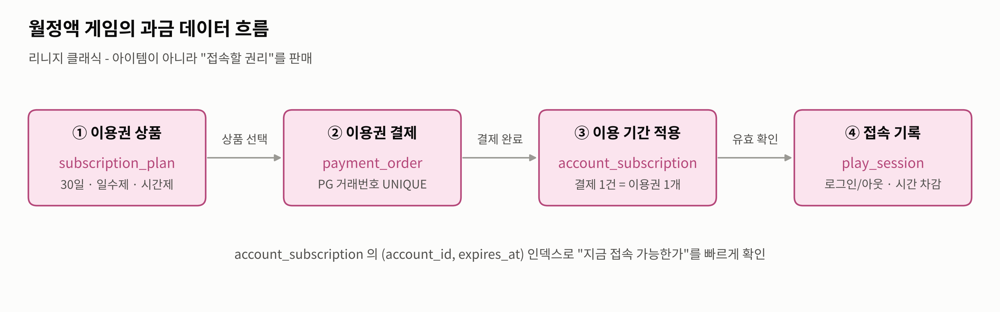

*그림 11. 월정액 게임(리니지 클래식)의 과금 데이터 흐름*

| 테이블 | 역할 | 설계 포인트 |
|---|---|---|
| `subscription_plan` | 이용권 상품 | 기간제(30일 등) / 일수제 / 시간제를 `plan_type`으로 구분. 기간제는 `duration_days`, 시간제는 `duration_hours` 사용 |
| `payment_order` | 이용권 결제 | 결제 1건이 상품(`plan_id`)을 직접 참조. PG 거래번호 UNIQUE |
| `account_subscription` | 계정에 적용된 이용권 | 결제 1건당 이용권 1개 → `order_id` UNIQUE(1:1). 이벤트로 무료 지급되면 NULL. `(account_id, expires_at)` 인덱스로 **로그인할 때 유효한 이용권이 있는지** 빠르게 확인 |
| `play_session` | 접속 기록 | 로그인·로그아웃 시각과 사용한 이용권을 기록. 시간제 이용권의 남은 시간 차감, 동시 접속자 통계에 사용 |

### 8.5 과금 모델 비교

| 항목 | 아이온2 | 메이플스토리 | 로스트아크 | 던전앤파이터 | 리니지 클래식 |
|---|---|---|---|---|---|
| 과금 방식 | 부분 유료 | 부분 유료 | 부분 유료 | 부분 유료 | **월정액** |
| 유료 재화 | 엔씨코인 | 넥슨캐시, 메이플포인트 | 로열 크리스탈, 크리스탈 | 세라 | 없음 (이용권 직접 결제) |
| 수령 단위 | 캐릭터 (또는 계정 보관함) | 캐릭터 | 원정대 | 캐릭터 | 계정 (접속 권한) |
| 확률형 요소 | 확률형 상품 + 천장 | 확률형 상품 + **큐브** | 확률형 상품 | 확률형 상품 | 모델에 없음 |
| 게임 경제와의 연결 | 분리 | 분리 (모델 기준) | **크리스탈 ↔ 골드** | 분리 (모델 기준) | 분리 |
| 정기 상품 | 멤버십 / 패스 | 패키지·기간제 | 시즌 패스 | 패키지 | **이용권 자체** |

메이플스토리는 확률형 요소가 **장비 강화 과정 안에** 들어가 있어 아이템 영역과 과금 영역이 FK로 강하게 연결된다. 로스트아크는 크리스탈 거래소 때문에 과금 영역이 **원정대 골드(게임 경제)** 와 연결된다. 아이온2는 구독형·천장형 상품처럼 **계정 단위로 누적·지속되는 상태**를 관리하는 테이블이 추가된다. 던전앤파이터는 외형(아바타)이 과금의 중심이라 과금 영역이 **장착 테이블**과 연결된다. 리니지 클래식은 과금 영역이 아이템과 전혀 연결되지 않고 **계정과 접속 세션**에만 연결된다는 점에서 구조가 가장 다르다.

---

## 9. 한계

- 실제 게임사의 내부 DB 구조는 공개되지 않았으므로, 게임 내 규칙을 바탕으로 재구성한 학습용 모델이다.
- 퀘스트, 우편, 친구, 탈것/펫 등은 범위를 줄이기 위해 제외했다.
- 과금 영역의 결제 수단, 상품 구성, 천장 횟수, 확률 값 등은 실제 서비스 수치가 아니라 구조를 보여주기 위한 예시이다. 리니지 클래식은 월정액 구조만 모델링했으며, 그 밖의 유료 상품 판매 여부는 다루지 않았다. 실제 결제 시스템은 보통 게임 DB와 분리된 별도의 결제/빌링 서버에서 관리한다.
- 운영 환경이라면 로그 테이블은 파티셔닝이나 별도 로그 DB로 분리하고, 재화 변동은 트랜잭션 원장 테이블로 관리하는 것이 일반적이다.
