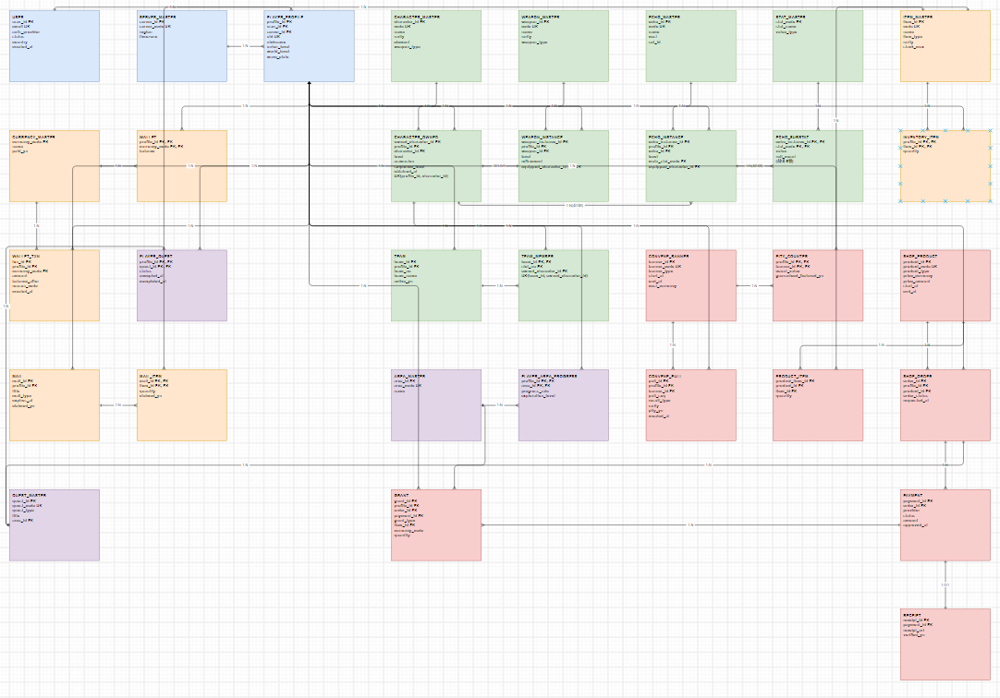
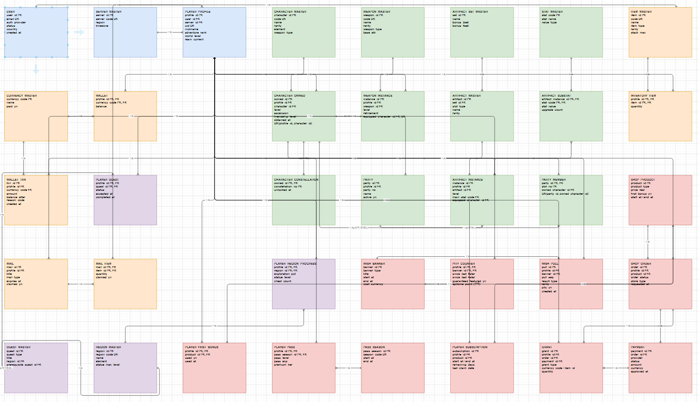
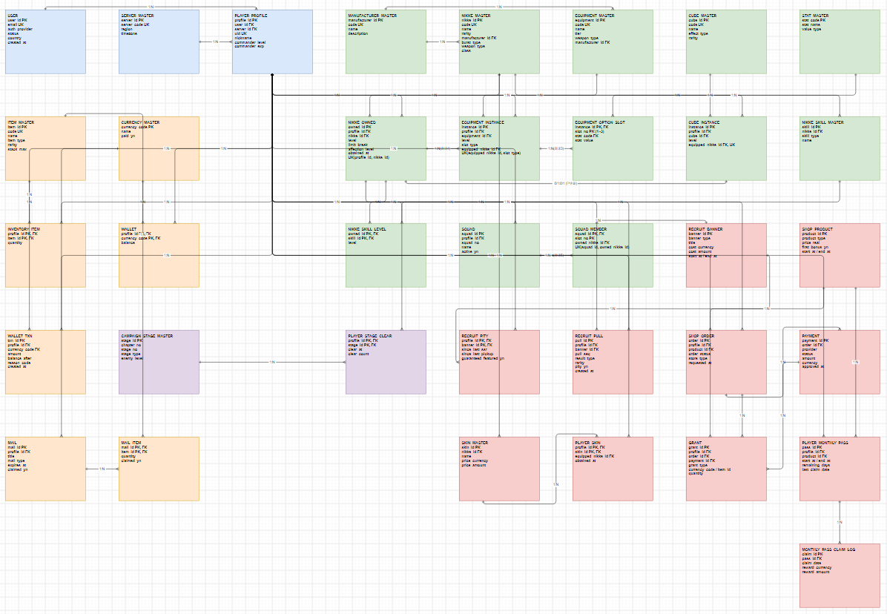

게임 데이터베이스 분석 포트폴리오
수집형 RPG 3종(명조, 원신, 니케)의 관계형 데이터베이스 구조 분석

교과목: 인터넷프로그래밍
이름 / 학번: 조성준 / 25311023
작성일: 2026년 10월 4일

1. 과제를 시작하며

1.1 선정 동기 및 분석 대상

게임 데이터베이스 분석 과제를 준비하면서, 시스템을 충분히 이해하고 있는 게임 3종을 분석 대상으로 선정하였다. 명조: 워더링 웨이브, 원신, 승리의 여신: 니케이다. 세 게임 모두 수집형 RPG로서 캐릭터 수집과 가챠라는 공통 뼈대를 가지지만, 장비 시스템은 각각 에코, 성유물, 장비와 큐브로 달라서, 공통 구조와 차이 구조를 대조하기에 적합하다고 판단하였다.

1.2 분석 방법

분석은 다음 순서로 진행하였다. 첫째, 게임 내 화면(프로필, 캐릭터, 장비, 인벤토리, 가챠, 상점)을 캡처하여 관측되는 데이터 항목을 목록화하였다. 둘째, 목록화한 데이터를 기준으로 테이블 후보를 도출하였다. 셋째, ER 모델 규칙에 따라 관계와 카디널리티를 정의하였다. 넷째, draw.io를 사용하여 Crow's Foot 표기법의 ERD를 작성하였다. 게임 시스템 중 화면만으로 확인이 어려운 수치는 공식 자료와 게임 데이터베이스 자료를 참고하였다.

1.3 전제

게임 서버의 내부 데이터베이스 스키마는 공개되지 않는다. 따라서 본 보고서의 모든 테이블 구조는 공개된 게임 기능과 자료를 근거로 작성자가 관계형 데이터베이스 관점에서 추론한 설계이다. 확인된 사실과 설계 판단이 섞이지 않도록, 설계 판단이 들어간 문장에서는 그러한 사실을 본문에 함께 적었다.

1.4 분석 범위

게임별로 계정과 프로필, 캐릭터와 중복 획득, 장비와 옵션, 인벤토리와 재화, 퀘스트와 탐험, 파티 편성, 가챠, 과금까지를 범위로 한다. 친구와 길드 등 소셜 기능은 분량 제약으로 메일 기능까지만 포함하였다.

2. 명조: 워더링 웨이브

2.1 선정 이유

명조의 에코 시스템은 몬스터 포획 장비를 강화하는 구조로, 메인 옵션과 서브 옵션이 분리되어 있어 관계형 모델링 연습 대상으로 적합하였다. 또한 팀 편성과 탐험 요소가 존재하여 콘텐츠 데이터 모델링 범위도 확보할 수 있었다.

2.2 게임에서 확인한 데이터

프로필 화면에서는 UID, 유니온 레벨, 월드 레벨, 행동력 개념의 웨이브 플레이트가 확인된다. 로그인 시 서버(Asia, America, Europe, SEA, HMT)를 선택할 수 있고, 한 계정으로 서버별 별도 진행 상황이 관리되는 것이 확인된다 [1] 캐릭터 화면에서는 레벨, 돌파, 중복 획득에 해당하는 시퀀스, 스킬 트리가 확인된다. 에코는 COST와 등급, 2개의 메인 스탯 라인, 최대 5개의 서브 스탯 등의 정보를 가지며, 캐릭터당 5개의 에코를 장착할 수 있다 [2]. 장착 에코의 COST 합계에는 제한이 있다 [2]. 소환 화면에서는 배너별 기간과 소비 재화, 천장 개념이 확인된다 [1].

2.3 테이블 설계

공통 데이터와 플레이어 보유 데이터를 분리하는 원칙을 전체에 적용하였다. 표 1은 주요 테이블이다.

표 1. 명조 주요 테이블

| 테이블 | 주요 역할 | 기본키 |
|---|---|---|
| USER | 계정 정보 | user_id |
| PLAYER_PROFILE | 서버별 프로필, 레벨, 행동력 | profile_id (uid 유일키) |
| CHARACTER_MASTER | 캐릭터 기준 정보 | character_id |
| CHARACTER_OWNED | 보유 캐릭터, 레벨, 시퀀스 | owned_character_id (profile, character 유일키) |
| WEAPON_MASTER / WEAPON_INSTANCE | 무기 기준 / 보유 및 장착 | weapon_id / weapon_instance_id |
| ECHO_MASTER / ECHO_INSTANCE | 에코 기준 / 보유 및 장착 | echo_id / echo_instance_id |
| ECHO_SUBSTAT | 에코 서브 스탯 1행 1옵션 | (echo_instance_id, stat_code) |
| ITEM_MASTER / INVENTORY_ITEM | 아이템 기준 / 보유 수량 | item_id / (profile_id, item_id) |
| CURRENCY_MASTER / WALLET | 재화 기준 / 잔액 | currency_code / (profile_id, currency_code) |
| WALLET_TXN | 재화 변동 이력 | txn_id |
| QUEST_MASTER / PLAYER_QUEST | 퀘스트 기준 / 진행 상태 | quest_id / (profile_id, quest_id) |
| PLAYER_AREA_PROGRESS | 지역별 탐험도 | (profile_id, area_id) |
| TEAM / TEAM_MEMBER | 편성 프리셋 / 슬롯(1~3) | team_id / (team_id, slot_no) |
| CONVENE_BANNER / PITY_COUNTER / CONVENE_PULL | 배너 / 천장 상태 / 뽑기 이력 | banner_id / (profile_id, banner_id) / pull_id |
| SHOP_PRODUCT / SHOP_ORDER / PAYMENT / GRANT | 상품 / 주문 / 결제 / 지급 | product_id / order_id / payment_id / grant_id |
| MAIL / MAIL_ITEM | 메일 / 첨부 보상 | mail_id / (mail_id, item_id) |

설계 과정에서 두 가지 시행착오가 있었다. 첫째, 초안에서는 에코 서브 옵션을 ECHO_INSTANCE의 문자열 컬럼 하나로 저장하는 방식을 검토하였으나, 한 컬럼에 여러 값이 들어가면 제1정규형의 원자값 원칙을 위반하므로 ECHO_SUBSTAT 테이블로 분리하였다. 에코는 최대 5개의 서브 스탯을 가질 수 있으므로 이 테이블은 최대 5행까지 생성된다 [2]. 둘째, 재화를 잔액만 저장하는 방식은 변동 원인 추적이 불가능하여 WALLET_TXN 이력 테이블을 추가하였다.

팀과 캐릭터는 M:N 관계이므로 중간 테이블 TEAM_MEMBER로 해소하였다. 슬롯 번호를 기본키에 포함한 이유는 편성 순서 역시 관리 대상 데이터이기 때문이다. 또한 동일 캐릭터가 한 팀에 중복 편성되는 것을 방지하기 위해 (team_id, owned_character_id) 유일키를 추가하였다.

명조는 로그인 시 서버를 선택할 수 있고 한 계정으로 서버별 별도 진행이 가능하므로 [1], 원신과 동일하게 USER와 PLAYER_PROFILE을 1:N으로 설계하고 SERVER_MASTER 테이블을 두었다.

2.4 관계 및 카디널리티

USER와 PLAYER_PROFILE은 1:N, SERVER_MASTER와 PLAYER_PROFILE은 1:N, PLAYER_PROFILE과 CHARACTER_OWNED은 1:N이다.
CHARACTER_OWNED와 WEAPON_INSTANCE은 양쪽 모두 선택적 참여인 1:1로, 무기를 장착하지 않은 상태와 캐릭터가 없는 무기를 모두 허용한다. CHARACTER_OWNED와 ECHO_INSTANCE은 장착 관계 기준으로 1:N이며, 하나의 캐릭터는 최대 5개의 에코를 장착할 수 있다 [2]. ECHO_INSTANCE와 ECHO_SUBSTAT은 1:N(최대 5)이다. TEAM과 TEAM_MEMBER은 1:N(최대 3), CHARACTER_OWNED와 TEAM_MEMBER은 1:N이다. CONVENE_BANNER와 CONVENE_PULL은 1:N, SHOP_ORDER와 PAYMENT는 결제 재시도를 고려하여 1:N으로 설계하였다.

2.5 가챠 및 과금

가챠는 배너(CONVENE_BANNER), 천장 상태(PITY_COUNTER), 뽑기 이력(CONVENE_PULL)의 3종 구조로 설계하였다. 천장은 사용자와 배너별로 독립적이므로 PITY_COUNTER의 기본키를 (profile_id, banner_id)로 설정하였다. 확률형 아이템의 뽑기 결과는 전량 로그로 보존하는 것이 타당하다고 판단하였다.

과금은 상품, 주문, 결제, 지급의 4단계로 분리하였다. 결제 실패와 재시도, 지급 누락 추적을 위해 주문과 결제, 지급을 각각 독립 테이블로 구성하였다.

2.6 ERD

그림 1은 명조의 계정과 프로필부터 캐릭터, 무기, 에코, 인벤토리, 재화, 편성, 가챠, 결제까지를 모델링한 것이다. 공통 마스터 데이터와 플레이어 보유 데이터를 분리하였고, 재화 변동과 뽑기 결과는 이력 테이블로 구성하였다.

3. 원신

3.1 선정 이유

세 게임 중 플레이 시간이 가장 길어 시스템 이해도가 높았고, 성유물이라는 다층 장비 구조와 구독형 과금(공월축복), 시즌제 콘텐츠(나선비경)를 포함하여 분석 범위가 가장 넓게 확보되었다.

3.2 게임에서 확인한 데이터

계정 구조는 하나의 계정으로 서버별 진행 상황이 분리된다. 원신은 서버(지역)에 따라 플레이 진행 정보와 UID가 구분되므로, 본 보고서에서는 하나의 계정이 여러 서버별 플레이 프로필을 가질 수 있는 것으로 모델링하였다 [3]. 성유물은 5개 부위로 구성되고 부위별 메인 옵션 후보가 다르며, 꽃 부위의 메인 옵션이 생명력 고정인 것을 확인하였다 [5]. 서브 옵션은 등급에 따라 부여되며 강화 시 상승한다 [5][6]. 기원 화면에서는 5성 보장 천장과 픽업 보장 여부 개념이 공개된 확률 정보와 함께 확인된다 [4]. 나선비경은 일정 주기로 시즌이 갱신되며 이전 기록과 구분되어 표시된다 [6]. 월축복은 구매 후 기간 동안 매일 보상을 수령하는 구조이다 [3].

3.3 테이블 설계

표 2는 원신의 주요 테이블이다.

표 2. 원신 주요 테이블

| 테이블 | 주요 역할 | 기본키 |
|---|---|---|
| USER / SERVER_MASTER | 계정 / 서버(지역) | user_id / server_id |
| PLAYER_PROFILE | 서버별 프로필, 모험 등급, 레진 | profile_id (uid 유일키) |
| CHARACTER_MASTER / CHARACTER_OWNED | 캐릭터 기준 / 보유 | character_id / owned_id |
| CHARACTER_CONSTELLATION | 운명의 자리 해금(1~6) | (owned_id, constellation_no) |
| WEAPON_MASTER / WEAPON_INSTANCE | 무기 기준 / 보유 및 장착 | weapon_id / instance_id |
| ARTIFACT_SET_MASTER | 세트 효과 | set_id |
| ARTIFACT_MASTER | 부위별 성유물 기준 | artifact_id |
| ARTIFACT_INSTANCE | 보유 성유물, 메인 옵션, 장착 | instance_id |
| ARTIFACT_SUBSTAT | 서브 옵션 1행 1옵션 | (instance_id, stat_code) |
| CURRENCY_MASTER / WALLET / WALLET_TXN | 재화 기준 / 잔액 / 변동 이력 | currency_code / (profile, currency) / txn_id |
| REGION_MASTER / PLAYER_REGION_PROGRESS | 지역 기준 / 탐험도 | region_id / (profile, region) |
| ABYSS_SEASON / PLAYER_ABYSS_PROGRESS | 나선비경 시즌 / 시즌별 기록 | season_id / (profile, season, floor) |
| PARTY / PARTY_MEMBER | 파티 프리셋 / 슬롯(1~4) | party_id / (party_id, slot_no) |
| WISH_BANNER / PITY_COUNTER / WISH_PULL | 배너 / 천장 및 보장 상태 / 뽑기 이력 | banner_id / (profile, banner) / pull_id |
| SHOP_PRODUCT / SHOP_ORDER / PAYMENT / GRANT | 상품 / 주문 / 결제 / 지급 | product_id / order_id / payment_id / grant_id |
| PLAYER_FIRST_BONUS | 첫 충전 사용 여부 | (profile_id, product_id) |
| PLAYER_SUBSCRIPTION / SUBSCRIPTION_CLAIM_LOG | 월정액 상태 / 일일 수령 이력 | subscription_id / claim_id |
| PASS_SEASON / PLAYER_PASS | 배틀패스 시즌 / 유저 패스 상태 | pass_season_id / (profile, season) |

성유물은 세트, 부위 기준, 보유 인스턴스, 서브 옵션의 4계층으로 분리하였다. 각 계층의 변경 주기가 다르기 때문이다. 장착 정보는 초안에서 캐릭터 측에 두는 방식을 검토하였으나, 성유물은 탈착 후에도 인벤토리에 잔존하므로 장착되는 측인 ARTIFACT_INSTANCE에 equipped_character_id를 두는 방식으로 수정하였다. 부위당 1개 장착 제약은 응용 단계에서 검증하는 것으로 정리하였다.

CHARACTER_CONSTELLATION은 보유 캐릭터(CHARACTER_OWNED)에 종속되는 데이터이므로, 기본키를 (owned_id, constellation_no)로 설계하여 중복을 방지하였다.

나선비경은 시즌 갱신 시 이전 기록이 사라지지 않도록 ABYSS_SEASON을 분리하고 PLAYER_ABYSS_PROGRESS의 기본키에 season_id를 포함하였다 [6]. 수업에서 배운 복합키를 실제 리셋 문제에 적용한 사례이다.

월정액 상품은 구독 상태 테이블과 일일 수령 로그 테이블을 쌍으로 구성하였다. 매일의 수령 여부를 기록하지 않으면 중복 지급과 누락을 판별할 수 없기 때문이다.

PITY_COUNTER의 epitome_point는 무기 기원 전용 값이므로 캐릭터 배너에서는 NULL이 된다. 본 보고서에서는 캐릭터/무기 기원의 공통 천장 정보를 하나의 PITY_COUNTER에서 관리하고, 무기 기원에만 필요한 epitome_point는 선택적 속성으로 두었다.

과금 유형은 재화 충전, 월정액, 배틀패스, 코스메틱으로 구분된다. 첫 충전 추가 혜택은 상품과 유저 조합별 1회 규칙이므로 (profile_id, product_id)를 기본키로 하는 PLAYER_FIRST_BONUS 테이블로 충분하다고 판단하였다 [3].

3.4 관계 및 카디널리티

USER와 PLAYER_PROFILE은 1:N, CHARACTER_OWNED와 CHARACTER_CONSTELLATION은 1:N(최대 6)이다. CHARACTER_OWNED와 ARTIFACT_INSTANCE는 장착 관계 기준으로 1:N이며, 하나의 캐릭터는 부위별 최대 1개의 성유물을 장착하여 최대 5개까지 장착할 수 있다 [5]. ARTIFACT_INSTANCE와 ARTIFACT_SUBSTAT은 1:N이다. PARTY와 PARTY_MEMBER은 1:N(최대 4)이며 (party_id, owned_character_id) 유일키로 중복 편성을 방지한다. 하나의 보유 캐릭터는 여러 파티에 편성될 수 있으므로 CHARACTER_OWNED와 PARTY는 M:N 관계이며 PARTY_MEMBER를 통해 해소한다. WISH_BANNER와 WISH_PULL은 1:N, PLAYER_SUBSCRIPTION과 SUBSCRIPTION_CLAIM_LOG는 1:N, PASS_SEASON과 PLAYER_PASS는 1:N이다.

3.5 가챠 및 과금

원신의 기원은 5성 보장 천장과 픽업 보장 여부가 분리되어 관리되어야 한다. 픽업이 아닌 5성 획득 시 다음 5성이 픽업으로 보장되는 규칙을 표현하기 위해 PITY_COUNTER에 guaranteed_featured_yn을 두었다 [4]. 무기 기원의 추가 보장 개념은 epitome_point로 표현하였다 [4].

3.6 ERD

그림 2는 원신의 서버 분리 계정 구조, 성유물 4계층, 시즌제 콘텐츠, 구독형 과금을 포함한 모델이다. 명조와 동일한 마스터/보유/이력 분리 원칙 위에 원신 고유의 시즌 키와 구독 로그가 추가된 형태이다.

4. 승리의 여신: 니케

4.1 선정 이유

앞의 두 게임과 공통 뼈대를 공유하면서도 한계돌파와 제조사 개념, 장비 옵션 슬롯 구조가 달라 차이점 분석용으로 적합하였다. 분량 배분을 위해 반복 설명은 줄이고 차이점 중심으로 기술한다.

4.2 게임에서 확인한 데이터

니케의 중복 획득은 캐릭터 성장에 사용되며, 본 보고서에서는 이를 limit_break 속성으로 단순화하여 모델링하였다. 니케는 4부위 장비(Head, Torso, Arm, Leg)를 착용하며, 니케당 최대 4개의 장비를 동시에 장착한다 [8][9]. 장비 1개당 최대 3개의 추가 옵션 라인(Overload 옵션)이 존재하며, Tier 9 기업 장비를 오버로드하면 Custom Module을 사용하여 해당 옵션을 부여·변경할 수 있다 [10][11]. 하모니 큐브는 니케당 1개 장착한다. 편대는 5인 구성이다. 제조사 유형은 ELYSION, MISSILIS, TETRA, PILGRIM, ABNORMAL로 구분하였다 [8].

4.3 테이블 설계

표 3은 니케의 주요 테이블이다.

표 3. 승리의 여신: 니케 주요 테이블

| 테이블 | 주요 역할 | 기본키 |
|---|---|---|
| USER / PLAYER_PROFILE | 계정 / 커맨더 프로필 | user_id / profile_id |
| MANUFACTURER_MASTER | 제조사 기준 | manufacturer_id |
| NIKKE_MASTER / NIKKE_OWNED | 니케 기준 / 보유, 한계돌파 | nikke_id / owned_id |
| NIKKE_SKILL_MASTER / NIKKE_SKILL_LEVEL | 스킬 기준 / 스킬별 레벨 | skill_id / (owned_id, skill_id) |
| EQUIPMENT_MASTER / EQUIPMENT_INSTANCE | 장비 기준 / 보유, 부위(slot_type), 장착 | equipment_id / instance_id |
| EQUIPMENT_OPTION_SLOT | 장비 옵션 슬롯 1행 1옵션 | (instance_id, slot_no) |
| CUBE_MASTER / CUBE_INSTANCE | 큐브 기준 / 보유 및 장착 | cube_id / instance_id |
| CAMPAIGN_STAGE_MASTER / PLAYER_STAGE_CLEAR | 스테이지 기준 / 클리어 기록 | stage_id / (profile, stage) |
| SQUAD / SQUAD_MEMBER | 편대 / 슬롯(1~5) | squad_id / (squad_id, slot_no) |
| RECRUIT_BANNER / RECRUIT_PITY / RECRUIT_PULL | 배너 / 천장 / 뽑기 이력 | banner_id / (profile, banner) / pull_id |
| PLAYER_MONTHLY_PASS / MONTHLY_PASS_CLAIM_LOG | 월정액 상태 / 일일 수령 이력 | pass_id / claim_id |
| SKIN_MASTER / PLAYER_SKIN | 스 기준 / 보유 | skin_id / (profile, skin) |

초안에서는 장비 옵션을 slot1부터 slot3까지 가로 컬럼으로 배치하는 방식을 검토하였으나, 슬롯별 값이 스탯 종류와 수치의 쌍으로 구성되므로 행 단위 테이블 EQUIPMENT_OPTION_SLOT로 수정하였다. 이는 명조의 에코 서브옵션 분리와 동일한 정규화 판단이다. 또한 EQUIPMENT_INSTANCE에 slot_type 컬럼을 추가하고 (equipped_nikke_id, slot_type) 유일키를 걸어 4부위별 1개 착용 제약을 표현하였다 [8][9].

하모니 큐브는 게임 내 장착 구조를 단순화하여 본 보고서에서는 니케별 장착 큐브를 선택적 1:1 관계로 모델링하였다.

4.4 관계 및 카디널리티

MANUFACTURER_MASTER는 NIKKE_MASTER와 EQUIPMENT_MASTER 양쪽으로 1:N이다. NIKKE_OWNED와 EQUIPMENT_INSTANCE은 부위 제약이 있는 1:N(최대 4), NIKKE_OWNED와 CUBE_INSTANCE은 선택적 1:1, EQUIPMENT_INSTANCE와 EQUIPMENT_OPTION_SLOT은 1:N(최대 3)이다 [10][11]. SQUAD와 SQUAD_MEMBER은 1:N(최대 5)이며 중복 편성 방지 유일키를 둔다. 월정액은 원신의 구독 패턴과 동일하여 PLAYER_MONTHLY_PASS와 MONTHLY_PASS_CLAIM_LOG 테이블로 구성하였다.

4.5 가챠 및 과금

모집 배너, 천장, 뽑기 이력의 3종 구조는 앞의 두 게임과 동일하다. 과금은 재화 충전, 월정액, 스 구매가 확인되었다 [7].

4.6 ERD

그림 3은 니케의 제조사 중심 구조와 4부위 장비, 옵션 슬롯, 큐브, 편대, 월정액을 포함한 모델이다. 공통 패턴 위에서 제조사 외래키와 4부위 제약이 추가된 형태이다.

5. 마치며

게임 시스템을 관계형 데이터베이스로 변환하는 과정에서 1:N과 M:N을 구분하고, 반복되는 데이터를 별도 테이블로 분리하는 정규화의 필요성을 실제 사례를 통해 확인할 수 있었다. 에코 서브옵션과 장비 옵션 슬롯을 행 단위 테이블로 분리한 판단, 편성과 시즌 기록에 복합키를 적용한 판단이 모두 그 사례이다.

세 게임은 서로 다른 시스템을 가지지만 마스터/보유/이력의 분리라는 공통 골격을 공유하였다. 반대로 장비 시스템의 차이는 테이블 계층 수의 차이(성유물 4계층, 에코 3계층, 장비 3계층+옵션 슬롯)로 그대로 드러났다. 데이터베이스 설계는 기술보다 도메인 이해가 선행되어야 한다는 점을 확인한 것이 본 과제의 가장 큰 수확이다.

참고 자료

[1] Kuro Games, 「명조: 워더링 웨이브」, 공식 홈페이지, https://wutheringwaves.kurogames.com/,
[2] Wuthering Waves Wiki, Fandom, https://wutheringwaves.fandom.com/, 
[3] HoYoverse, 「원신」, 공식 홈페이지, https://genshin.hoyoverse.com/,
[4] HoYoverse, 「원신」 게임 내 기원 확률 정보 공개 화면(공식),
[5] Honey Hunter World, 원신 데이터베이스, https://genshin.honeyhunterworld.com/,
[6] Genshin Impact Wiki, Fandom, https://genshin-impact.fandom.com/,
[7] SHIFT UP, 「승리의 여신: 니케」, 공식 홈페이지, https://nikke-shiftup.com/,
[8] NIKKE Wiki, Fandom, https://nikke-goddess-of-victory.fandom.com/,
[9] NIKKE Database, Equipment, https://nikke.gg/equipment/, 확인일 2026.10.05.
[10] NIKKE Wiki, Gear, https://nikke-goddess-of-victory.fandom.com/wiki/Gear,
[11] Prydwen, NIKKE Overload Gear, https://www.prydwen.gg/nikke/guides/overload-gear-intro,