# 데이터베이스 분석 - 원신

한현수\
25311027\
게임 프로그래밍 2A\
인터넷프로그래밍

## 목차

- 플레이어 (`account`)
- 캐릭터 (`character`, `player_character`)
- 무기 (`weapon`, `player_weapon`)
- 성유물 (`artifact`, `player_artifact`, `player_artifact_substat`)
- 특성 (`talent`, `player_talent`)
- 월드 탐사 (`exploration_object`, `player_exploration_object`)
- 기원 (`banner`, `player_banner_pull`, `player_wish_guarantee`)
- 현금 구매 (`real_money_purchase`, `player_welkin`)

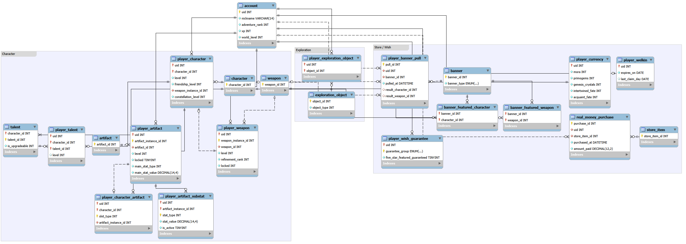 
*ERD*

## 플레이어 (`account`)

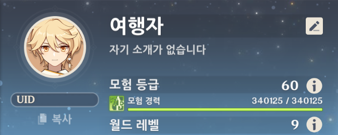 
*계정 정보 메뉴*

닉네임 (`nickname`)은 영어 기준 최대 14자까지 입력할 수 있어 `VARCHAR(14)`로 설정했다.

## 캐릭터 (`character`, `player_character`)

캐릭터를 나타내는 `character_id`와 플레이어의 `uid`를 조합하여 캐릭터 소유 여부를 저장한다.

 
*캐릭터 레벨*

`level`은 캐릭터의 레벨이다.

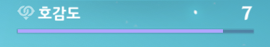 
*캐릭터 호감도 레벨*

`friendship_level`은 캐릭터의 호감도 레벨이다.

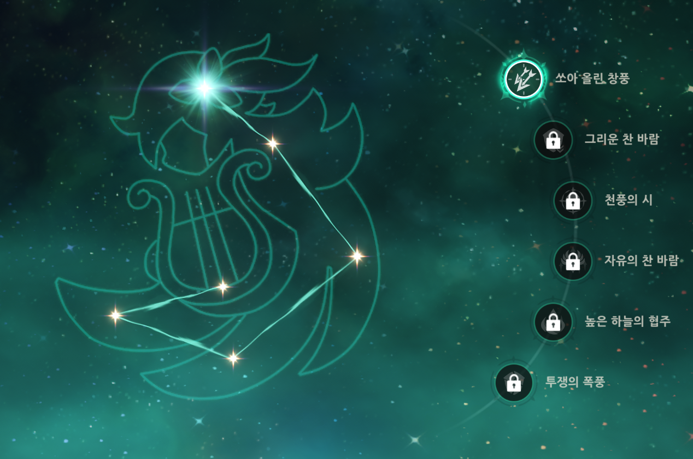 
*캐릭터 운명의 자리 단계*

`constellation_level`은 활성화된 운명의 자리 단계이다.

## 무기 (`weapon`, `player_weapon`)

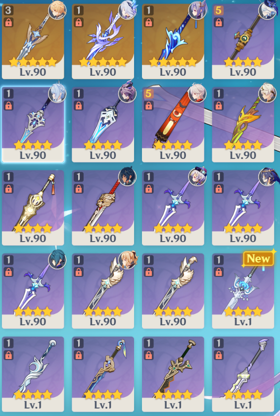 
*인벤토리의 무기*

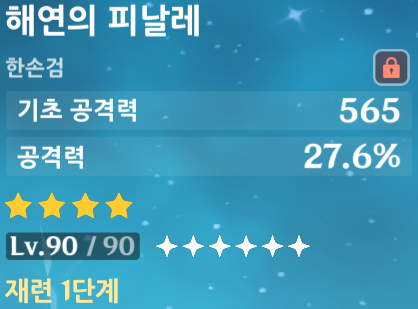 
*무기*

`weapon_id`는 무기의 종류를, `weapon_instance_id`는 플레이어가 소유한 개별 무기를 식별한다.\
캐릭터가 장착한 무기는 `player_character`의 `weapon_instance_id`로 참조한다.\
`refinement_rank`는 재련 단계이며, `locked`로 잠금 여부를 표현했다.

## 성유물 (`artifact`, `player_artifact`, `player_artifact_substat`)

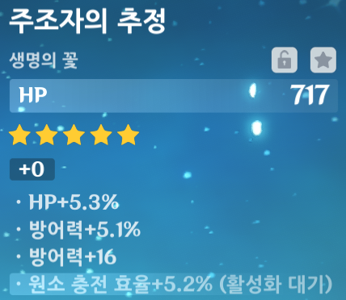 
*성유물*

각 성유물의 주 옵션은 종류 (`main_stat_type`)와 값 (`main_stat_value`)으로 표현했다.\
또한, 최대 4개의 부 옵션이 있으며, 이를 `player_artifact_substat`으로 표현했다.\
`is_active`가 0이면 활성화 대기 상태이다.\
사진에서 보이듯, 활성화 대기 상태일 때도 옵션 종류와 초기 값이 있다.\
같은 성유물 내에서 부 옵션의 종류는 중복되지 않는다.

## 특성 (`talent`, `player_talent`)

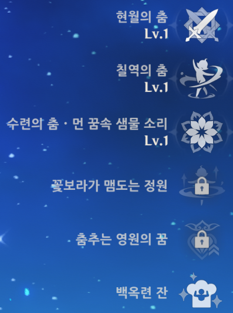 
*캐릭터 특성*

사진의 캐릭터에는 업그레이드 가능한 특성 3개와 패시브 특성 3개가 있다.\
`talent`의 `is_upgradeable`로 업그레이드 가능한 특성과 불가능한 특성을 구분한다.\
`level`은 특성의 현재 레벨이다.

## 월드 탐사 (`exploration_object`, `player_exploration_object`)

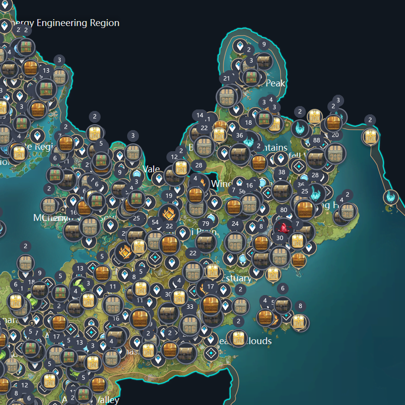 
*월드 탐사 중 수집 가능한 오브젝트들*

`exploration_object`는 월드에 배치된 일회성 수집 오브젝트를 나타낸다.\
`player_exploration_object`에 행이 있으면 해당 플레이어가 그 오브젝트를 수집한 것으로 간주한다.

## 기원 (`banner`, `player_banner_pull`, `player_wish_guarantee`)

 
*기원 종류들*

캐릭터 이벤트 기원 (`character_event`), 무기 이벤트 기원 (`weapon_event`), 상시 기원 (`standard`)을 다룬다.\
캐릭터 및 무기 이벤트 기원은 뒤얽힌 인연 (`intertwined_fate`)을, 상시 기원은 만남의 인연 (`acquaint_fate`)을 소모한다.\
`banner`의 `banner_type`은 재화가 아닌 기원의 종류를 나타낸다. 캐릭터 이벤트 기원과 캐릭터 이벤트 기원-2는 모두 `character_event`에 해당하며, 개별 기원은 서로 다른 `banner_id`로 구분한다.\
`player_banner_pull`의 행 하나는 기원 1회를 나타낸다.\
기원 결과는 NULL을 허용하는 `result_character_id`와 `result_weapon_id`에 저장한다.

이벤트 기원에서 픽업 대상이 아닌 5성 캐릭터 또는 무기를 얻으면, 다음 5성 결과는 픽업 대상이 된다.\
`player_wish_guarantee`는 다음 5성 결과의 픽업 보장 여부 (`five_star_featured_guaranteed`)를 저장한다.\
이 모델은 픽업 보장 여부만 간략화하여 표현했다.

## 현금 구매 (`real_money_purchase`, `player_welkin`)

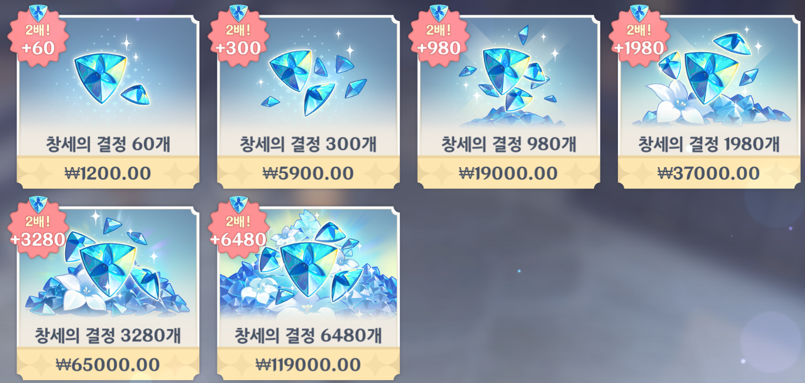 
*현금 구매 가능한 상품들*

`real_money_purchase`의 행 하나는 구매 1회를 나타낸다.\
`purchased_at`으로 구매 일시를 저장하고, `amount_paid`로 결제 금액을 저장했다.

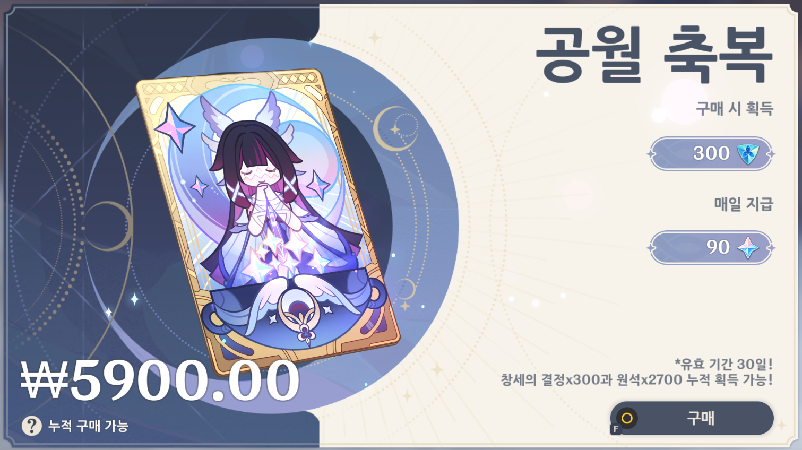 
*공월 축복*

공월 축복에는 유효 기간이 있으므로 `player_welkin`을 따로 만들었다.\
계정 하나에는 공월 축복 상태가 최대 1행 존재한다.\
`expires_on`은 만료되는 게임 날짜를 저장하며, 활성 상태에서 추가로 구매하면 유효 기간을 연장한다.\
`last_claim_day`는 마지막으로 보상을 받은 게임 날짜를 저장하여, 하루에 한 번만 보상을 받을 수 있도록 했다.\
한 번도 보상을 받지 않은 경우를 표현하기 위해 `last_claim_day`에 NULL을 허용했다.