# 데이터베이스 분석 - 레인보우 식스 시즈

한현수\
25311027\
게임 프로그래밍 2A\
인터넷프로그래밍

## 목차

- 간략한 게임 설명
- 오퍼레이터 (`operator`)
- 선택된 오퍼레이터 무장 (`player_operator_loadout`)
- 선택된 오퍼레이터 무장 부착물 (`player_operator_weapon_attachment`)
- 스킨
- 오퍼레이터 스킨 (`operator_customization`)
- 무기와 특수 가젯 스킨 (`player_operator_weapon_customization`, `player_operator_gadget_customization`)
- 랭크와 시즌 (`player_ranked_state`)
- 매치 (`match`)
- 매치의 플레이어 (`match_player`)
- 매치별 RP 변동 (`match_rp_change`)
- 라운드와 라운드 이벤트 (`round`, `round_player`, `round_event`)
- 게임 재화 (`player_currency`)
- 게임 내 구매 (`purchase`)
- 현금 구매 (`real_money_purchase`)

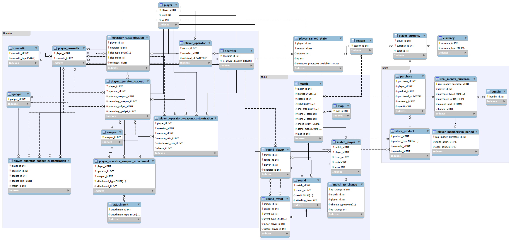 *ERD*

## 간략한 게임 설명

레인보우 식스 시즈는 5대5 멀티플레이어 택티컬 FPS 게임이다.\
하나의 매치는 여러 라운드로 이루어져 있으며, 플레이어는 각 라운드에 사용할 캐릭터인 오퍼레이터를 선택한다.

이 문서는 게임 화면과 동작을 관찰하여 추론한 관계형 데이터베이스 설계이며, Ubisoft의 실제 내부 데이터베이스 구조를 의미하지 않는다. 분석 범위는 아래에서 다루는 시스템과 아이템 종류로 한정한다.

## 오퍼레이터 (`operator`)

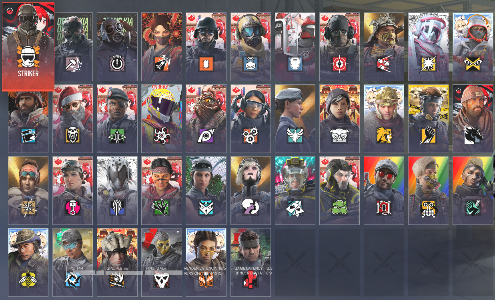 *오퍼레이터 리스트 화면*

한 플레이어 (`player`)는 여러 오퍼레이터 (`operator`)를 소유할 수 있다.\
한 오퍼레이터도 여러 플레이어가 소유할 수 있으므로, `player`와 `operator`는 M:N 관계이며, 이를 연결하는 `player_operator` 테이블을 만들었다.\
행이 존재하면 해당 플레이어가 그 오퍼레이터를 소유한 것이다.\
오퍼레이터의 획득 시점을 저장하기 위해 `obtained_at` 속성도 만들었다.

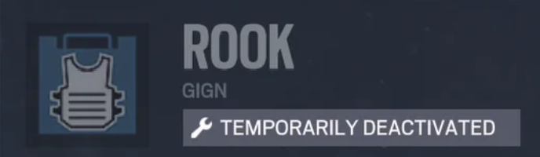 *제한된 오퍼레이터 예시 1*

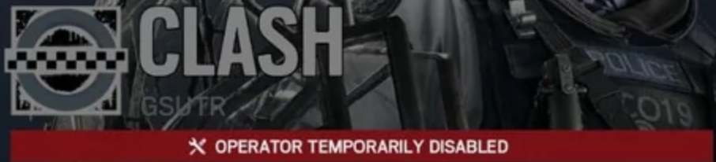 *제한된 오퍼레이터 예시 2*

게임에서는 치명적인 버그가 발견됐을 경우, 특정 오퍼레이터의 사용이 일시적으로 제한되는 사례가 있다.\
이러한 관찰된 동작을 표현하기 위해 `is_server_disabled` 속성을 만들었다.

## 선택된 오퍼레이터 무장 (`player_operator_loadout`)

각 오퍼레이터는 주 무기 (`primary_weapon_id`), 보조 무기 (`secondary_weapon_id`), 특수 가젯 (`primary_gadget_id`), 그리고 보조 가젯 (`secondary_gadget_id`)이 있다.\
같은 오퍼레이터라도 플레이어마다 선택한 무기와 가젯이 다를 수 있다.\
따라서 선택한 무장 정보는 플레이어와 오퍼레이터의 조합별로 `player_operator_loadout`에 저장하도록 했다.\
플레이어가 소유하지 않은 오퍼레이터의 무장 설정을 저장할 수 있도록 설계했다. 오퍼레이터별로 사용 가능한 무기와 가젯의 조합은 애플리케이션에서 검증하도록 했다.

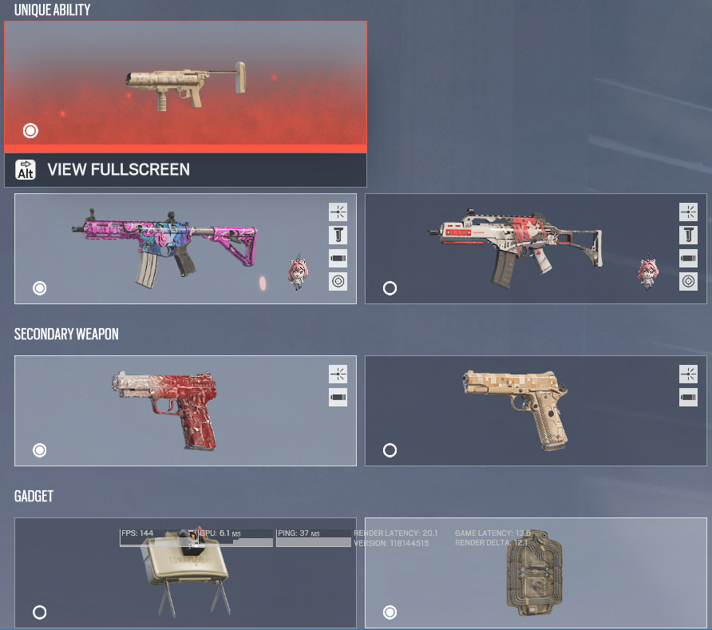 *가장 흔한 오퍼레이터의 무장 선택 메뉴*

대부분의 경우에는 주 무기, 보조 무기, 1개의 특수 가젯 선택지, 그리고 보조 가젯이 있다.

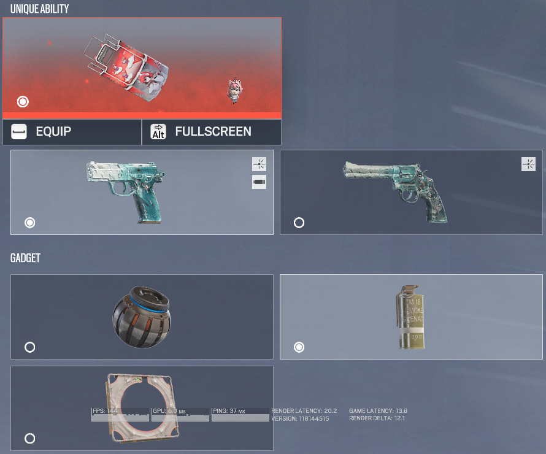 *주 무기가 없는 오퍼레이터의 무장 선택 메뉴*

하지만 이러한 방패병의 경우 주 무기 또는 보조 무기가 없는 경우가 있기 때문에, 대부분의 속성과는 달리 무기 속성들은 NULL 값을 허용했다.

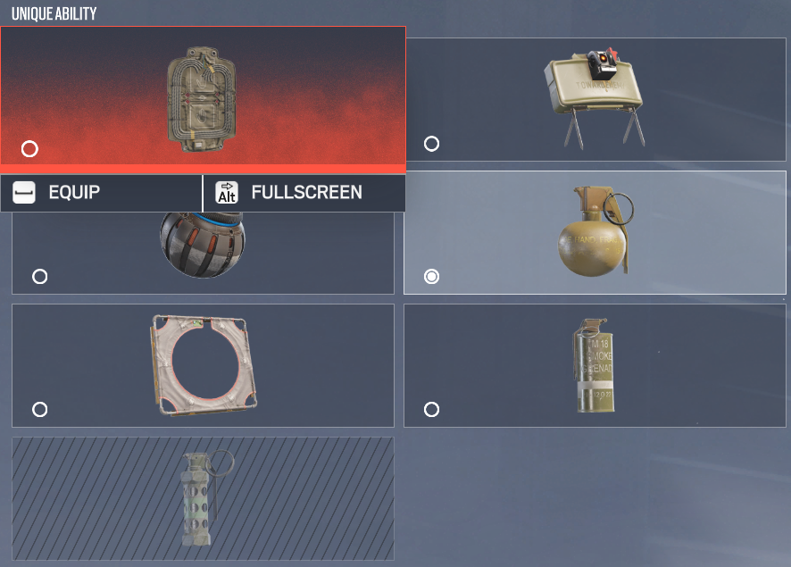 *특수 가젯 선택지가 여러개인 오퍼레이터의 무장 선택 메뉴*

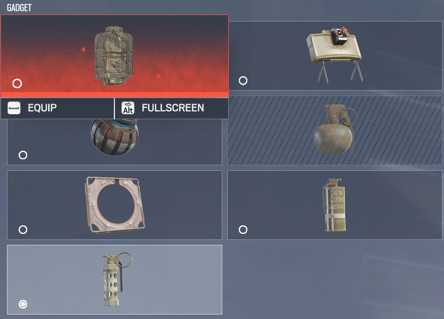 *특수 가젯 선택지가 여러개인 오퍼레이터의 무장 선택 메뉴*

대부분의 경우 특수 가젯에는 단 하나의 선택지만 있다.\
하지만 2개의 오퍼레이터의 경우에는 특수 가젯 선택지가 여러 개 있기 때문에 `primary_gadget_id`를 추가했다.

## 선택된 오퍼레이터 무장 부착물 (`player_operator_weapon_attachment`)

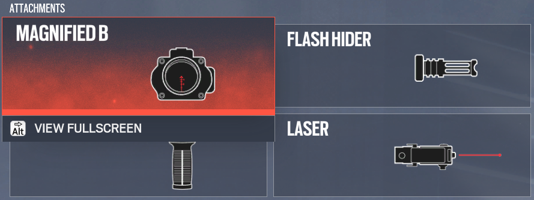 *모든 부착물 종류를 지원하는 총의 메뉴*

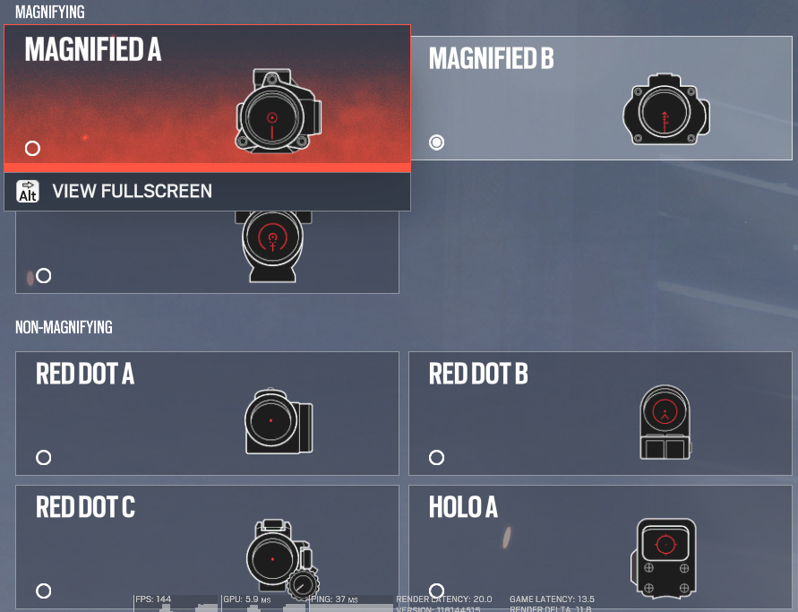 *조준경 부착물 메뉴*

무기에는 조준경 (`sight`), 총열 (`barrel`), 그리고 손잡이 (`grip`)를 장착할 수 있다.\
각 총마다 지원하는 부착물 종류가 다르며, 해당 총에 장착할 수 있는 부착물인지는 애플리케이션에서 검증하도록 했다.\
플레이어가 선택한 부착물은 `player_operator_weapon_attachment`에 저장한다.\
따라서 플레이어가 각 오퍼레이터의 무기에 대해 선택한 부착물을 종류별로 저장한다.\
장착하지 않거나 장착 선택지가 없는 상태는 `attachment_id`를 NULL로 표기하도록 했다.

## 스킨

이 문서에서 스킨은 오퍼레이터의 복장, 부착물 스킨, 무기 스킨 등 꾸미기 전용 아이템을 의미한다.\
스킨을 `cosmetic` 테이블로 나타냈으며, 스킨의 ID와 종류를 저장한다.\
플레이어가 소유하는 스킨을 저장하는 `player_cosmetic` 테이블을 만들었다.

## 오퍼레이터 스킨 (`operator_customization`)

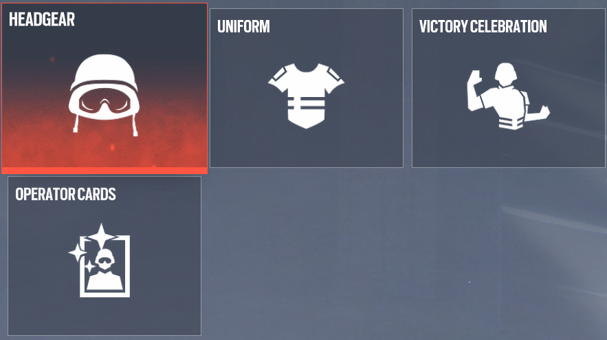 *오퍼레이터 스킨 종류 메뉴*

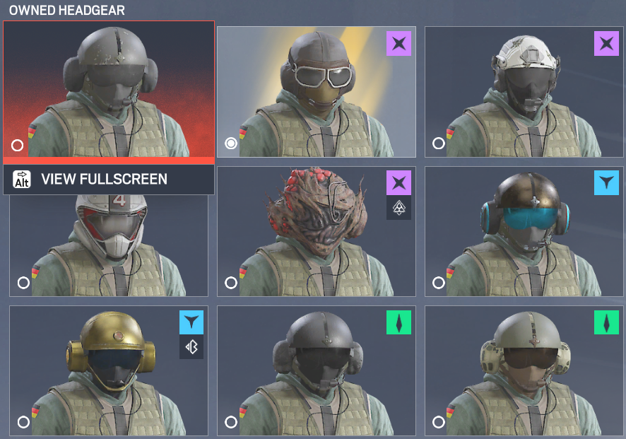 *오퍼레이터 머리 스킨 메뉴*

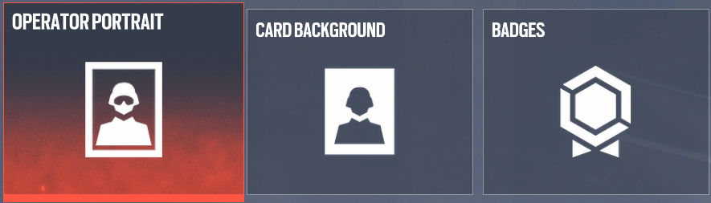 *오퍼레이터 UI 카드 종류 메뉴*

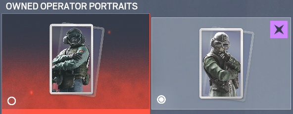 *오퍼레이터 UI 카드 전경 메뉴*

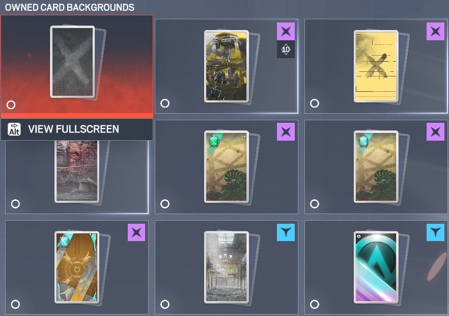 *오퍼레이터 UI 카드 배경 메뉴*

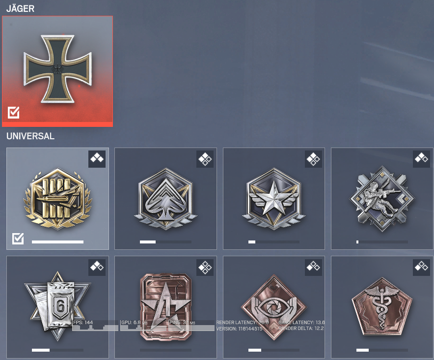 *오퍼레이터 UI 카드 배지 메뉴*

오퍼레이터는 머리 (`head`), 몸 (`body`), UI 카드의 배경 (`background`), 전경 (`foreground`), 그리고 3개의 배지 (`badge`)를 가질 수 있다.\
`slot_type`은 위의 스킨 종류를 의미한다.\
`slot_index`는 배지일 때 1~3이고, 나머지 종류일 때는 1로 고정한다.\
따라서 복합 기본 키 (`player_id`, `operator_id`, `slot_type`, `slot_index`)로 각 슬롯에 하나의 스킨만 선택하도록 한다.\
`operator_customization`에 행이 존재한다면, 플레이어가 기본값이 아닌 스킨을 선택했다는 것이다.

## 무기와 특수 가젯 스킨 (`player_operator_weapon_customization`, `player_operator_gadget_customization`)

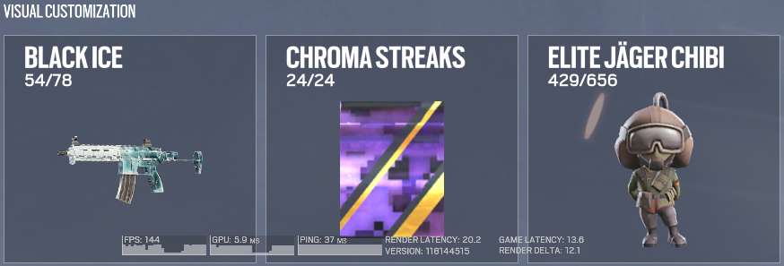 *무기 스킨 종류 메뉴*

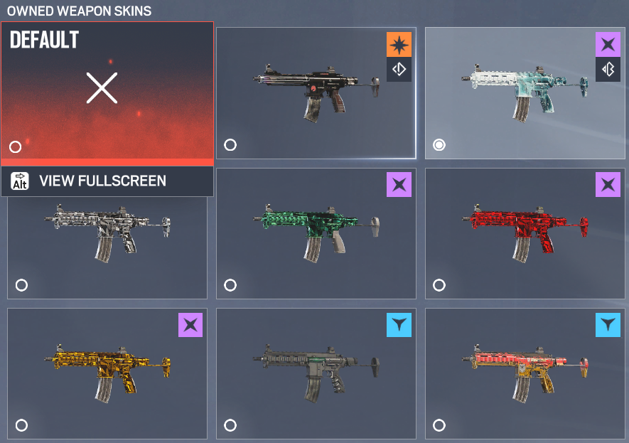 *무기 스킨 메뉴*

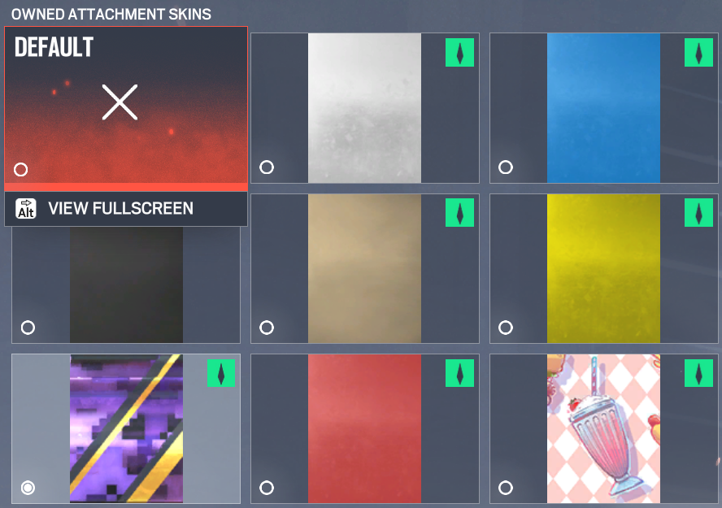 *무기 부착물 스킨 메뉴*

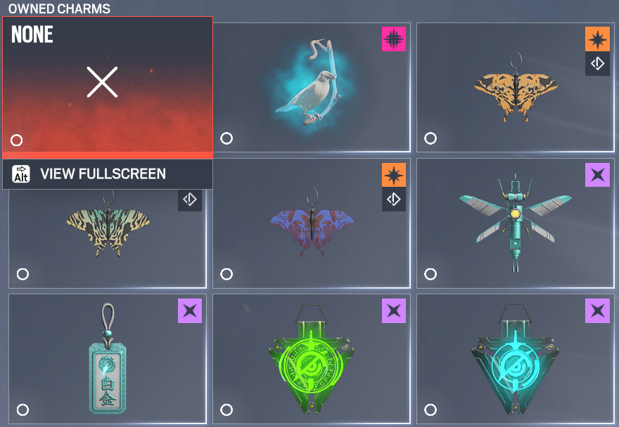 *무기 부적 메뉴*

오퍼레이터의 무기에 적용할 수 있는 스킨 종류에는 무기 스킨 (`weapon_skin_id`), 부착물 스킨 (`attachment_skin_id`), 그리고 부적 (`charm_id`)이 있다.\
플레이어가 선택하지 않거나 해당 무기가 지원하지 않는 종류일 때 값은 NULL이다.\
플레이어가 각 오퍼레이터의 무기에 대해 선택한 스킨을 저장한다.

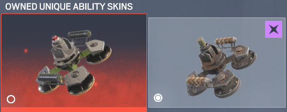 *특수 가젯 스킨 메뉴*

특수 가젯에도 스킨이 있다.

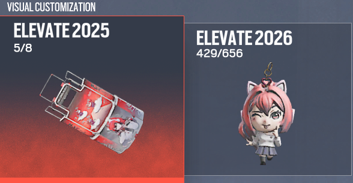 *특수 가젯 스킨 종류 메뉴*

하지만 일부 오퍼레이터는 특수 가젯에 부적도 선택할 수 있다.\
플레이어가 각 오퍼레이터의 특수 가젯에 대해 선택한 스킨을 저장한다.

## 랭크와 시즌 (`player_ranked_state`)

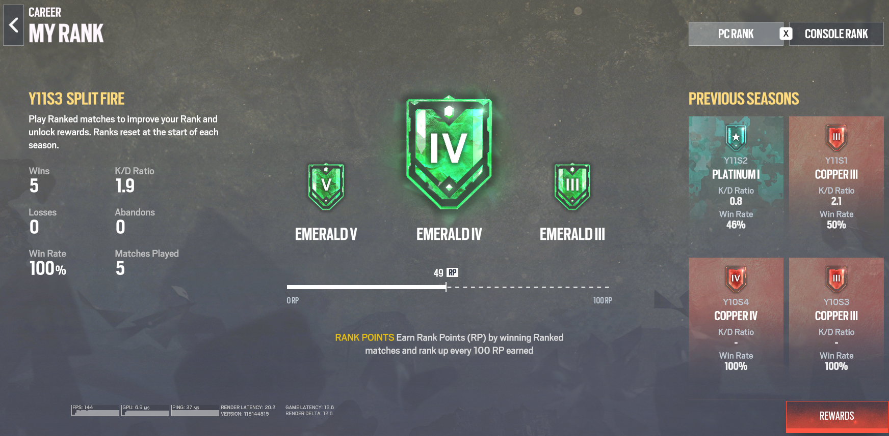 *랭크 메뉴*

플레이어의 시즌별 랭크 상태를 나타내는 테이블이다.\
`season_id`로 어느 시즌의 데이터인지 나타낸다.\
플레이어의 랭크는 각 시즌마다 초기화되며, 5매치의 배치고사를 치러야 한다.\
랭크를 올리려면 100 RP(랭크 포인트, Rank Point)를 모아야 한다.\
랭크 포인트는 `rp`로 나타낸다.\
만약 패배하여 새로 계산된 랭크 포인트가 0 미만일 때, 강등 보호가 있을 경우 랭크 포인트가 0으로 설정되고 강등당하지 않는다.\
강등 보호는 플레이어가 0 RP 초과인 상태에서 매치를 시작했을 때 지급된다.\
현재 랭크는 `division`으로 나타내며, NULL일 경우 아직 배치고사를 완료하지 않았다는 뜻이다.\
강등 보호는 `demotion_protection_available` 속성이다.

## 매치 (`match`)

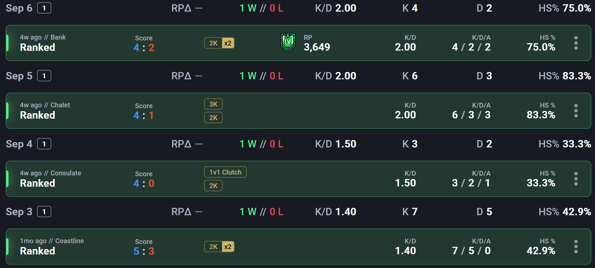 *매치 히스토리*

`result`는 무승부 (`draw`), 1번 팀 승리 (`team_1_win`), 그리고 2번 팀 승리 (`team_2_win`) 중 하나이며, NULL 값은 결과가 확정되기 전이거나 승패 없이 매치가 취소된 상태이다.\
`end_type`은 매치가 끝난 이유이며, 정상 종료 (`normal`), 한 팀의 항복 (`forfeit`), 그리고 취소 (`cancelled`) 중 하나이며, 매치가 끝나기 전에는 NULL 값이다.

## 매치의 플레이어 (`match_player`)

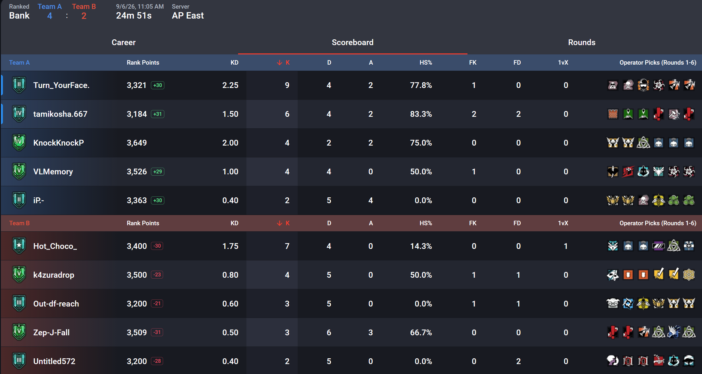 *매치 정보*

각 매치에 참석한 플레이어의 정보를 나타내는 테이블이다.\
어느 팀에 있었는지, 최종 어시스트 수, 그리고 최종 점수를 나타낸다.

## 매치별 RP 변동 (`match_rp_change`)

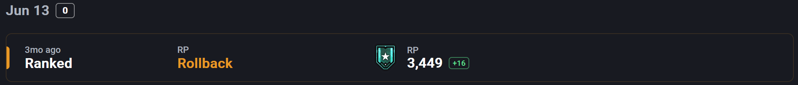 *매치 정보*

만약 이미 끝난 매치에서 부정행위를 한 플레이어가 정지당했을 때, 그 매치의 RP 변동은 롤백된다.\
그것을 표현하기 위해 따로 테이블을 만든 것이다.\
예를 들어, 한 매치에서 플레이어가 +30만큼의 RP를 얻었다면, 그것을 기록한다.\
그 매치가 롤백될 때, 새로운 행을 만들어서 -30만큼 RP를 변경하고 롤백이라고 지정한다.

## 라운드와 라운드 이벤트 (`round`, `round_player`, `round_event`)

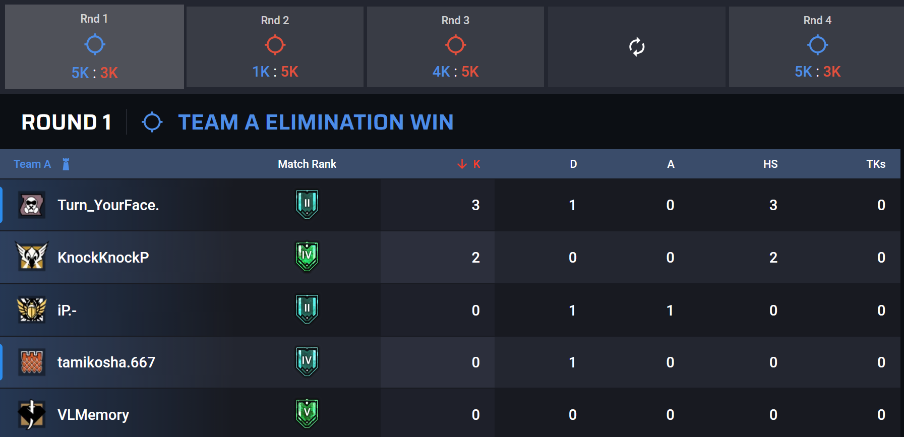 *라운드 정보*

`round`는 한 매치의 한 라운드를 나타낸다.\
`result`는 무승부 (`draw`), 1번 팀 승리 (`team_1_win`), 그리고 2번 팀 승리 (`team_2_win`) 중 하나이며, 라운드가 끝나기 전에는 NULL 값이다.\
두 팀은 공격과 방어를 둘 다 하기 때문에, 공격하는 팀을 `attacking_team`에 저장한다.\
각 라운드마다 각 플레이어는 다른 오퍼레이터를 선택할 수 있기 때문에 그 정보를 `round_player`에 나타낸다.

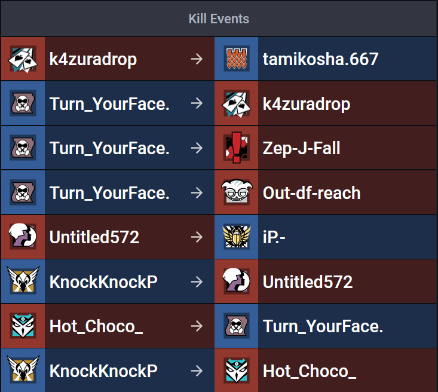 *라운드 이벤트 정보*

라운드 내에서 킬, 설치, 또는 해체가 이루어질 때, 그것을 `round_event`에 기록한다.\
위의 3개의 행동은 모두 행위자가 있기 때문에 `actor_player_id`는 NULL이 아니다.\
하지만, 설치 및 해체는 킬과 달리 당하는 사람이 없기 때문에 `victim_player_id`는 NULL 값이 될 수 있다.

## 게임 재화 (`player_currency`)

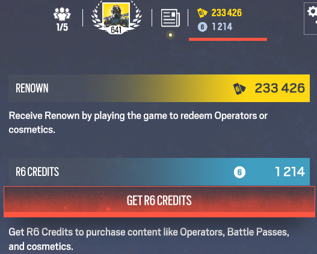 *재화*

플레이어는 게임을 하면서 자연스럽게 얻을 수 있는 명성 (`renown`)과 현금으로 구매할 수 있는 R6 크레딧 (`r6_credit`)을 보유한다.\
`balance`는 해당 재화의 보유 잔액이다.\
`currency` 테이블의 `currency_type`은 명성과 R6 크레딧 중 무엇인지 나타낸다.

## 게임 내 구매 (`purchase`)

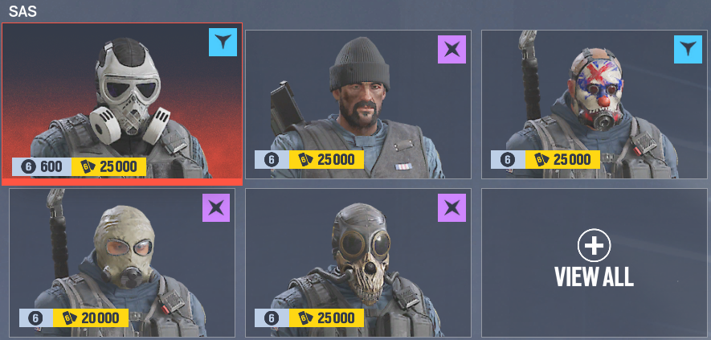 *재화*

게임 내 재화를 이용해 게임 내 상품 (`store_product`)을 구매한 것을 나타낸다.\
`store_product`는 오퍼레이터 또는 스킨일 수 있기 때문에 (`cosmetic_id`)와 (`operator_id`)의 NULL 값을 허용했으며, 어느 것인지는 `product_type`으로 나타내게 했다. 두 ID 중 정확히 하나만 값이 있어야 하며, `product_type`이 스킨이면 `cosmetic_id`만, 오퍼레이터이면 `operator_id`만 저장한다.

## 현금 구매 (`real_money_purchase`)

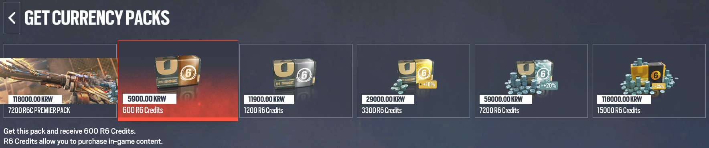 *재화*

실제 돈을 지불해서 구매한 것은 `real_money_purchase`에 나타냈다.\
`purchase_type`은 R6 크레딧 번들 (`credit_bundle`) 또는 멤버십 (`membership`)이다.\
`player_membership_period`는 멤버십을 구매했을 시 멤버십 시작일과 종료일을 저장하도록 했다. 한 현금 구매에는 멤버십 기간이 0개 또는 1개 연결되며, 멤버십 구매일 때만 1개가 존재하고 R6 크레딧 번들 구매일 때는 존재하지 않는다.