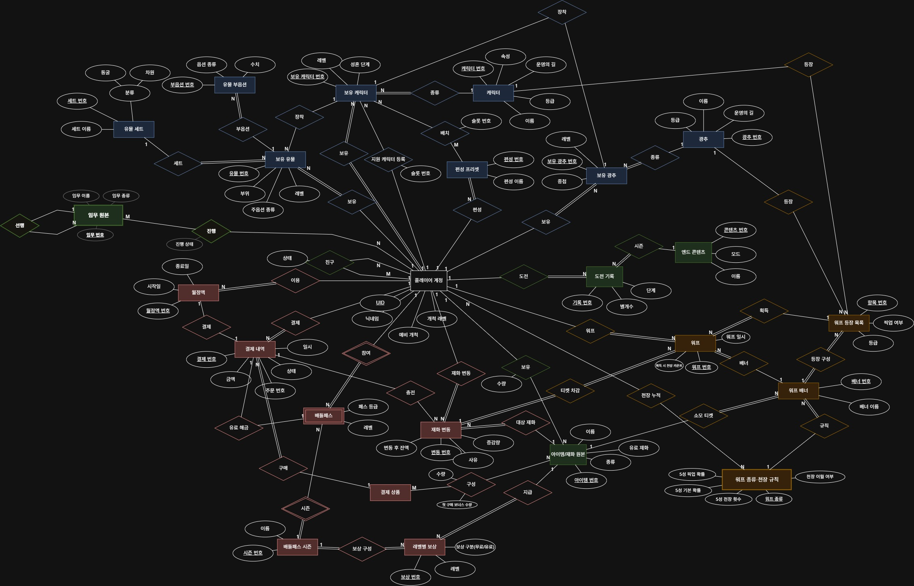
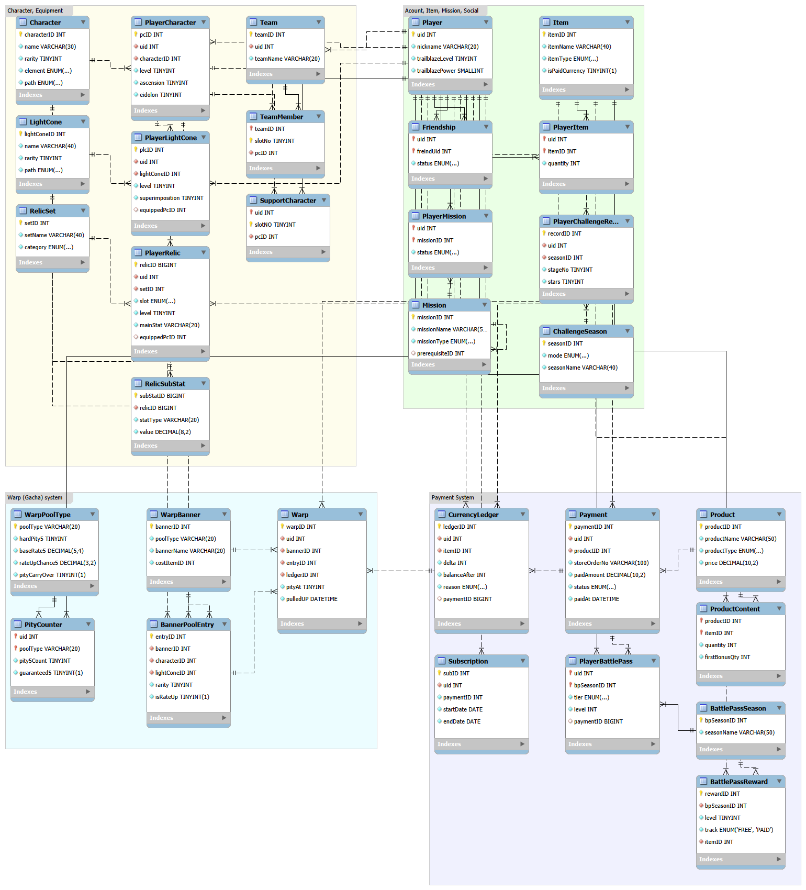
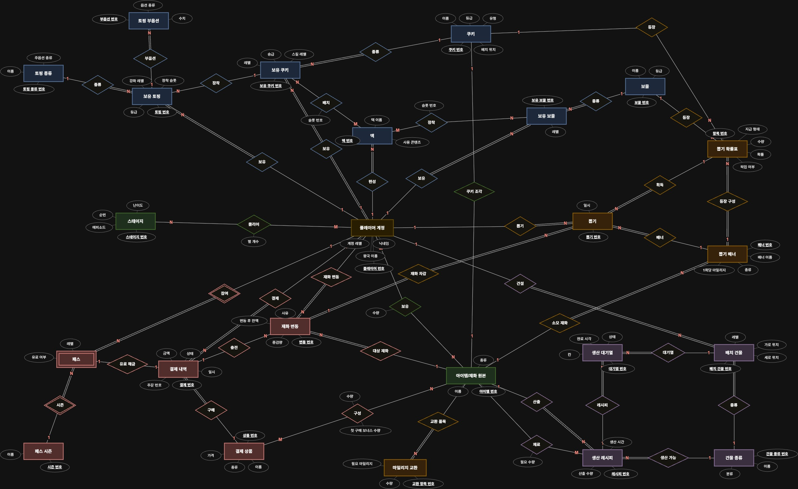
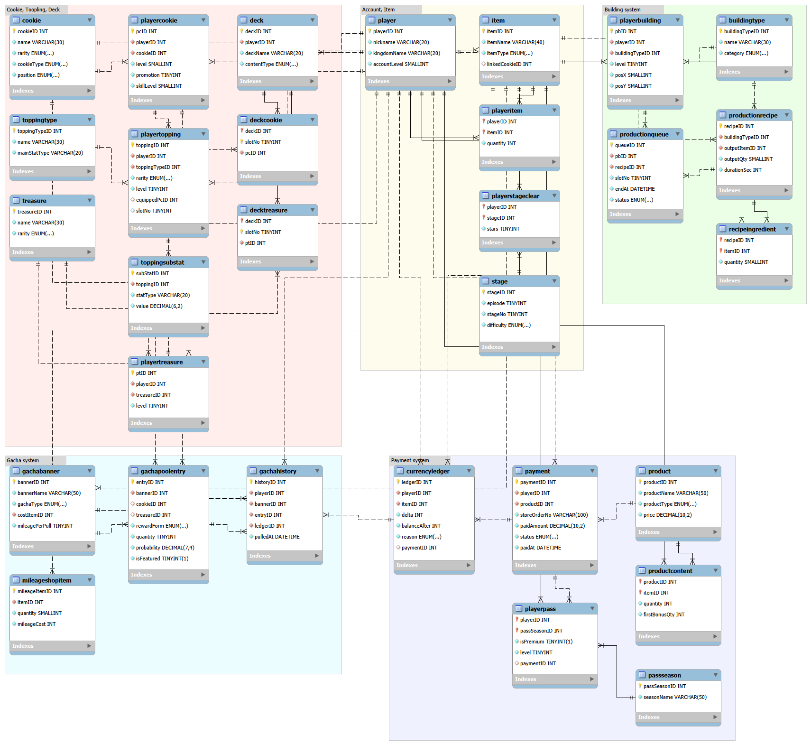

# 게임 데이터베이스 분석 포트폴리오

### 붕괴: 스타레일 · 쿠키런: 킹덤
---

## 1. 개요

분석 대상으로는 직접 오래 플레이해 온 붕괴: 스타레일과 쿠키런: 킹덤을 골랐다. 두 게임 모두 해본 시간이 길어서 화면을 보면서 "이 정보는 어디에 어떻게 저장되어 있을까"를 떠올리기 쉬웠다.

두 게임은 캐릭터를 모아서 키우고, 가챠로 과금을 한다는 점에서는 비슷하다. 하지만 스타레일은 턴제 RPG이고, 쿠키런: 킹덤은 전투에 왕국을 짓고 재료를 생산하는 경영 요소가 붙어 있는 게임이라 실제 데이터 구조는 꽤 다를 것이라고 생각했다.

---

## 2. 분석 방법

게임 회사의 실제 DB는 볼 수 없기 때문에, 게임 화면에 보이는 정보를 근거로 구조를 추측하는 방식으로 진행했다.

먼저 두 게임을 플레이하면서 프로필, 캐릭터 육성, 편성, 가방, 가챠, 상점 화면을 하나씩 확인했다. 화면에 나오는 값뿐만 아니라 "슬롯이 몇 칸인지", "최대 몇 단계까지 올라가는지" 같은 제약도 같이 적어 두었다.

그다음 화면에 반복해서 나오는 대상을 개체로, 그 대상이 가진 값을 속성으로 정리했다. 이때 가장 신경 쓴 건 '원본'과 '보유'를 나누는 것이었다. 예를 들어 캐릭터 이름이나 등급은 누가 가지고 있든 똑같지만, 레벨이나 성혼 단계는 플레이어마다 다르다. 그래서 캐릭터 정보 자체를 담는 개체와 플레이어가 가진 캐릭터를 담는 개체를 따로 두었다.

개체를 정리한 뒤에는 기본키와 외래키를 정하고, 개체끼리 몇 개씩 연결되는지(1:1, 1:N, M:N), 꼭 연결되어야 하는지를 따져 보았다. 이 내용을 draw.io에서 Chen 표기법으로 그려 개념 ERD를 만들었고, M:N 관계를 연결 테이블로 바꾼 다음 MySQL Workbench에서 Crow's Foot 표기법으로 논리 ERD를 만들었다.

---

## 3. 붕괴: 스타레일

### 3.1 시스템 분석

스타레일에서 확인한 화면과, 거기서 뽑아낸 개체는 다음과 같다.

| 시스템 | 화면에서 확인한 내용 | 정리한 개체 |
|---|---|---|
| 계정 | 프로필의 UID, 닉네임, 개척 레벨, 개척력 | 플레이어 계정 |
| 캐릭터 | 등급, 속성, 운명의 길, 레벨, 돌파 단계, 성혼 | 캐릭터, 보유 캐릭터 |
| 광추 | 등급, 운명의 길, 중첩, 장착 캐릭터 (캐릭터당 1개) | 광추, 보유 광추 |
| 유물 | 세트, 6개 부위, 주옵션, 부옵션 최대 4개, 강화 레벨 | 유물 세트, 보유 유물, 유물 부옵션 |
| 편성 | 4칸짜리 팀 편성, 여러 개의 프리셋, 지원 캐릭터 | 편성 프리셋, 편성 슬롯, 지원 캐릭터 |
| 친구 | 친구 목록과 친구 요청 상태 | 친구 관계 |
| 임무 | 임무 종류, 앞 임무를 끝내야 다음 임무가 열리는 구조 | 임무 원본, 임무 진행 |
| 엔드 콘텐츠 | 시즌마다 바뀌는 콘텐츠, 단계별 별 개수 | 엔드 콘텐츠, 도전 기록 |
| 가방 | 소재, 소모품, 재화와 보유 수량 | 아이템/재화 원본, 보유 아이템 |
| 워프 | 배너, 확률과 천장 안내, 워프 기록 | 워프 종류·천장 규칙, 워프 배너, 워프 등장 목록, 천장 카운터, 워프 |
| 상점 | 충전 상품, 첫 구매 보너스, 월정액, 배틀패스 | 결제 상품, 상품 구성, 결제 내역, 월정액, 배틀패스, 배틀패스 시즌, 레벨별 보상, 재화 변동 |

### 3.2 개체·속성·키

정리한 개체를 테이블로 옮기니 모두 31개가 나왔다. 굵은 글씨가 기본키이고, (FK)는 외래키이다.

| 영역 | 테이블 (개체) | 속성 |
|---|---|---|
| 육성·장비 | Character (캐릭터) | **characterID**, name, rarity, element, path |
| | PlayerCharacter (보유 캐릭터) | **pcID**, uid(FK), characterID(FK), level, ascension, eidolon |
| | LightCone (광추) | **lightConeID**, name, rarity, path |
| | PlayerLightCone (보유 광추) | **plcID**, uid(FK), lightConeID(FK), level, superimposition, equippedPcID(FK) |
| | RelicSet (유물 세트) | **setID**, setName, category |
| | PlayerRelic (보유 유물) | **relicID**, uid(FK), setID(FK), slot, level, mainStat, equippedPcID(FK) |
| | RelicSubStat (유물 부옵션) | **subStatID**, relicID(FK), statType, value |
| 편성 | Team (편성 프리셋) | **teamID**, uid(FK), teamName |
| | TeamMember (편성 슬롯) | **teamID(FK), slotNo**, pcID(FK) |
| | SupportCharacter (지원 캐릭터) | **uid(FK), slotNo**, pcID(FK) |
| 계정·친구·임무 | Player (플레이어 계정) | **uid**, nickname, trailblazeLevel, trailblazePower |
| | Friendship (친구 관계) | **uid(FK), friendUid(FK)**, status |
| | Mission (임무 원본) | **missionID**, missionName, missionType, prerequisiteID(FK) |
| | PlayerMission (임무 진행) | **uid(FK), missionID(FK)**, status |
| | ChallengeSeason (엔드 콘텐츠) | **seasonID**, mode, seasonName |
| | PlayerChallengeRecord (도전 기록) | **recordID**, uid(FK), seasonID(FK), stageNo, stars |
| 아이템 | Item (아이템/재화 원본) | **itemID**, itemName, itemType, isPaidCurrency |
| | PlayerItem (보유 아이템) | **uid(FK), itemID(FK)**, quantity |
| 워프 | WarpPoolType (워프 종류·천장 규칙) | **poolType**, hardPity5, baseRate5, rateUpChance5, pityCarryOver |
| | WarpBanner (워프 배너) | **bannerID**, poolType(FK), bannerName, costItemID(FK) |
| | BannerPoolEntry (워프 등장 목록) | **entryID**, bannerID(FK), characterID(FK), lightConeID(FK), rarity, isRateUp |
| | PityCounter (천장 카운터) | **uid(FK), poolType(FK)**, pity5Count, guaranteed5 |
| | Warp (워프) | **warpID**, uid(FK), bannerID(FK), entryID(FK), ledgerID(FK), pityAt, pulledAt |
| 결제 | Product (결제 상품) | **productID**, productName, productType, price |
| | ProductContent (상품 구성) | **productID(FK), itemID(FK)**, quantity, firstBonusQty |
| | Payment (결제 내역) | **paymentID**, uid(FK), productID(FK), storeOrderNo, paidAmount, status, paidAt |
| | Subscription (월정액) | **subID**, uid(FK), paymentID(FK), startDate, endDate |
| | BattlePassSeason (배틀패스 시즌) | **bpSeasonID**, seasonName |
| | BattlePassReward (레벨별 보상) | **rewardID**, bpSeasonID(FK), level, track, itemID(FK) |
| | PlayerBattlePass (배틀패스) | **uid(FK), bpSeasonID(FK)**, tier, level, paymentID(FK) |
| | CurrencyLedger (재화 변동) | **ledgerID**, uid(FK), itemID(FK), delta, balanceAfter, reason, paymentID(FK) |

### 3.3 관계와 카디널리티

관계는 모두 41개가 나왔다(1:N과 1:1이 34개, M:N이 7개). 표에는 주요한 것만 정리했다.

| 관계 | 개체 A | 카디널리티 | 개체 B | 이렇게 본 이유 |
|---|---|---|---|---|
| 보유 | 플레이어 계정 | 1 : N | 보유 캐릭터·광추·유물 | 한 플레이어가 여러 개를 가지고 있음 |
| 종류 | 캐릭터 / 광추 | 1 : N | 보유 캐릭터 / 보유 광추 | 같은 캐릭터를 여러 플레이어가 가지고 있음 |
| 장착 | 보유 캐릭터 | 1 : 1 | 보유 광추 | 캐릭터 하나에 광추는 1개만 낄 수 있음 |
| 장착 | 보유 캐릭터 | 1 : N | 보유 유물 | 부위마다 1개씩, 최대 6개 |
| 부옵션 | 보유 유물 | 1 : N | 유물 부옵션 | 유물 하나에 부옵션 최대 4개 |
| 배치 | 편성 프리셋 | M : N | 보유 캐릭터 | 한 팀에 4명, 한 캐릭터가 여러 팀에 들어갈 수 있음 |
| 친구 | 플레이어 계정 | M : N | 플레이어 계정 | 플레이어끼리 맺는 관계 |
| 선행 | 임무 원본 | 1 : N | 임무 원본 | 임무 하나를 끝내면 다음 임무 여러 개가 열림 |
| 보유 | 플레이어 계정 | M : N | 아이템/재화 원본 | 아이템마다 수량이 따로 있음 |
| 규칙 | 워프 종류·천장 규칙 | 1 : N | 워프 배너 | 같은 종류의 배너는 천장 규칙이 같음 |
| 천장 누적 | 플레이어 계정 | M : N | 워프 종류·천장 규칙 | 플레이어마다 워프 종류별로 횟수가 쌓임 |
| 획득 | 워프 등장 목록 | 1 : N | 워프 | 워프 한 번에 등장 목록 중 하나가 나옴 |
| 티켓 차감 | 재화 변동 | 1 : N | 워프 | 10연차를 하면 티켓 차감은 1번, 워프 기록은 10개 |
| 결제 | 플레이어 계정 | 1 : N | 결제 내역 | |
| 구성 | 결제 상품 | M : N | 아이템/재화 원본 | 상품 하나에 여러 아이템이 들어 있음 |
| 참여 | 플레이어 계정 | 1 : N | 배틀패스 | 배틀패스는 플레이어와 시즌으로만 구분됨 |
| 충전 | 결제 내역 | 1 : N | 재화 변동 | 결제로 들어온 재화를 기록 |

### 3.4 과금 구조 분석

스타레일 과금에서 눈에 띈 건 재화가 여러 번 바뀐다는 점이다. 현금으로 유료 재화를 사고, 그걸 성옥으로 바꾸고, 성옥으로 다시 워프 티켓을 사서 워프를 돌린다. 단계가 많다 보니 "이 결제로 산 재화가 어디에 쓰였는지"를 따라갈 수 있어야 한다고 생각했다. 그래서 모든 재화를 아이템/재화 원본에 넣고, 재화가 늘거나 줄 때마다 재화 변동 테이블에 한 줄씩 남기도록 했다. 결제 내역, 재화 변동, 워프가 외래키로 이어져 있어서 결제 한 건이 어떤 워프로 이어졌는지 끝까지 확인할 수 있다. 결제 내역의 주문 번호에는 중복 불가 제약을 걸었는데, 같은 결제로 재화가 두 번 들어가는 일을 막기 위해서이다.

천장은 워프 상세 정보를 보고 분석했다. 캐릭터 이벤트 워프는 90회, 광추 이벤트 워프는 80회 안에 5성이 반드시 나오고, 픽업을 놓치면 다음 5성은 픽업이 확정된다. 그리고 천장 횟수는 배너가 바뀌어도 다음 배너로 그대로 넘어간다. 천장 횟수를 배너에 묶어서 저장하면 배너가 바뀔 때마다 카운트가 끊기기 때문에, 천장 규칙은 '워프 종류'에 두고 플레이어의 천장 카운트도 (플레이어, 워프 종류)를 기본키로 저장했다. 픽업을 놓친 상태인지는 guaranteed5에 따로 저장한다.

월정액은 결제 한 번이 정해진 기간 동안의 혜택이 되는 상품이라 결제 내역과 1:1로 연결했다. 배틀패스는 따로 번호를 붙이지 않고 플레이어와 시즌 조합으로만 구분되기 때문에 약한 개체로 정리했다.

### 3.5 ERD

#### 개념 ERD (Chen 표기법)

그림 1. 붕괴: 스타레일 개념 ERD

#### 논리 ERD (Crow's Foot 표기법)

그림 2. 붕괴: 스타레일 논리 ERD (MySQL Workbench)

개념 ERD에서 마름모로 그렸던 M:N 관계 7개(배치, 지원 캐릭터 등록, 친구, 보유, 진행, 구성, 천장 누적)는 논리 ERD에서 TeamMember, SupportCharacter, Friendship, PlayerItem, PlayerMission, ProductContent, PityCounter 연결 테이블로 바뀌었다.

---

## 4. 쿠키런: 킹덤

### 4.1 시스템 분석

쿠키런: 킹덤에서 확인한 화면과, 거기서 뽑아낸 개체는 다음과 같다.

| 시스템 | 화면에서 확인한 내용 | 정리한 개체 |
|---|---|---|
| 계정 | 닉네임, 왕국 이름, 계정 레벨 | 플레이어 계정 |
| 쿠키 | 등급, 유형(돌격·방어 등), 배치 위치(전방·중앙·후방), 레벨, 승급(별), 스킬 레벨 | 쿠키, 보유 쿠키 |
| 토핑 | 쿠키당 5칸, 토핑 종류별 주옵션, 등급, 강화 레벨, 부옵션 | 토핑 종류, 보유 토핑, 토핑 부옵션 |
| 보물 | 등급, 레벨, 덱마다 최대 3개 | 보물, 보유 보물 |
| 덱 | 쿠키 5칸과 보물 3칸, 콘텐츠마다 다른 덱 | 덱, 덱 쿠키 슬롯, 덱 보물 슬롯 |
| 왕국 | 지도 위 건물 위치, 건물 레벨, 생산 레시피(재료, 시간, 산출량), 생산 대기열 | 건물 종류, 배치 건물, 생산 레시피, 필요 재료, 생산 대기열 |
| 월드 탐험 | 에피소드, 스테이지 번호, 난이도, 별 개수 | 스테이지, 스테이지 클리어 |
| 가방 | 재료, 재화, 쿠키 조각과 보유 수량 | 아이템/재화 원본, 보유 아이템 |
| 뽑기 | 쿠키 뽑기와 보물 뽑기, 확률 정보(쿠키 통째/조각), 마일리지와 교환 | 뽑기 배너, 뽑기 확률표, 뽑기, 마일리지 교환 |
| 상점 | 크리스탈 상품, 패키지, 패스 | 결제 상품, 상품 구성, 결제 내역, 패스, 패스 시즌, 재화 변동 |

### 4.2 개체·속성·키

테이블은 모두 30개가 나왔다.

| 영역 | 테이블 (개체) | 속성 |
|---|---|---|
| 육성·장비 | cookie (쿠키) | **cookieID**, name, rarity, cookieType, position |
| | playercookie (보유 쿠키) | **pcID**, playerID(FK), cookieID(FK), level, promotion, skillLevel |
| | toppingtype (토핑 종류) | **toppingTypeID**, name, mainStatType |
| | playertopping (보유 토핑) | **toppingID**, playerID(FK), toppingTypeID(FK), rarity, level, equippedPcID(FK), slotNo |
| | toppingsubstat (토핑 부옵션) | **subStatID**, toppingID(FK), statType, value |
| | treasure (보물) | **treasureID**, name, rarity |
| | playertreasure (보유 보물) | **ptID**, playerID(FK), treasureID(FK), level |
| 덱 | deck (덱) | **deckID**, playerID(FK), deckName, contentType |
| | deckcookie (덱 쿠키 슬롯) | **deckID(FK), slotNo**, pcID(FK) |
| | decktreasure (덱 보물 슬롯) | **deckID(FK), slotNo**, ptID(FK) |
| 계정·콘텐츠 | player (플레이어 계정) | **playerID**, nickname, kingdomName, accountLevel |
| | stage (스테이지) | **stageID**, episode, stageNo, difficulty |
| | playerstageclear (스테이지 클리어) | **playerID(FK), stageID(FK)**, stars |
| 아이템 | item (아이템/재화 원본) | **itemID**, itemName, itemType, linkedCookieID(FK) |
| | playeritem (보유 아이템) | **playerID(FK), itemID(FK)**, quantity |
| 왕국 경영 | buildingtype (건물 종류) | **buildingTypeID**, name, category |
| | playerbuilding (배치 건물) | **pbID**, playerID(FK), buildingTypeID(FK), level, posX, posY |
| | productionrecipe (생산 레시피) | **recipeID**, buildingTypeID(FK), outputItemID(FK), outputQty, durationSec |
| | recipeingredient (필요 재료) | **recipeID(FK), itemID(FK)**, quantity |
| | productionqueue (생산 대기열) | **queueID**, pbID(FK), recipeID(FK), slotNo, endAt, status |
| 뽑기 | gachabanner (뽑기 배너) | **bannerID**, bannerName, gachaType, costItemID(FK), mileagePerPull |
| | gachapoolentry (뽑기 확률표) | **entryID**, bannerID(FK), cookieID(FK), treasureID(FK), rewardForm, quantity, probability, isFeatured |
| | gachahistory (뽑기) | **historyID**, playerID(FK), bannerID(FK), entryID(FK), ledgerID(FK), pulledAt |
| | mileageshopitem (마일리지 교환) | **mileageItemID**, itemID(FK), quantity, mileageCost |
| 결제 | product (결제 상품) | **productID**, productName, productType, price |
| | productcontent (상품 구성) | **productID(FK), itemID(FK)**, quantity, firstBonusQty |
| | payment (결제 내역) | **paymentID**, playerID(FK), productID(FK), storeOrderNo, paidAmount, status, paidAt |
| | passseason (패스 시즌) | **passSeasonID**, seasonName |
| | playerpass (패스) | **playerID(FK), passSeasonID(FK)**, isPremium, level, paymentID(FK) |
| | currencyledger (재화 변동) | **ledgerID**, playerID(FK), itemID(FK), delta, balanceAfter, reason, paymentID(FK) |

### 4.3 관계와 카디널리티

관계는 모두 39개가 나왔다(1:N과 1:1이 33개, M:N이 6개). 주요한 것만 정리하면 다음과 같다.

| 관계 | 개체 A | 카디널리티 | 개체 B | 이렇게 본 이유 |
|---|---|---|---|---|
| 보유 | 플레이어 계정 | 1 : N | 보유 쿠키·토핑·보물 | 한 플레이어가 여러 개를 가지고 있음 |
| 장착 | 보유 쿠키 | 1 : N | 보유 토핑 | 쿠키 하나에 토핑 최대 5개 |
| 부옵션 | 보유 토핑 | 1 : N | 토핑 부옵션 | |
| 배치 | 덱 | M : N | 보유 쿠키 | 덱 하나에 5칸, 한 쿠키가 여러 덱에 들어갈 수 있음 |
| 장착 | 덱 | M : N | 보유 보물 | 보물은 쿠키가 아니라 덱에 끼움 (3칸) |
| 건설 | 플레이어 계정 | 1 : N | 배치 건물 | 같은 건물을 여러 개 지을 수 있음 |
| 생산 가능 | 건물 종류 | 1 : N | 생산 레시피 | 레시피마다 생산하는 건물이 정해져 있음 |
| 재료 | 생산 레시피 | M : N | 아이템/재화 원본 | 레시피 하나에 재료가 여러 개, 재료 하나가 여러 레시피에 쓰임 |
| 대기열 | 배치 건물 | 1 : N | 생산 대기열 | 건물마다 생산 대기열이 여러 칸 |
| 클리어 | 플레이어 계정 | M : N | 스테이지 | 스테이지마다 받은 별 개수가 다름 |
| 쿠키 조각 | 쿠키 | 1 : 1 | 아이템/재화 원본 | 쿠키마다 전용 조각이 하나씩 있음 |
| 등장 구성 | 뽑기 배너 | 1 : N | 뽑기 확률표 | 배너마다 확률표가 따로 있음 |
| 등장 | 쿠키 / 보물 | 1 : N | 뽑기 확률표 | 확률표 한 줄에는 쿠키나 보물 중 하나만 들어감 |
| 재화 차감 | 재화 변동 | 1 : N | 뽑기 | 10연차를 하면 재화 차감은 1번, 뽑기 기록은 10개 |
| 구성 | 결제 상품 | M : N | 아이템/재화 원본 | 상품 하나에 여러 아이템이 들어 있음 |
| 참여 | 플레이어 계정 | 1 : N | 패스 | 패스는 플레이어와 시즌으로만 구분됨 |

### 4.4 과금 구조 분석

쿠키런: 킹덤은 현금으로 크리스탈을 사서 바로 뽑기에 쓰는 구조라 스타레일보다 단계가 짧다. 결제와 재화 쪽은 스타레일 때와 같은 방식(결제 상품, 상품 구성, 결제 내역, 재화 변동)을 그대로 적용했다.

뽑기 확률 정보를 보면 같은 쿠키라도 "쿠키 통째"와 "쿠키 조각 몇 개"가 서로 다른 확률로 따로 적혀 있다. 그래서 뽑기 확률표의 한 줄을 "어떤 쿠키나 보물이, 통째인지 조각인지, 몇 개가, 몇 % 확률로 나오는지"로 정했다. 조각으로 나온 경우에는 아이템/재화 원본의 linkedCookieID를 통해 어느 쿠키의 조각인지 알 수 있다.

뽑기를 할 때마다 마일리지가 쌓이고, 모은 마일리지로 아이템을 교환할 수 있는 것도 확인했다. 마일리지는 재화의 한 종류로 넣어서 쌓이는 것과 쓰는 것이 모두 재화 변동에 기록되게 했다. 이렇게 하니 스타레일의 천장 카운터처럼 플레이어별 상태를 따로 저장하는 테이블은 필요하지 않았다.

### 4.5 ERD

#### 개념 ERD (Chen 표기법)

그림 3. 쿠키런: 킹덤 개념 ERD

#### 논리 ERD (Crow's Foot 표기법)

그림 4. 쿠키런: 킹덤 논리 ERD (MySQL Workbench)

개념 ERD의 M:N 관계 6개(배치, 장착, 재료, 보유, 클리어, 구성)는 논리 ERD에서 deckcookie, decktreasure, recipeingredient, playeritem, playerstageclear, productcontent 연결 테이블로 바뀌었다.

---

## 5. 참고 자료 및 출처

| 번호 | 자료 |
|---|---|
| 1 | 붕괴: 스타레일 게임 내 화면 (프로필, 캐릭터·광추·유물, 편성, 임무, 가방, 워프 상세 정보·워프 기록, 상점), 2026년 9~10월 확인 |
| 2 | 쿠키런: 킹덤 게임 내 화면 (프로필, 쿠키·토핑·보물, 덱, 왕국, 월드 탐험, 뽑기 확률 정보, 상점), 2026년 9~10월 확인 |
| 3 | 붕괴: 스타레일 공식 홈페이지, HoYoverse, https://hsr.hoyoverse.com |
| 4 | 데브시스터즈 공식 홈페이지, https://www.devsisters.com |
| 5 | MySQL 8.0 Reference Manual, FOREIGN KEY Constraints, https://dev.mysql.com/doc/refman/8.0/en/create-table-foreign-keys.html |
| 6 | MySQL Workbench Manual, https://dev.mysql.com/doc/workbench/en/ |
| 7 | draw.io, https://www.drawio.com |
